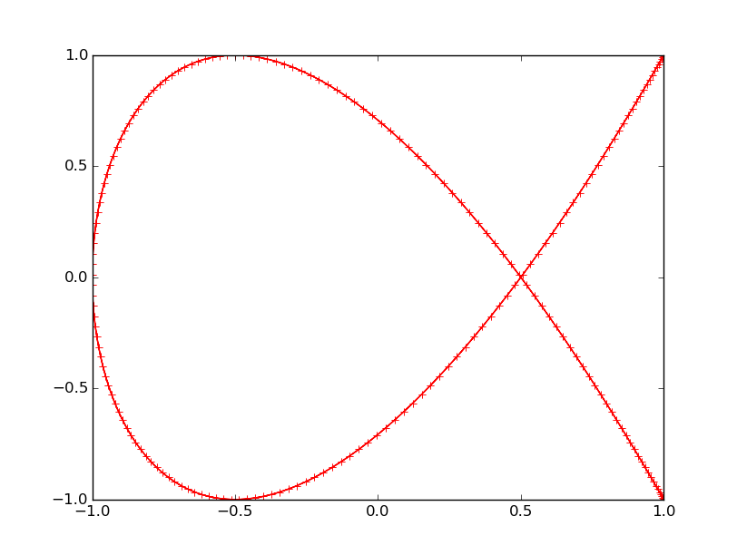
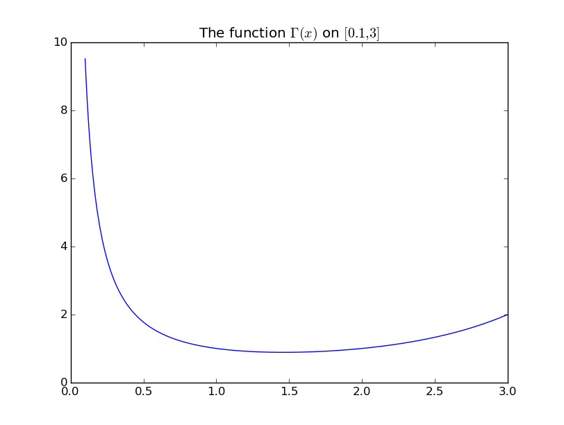
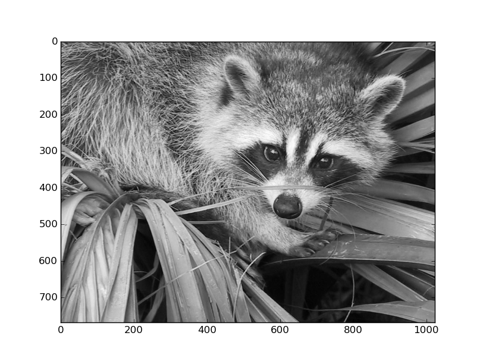
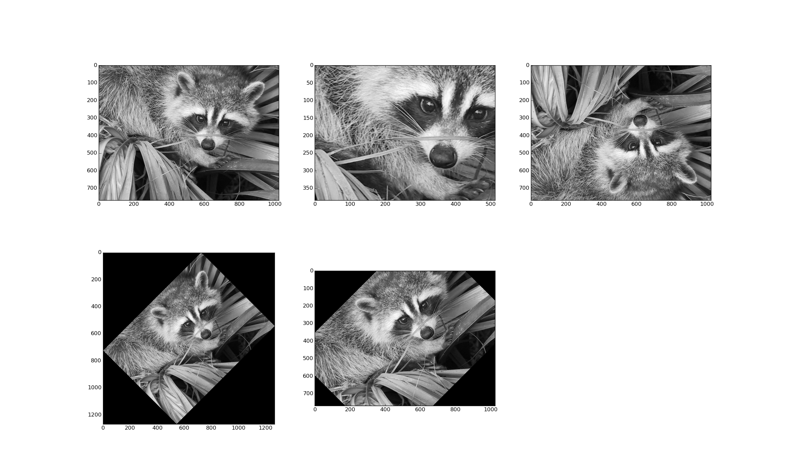

% Python tutorial @ BIG (EPFL)
% Lilian Besson
% BIG, EPFL, July 2016
---
lang: english
babel-lang: english
handout: true
institute: BIG, EPFL
---

## A short introduction to Python for Image Analysis and Deep Learning

*Lilian Besson*

BIG, EPFL, July 2016

 

---

## Introduction
This short tutorial will get you started with Python 3.

We will try to discover together what Daniel asked me yesterday.

---

## 1. Installing Python 3
> *Try to do this on your laptop, during the tutorial*

1. Download [Anaconda (Python 3.5)](https://repo.continuum.io/archive/Anaconda3-4.1.0-MacOSX-x86_64.pkg) from [continuum.io/downloads](https://www.continuum.io/downloads) (~ 346 Mo)
2. Install it: double-click the downloaded `.pkg` file and follow the instructions
3. Check that Python (`python3`) has been installed:

```bash
$ python3
[it should work]
```

---

## 2. Basic introduction to Python
- **Not covered today**
- Start with [introtopython.org](http://introtopython.org/)
- More in-depth tutorial: [scipy-lectures.org](http://www.scipy-lectures.org/) (very good quality)


- Example: [Hello World!](http://introtopython.org/hello_world.html)

```python
>>> print("Hello Python world!")
Hello Python world!
```

---

## 3. Using the Spyder IDE
- The Spyder IDE [is shipped](https://pythonhosted.org/spyder/installation.html#installing-on-macos-x) with Anaconda
- Gives a nice MATLAB-like interface: advanced editing, interactive testing, debugging and introspection features
- A numerical computing environment thanks to the support of: `IPython` (enhanced interactive Python interpreter) and core Python libraries: `NumPy` (linear algebra), `SciPy` (signal and image processing) or `matplotlib` (interactive 2D/3D plotting)
- Easy to debug: add breakpoint, previous/next buttons etc

- → It's *Demo time!*

- Other good IDE : the [Jupyter notebook](https://jupyter.org/) [jupyter.org](https://jupyter.org/)

---

## 4. Importing the main libraries
- They are all shipped with Anaconda!

- [NumPy](http://www.numpy.org/): `import numpy as np`
- [Scipy](http://www.scipy.org/): `import scipy`
- [MatPlotLib](http://matplotlib.org/): `import matplotlib.pyplot as plt`

---

## 4.1. First example:

```python
t = np.linspace(0, 2 * np.pi, 400)
x = np.cos(2*t)
y = np.cos(3*t)
plt.figure()
plt.plot(x, y, 'r+-')
plt.show()
```

---

## 4.1. First example:
[](figures/figure_1.png)

---

## 4.1. Second example:

```python
from scipy.special import gamma
x = np.linspace(0.1, 3, 400)
y = gamma(x)
plt.figure()
plt.plot(x, y)
plt.title("The function $\Gamma(x)$ on $[0.1, 3]$")
plt.show()
```

---

## 4.1. Second example:
[](figures/figure_2.png)

---

## 5. Reading data, images etc with `scipy` or `scikit-image`
- They are all shipped with Anaconda!

- `scipy.ndimage` implements a lot of image processing functions, mostly for n-dimensional images. Cf. the tutorial http://www.scipy-lectures.org/advanced/image_processing/index.html

- And `scikit-image` ([scikit-image.org](http://scikit-image.org)) adds functions specific to 2D/3D images, and more. Cf. the tutorial http://www.scipy-lectures.org/packages/scikit-image/index.html#scikit-image

- For 3D plotting, use [Mayavi](http://www.scipy-lectures.org/packages/3d_plotting/index.html#mayavi-label)

---

## 5.1. Example: reading an image
```python
from scipy import ndimage  # module for n-d images
import matplotlib.pyplot as plt  # module for plotting

from scipy import misc  # some toy data are in this module
face = misc.face(gray=True)
# Or
face = plt.imread('face.png')
# Or
from skimage.io import imread  # import a function
face = imread('face.jpg')

print(face[0, 0])  # first pixel: 114
# display the image
plt.imshow(face, cmap='gray')
plt.show()
```

---

## 5.1. Example: reading an image
[](figures/figure_3.png)

---

## 5.2. Example: more on images

```python
lx, ly = face.shape
# cropping, by slicing the ndarray (matrix)
crop_face = face[lx / 4: - lx / 4, ly / 4: - ly / 4]
# up <-> down flip
flip_ud_face = np.flipud(face)
# rotation
rotate_face = ndimage.rotate(face, 45)
rotate_face_noreshape = ndimage.rotate(face, 45, reshape=False)

plt.figure()
plt.subplot(2, 3, 1)
plt.imshow(face, cmap='gray')
plt.subplot(2, 3, 2)
plt.imshow(crop_face, cmap='gray')
# etc...
```

---

## 5.2. Example: more on images
[](figures/figure_4.png)

---

## 6. Machine Learning in Python with `scikit-learn`
- Shipped with Anaconda
- Importing [scikit-learn](http://scikit-learn.org/): `import sklearn as sk`, `from sklearn import XXX`
- Documentation on [scikit-learn.org](http://scikit-learn.org/stable/tutorial/index.html)
- Lots of "not-deep" machine learning algorithm, easy to use
- Lots of examples

---

## 7. Deep Learning in Python with `caffe`, `lasagne` or `tensorflow`
- **I don't do deep learning myself!** So I don't know which library is the best...
- **NOT shipped with Anaconda !**

- `caffe`: Python interface to a C++ engine, by Berkeley's Vision lab, [caffe.berkeleyvision.org](http://caffe.berkeleyvision.org/), [example](http://nbviewer.jupyter.org/github/BVLC/caffe/blob/master/examples/01-learning-lenet.ipynb#2.-Creating-the-net)

- `lasagne`: C and Python, built on top of `theano`, by Yoshua Bengio's lab (Montreal), [lasagne.readthedocs.org](http://lasagne.readthedocs.org/), [example](https://github.com/Lasagne/Lasagne#example)

- `tensorflow`: Python interface to a C++ engine, by Google, [tensorflow.org](http://www.tensorflow.org/), [example](https://github.com/pkmital/tensorflow_tutorials#tensorflow-tutorials). See also: [tflearn.org](http://tflearn.org/#quick-overview)

- Also interesting: [keras.io](http://keras.io/), using either Theano or TensorFlow, pure Python, [example](http://keras.io/#getting-started-30-seconds-to-keras)

---

## Questions ?
> Please ask if any!

---

## References for Python 3 and basic tools

- `Python 3` documentation: [docs.python.org/3](https://docs.python.org/3/)
- [introtopython.org](http://www.introtopython.org/) for a small introduction to Python syntax and concepts

- `Spyder` documentation: [pythonhosted.org/spyder](https://pythonhosted.org/spyder/)
- `IPython` tutorial: [ipython.readthedocs.io](https://ipython.readthedocs.io/en/stable/interactive/tutorial.html)

---

## References for libraries (1/3)
- `NumPy` documentation: [docs.scipy.org/doc/numpy/reference](http://docs.scipy.org/doc/numpy/reference/)
- `SciPy` documentation: [docs.scipy.org/doc/scipy/reference](http://docs.scipy.org/doc/scipy/reference/)
- `SciPy` for image manipulation: [www.scipy-lectures.org/advanced/image_processing](http://www.scipy-lectures.org/advanced/image_processing)

- `MatPlotLib` documentation: [matplotlib.org/contents.html](http://matplotlib.org/contents.html)
- `MatPlotLib` tutorial: [www.labri.fr/perso/nrougier/teaching/matplotlib](http://www.labri.fr/perso/nrougier/teaching/matplotlib/)

---

## References for libraries (2/3)
- `scikit-learn` tutorial: [scikit-learn.org/stable/tutorial/index.html](http://scikit-learn.org/stable/tutorial/index.html)
- `scikit-image` tutorial: [scikit-image.org/docs/stable/overview.html](http://scikit-image.org/docs/stable/overview.html)
- Also on [scipy-lectures.org](http://www.scipy-lectures.org/): [www.scipy-lectures.org/packages/scikit-image](http://www.scipy-lectures.org/packages/scikit-image)

---

## References for libraries (3/3)
- `theano` documentation: [deeplearning.net/software/theano](http://deeplearning.net/software/theano)
- `lasagne` documentation: [lasagne.readthedocs.org](http://lasagne.readthedocs.org/)
- `tensorflow` documentation: [www.tensorflow.org/versions/r0.9/get_started/index.html](https://www.tensorflow.org/versions/r0.9/get_started/index.html)
- `tflearn` tutorial: [tflearn.org/#quick-overview](http://tflearn.org/#quick-overview)
- `keras` tutorial: [keras.io/#getting-started-30-seconds-to-keras](http://keras.io/#getting-started-30-seconds-to-keras)

---

## Questions ?
> Please ask if any!
