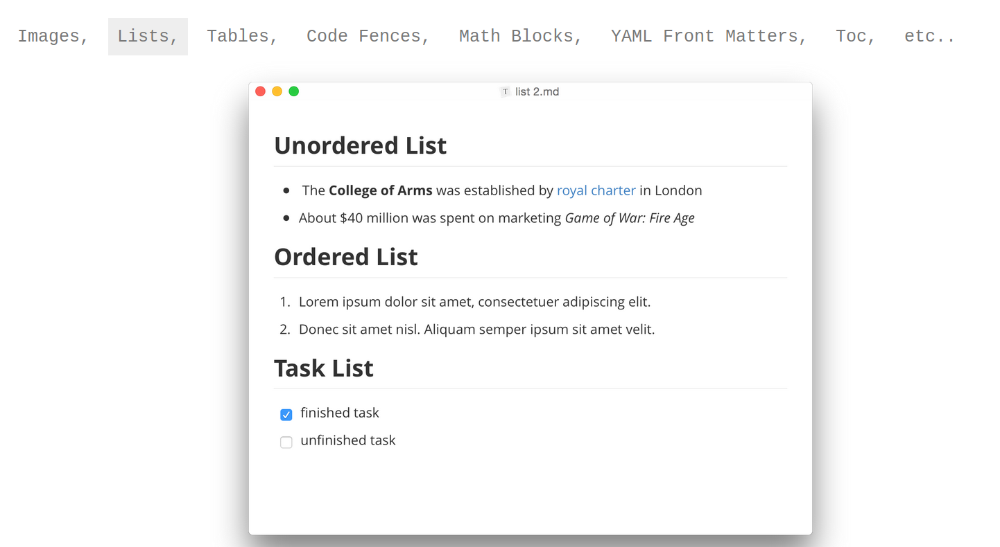
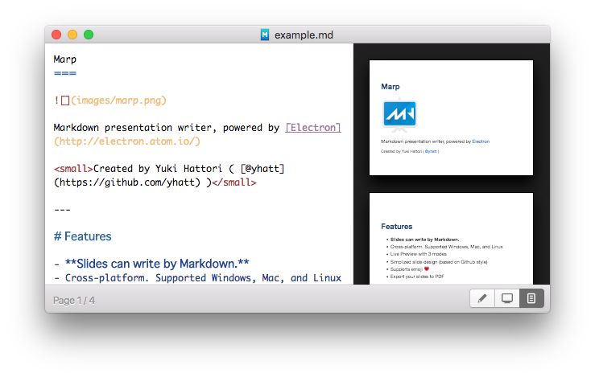

<!--
page_number: true
footer: GouTP @ SCEE |  Date: 23 Feb 2017  |  By: Lilian Besson  | About: Markdown & MediaWiki
-->

# GouTP @ SCEE

- *About:*
  Markdown: concept, syntax, tools
  Wiki & MediaWiki

- *Date:*
  23 Feb 2017

- *Who:*
  Lilian Besson
  ==`lilian.besson@supelec`==

---
# Outline
0. Intro: markup languages

1. Markdown
   - Syntax, examples
   - Experiment with *Markdown* :boom: !
   - 2 tools: demo of *Typora* and *Marp*
   - Pro tool : `pandoc` (another GouTP)

2. MediaWiki
   - For Wikipedia, and our internal SCEE Wiki

---
# Intro: why using markup languages?
#### Facts
- LaTeX and HTML can be painful to write manually :cry:
- Hard to read and parse for a human, and need a learning time

#### Solution ?
- Use a **markup language as simple as possible** :smiley:
- For many use, a lightweight markup language is enough:
  1. write *simple text* with light markup
  2. *convert* the text to PDF, LaTeX, HTML etc.
- Example: *Wikipedia* pages are not written in HTML ...

---
# 1. Markdown
 

> Close to the "natural" syntax we use in emails :e-mail:

- Emphasis: `*italic*`, `**bold**`, `~~striked~~`
- Lists: unumbered with `- item`, numbered with `1. item`
- Titles: `# Title 1`, `## Heading 2`, `### Heading 3` etc
- Links: `[text](address)` and image: ``
- Quote: like emails, `> quote ...`

---
# Example of Markdown output
## Heading 2
- Emphasis: *italic*, **bold**, ~~striked~~
- Lists, one item by line,:
  1. unnumbered with `- item`
  2. numbered with `1. item`

### Heading 3
- Links: [commonmark.org](http://commonmark.org)
- and image: 
> Quote: like emails, `> quote ...`

---
# Markdown tutorial
> No official reference for the syntax, but the best reference is [CommonMark (`CommonMark.org`)](http://commonmark.org/)

- Markup reference: [`CommonMark.org/help`](http://commonmark.org/help/) :information_desk_person:

- 5 minutes tutorial: [`CommonMark.org/help/tutorial`](http://commonmark.org/help/)
   :computer: :keyboard: $\longrightarrow$ **Let's do it now!**

> There is plenty of syntax extensions: for tables, footnotes, etc

---
# *Demo time:* Typora for *notes*
- Markdown *document* writer:
  [`typora.io`](https://typora.io)
  

---
# *Demo time:* Marp for *slides*

- Markdown *presentation* writer, free and open-source:
  [`yhatt.github.io/marp`](https://yhatt.github.io/marp/)
  

---

# *Marp:* Features

- Free and open-source
- **Slides are written in pure Markdown.**
- *Cross-platform*. Supports Windows, Mac, and Linux
- *Live Preview* with 3 modes
- Slide themes and custom background images
- Supports emoji :heart:
- Render maths in your slides:
  $$\mathrm{e}^{i \pi} = -1$$
- Export your slides to PDF

---
# 2. MediaWiki
- A Wiki tool, free and open-source, powering Wikipedia :earth_americas:
  $\longrightarrow$ [mediawiki.org](https://www.mediawiki.org/)
- Syntax very close to Markdown, only small differences

Used internally @ SCEE for our MediaWiki: *demo time*
[MediaWiki on WS1](http://172.16.3.26) (→ `T581001`, IP: `172.16.3.26`)

- Log in, edit a page, save it
  :computer: :keyboard: $\longrightarrow$ **Let's try it now!**

---
# Conclusion :candy:
- I hope you learned how to use **Markdown** & **MediaWiki**
- Now... use it ! :smile:
- Try to edit our [SCEE MediaWiki](http://172.16.3.26), if you want to add content :mag:

- If you are curious about a more complete use of Markdown, try to practice with it, and wait for next GouTP on **Advanced Markdown with `pandoc`** !

> *Thanks for coming!* :wave:
