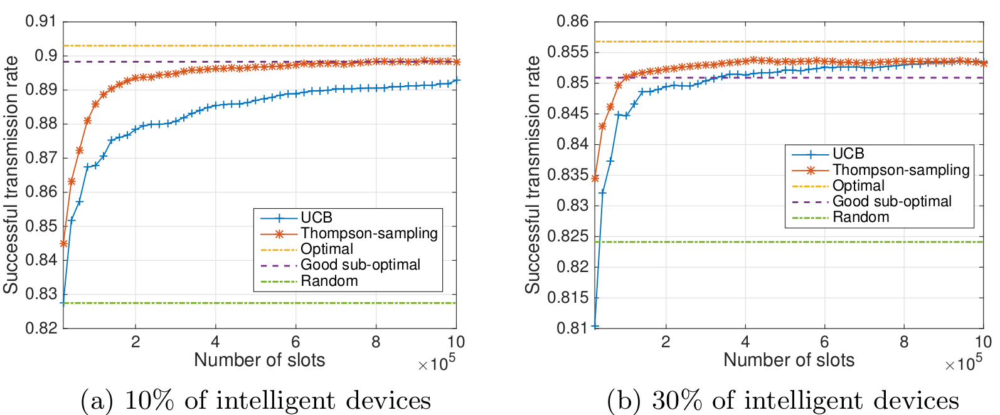
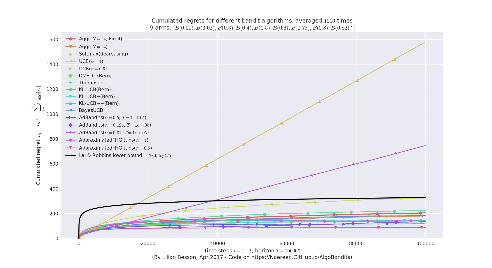

# Comité de Suivi Individuel du Doctorant
- Doctorant : Lilian Besson
- Titre de la thèse :
  *"Apprentissage statistique séquentiel pour la radio cognitive multi-joueurs"*
- Dates : 1er octobre 2016 à septembre 2019
- Encadrement :
    + Directeur de thèse : & **Christophe Moy** & à Rennes
    + Co-encadrante : & **Émilie Kaufmann** & à Lille

- Comité de suivi : **Patrick Maillé** & **Rémi Gribonval**
  Merci !

----

# Présentation personnelle

## Rapidement, je suis...
- Français, 23 ans, je viens des Hautes-Alpes (Briançon),
- Normalien de l'ENS Cachan (2011-2016), diplômé en *mathématiques* et *informatique*
  (agrégation en 2014, master MVA en 2016).

## Avant et maintenant...
- *Avant* : stages de recherche en 2012, 2013, et 2016, un an d'enseignement en 2014-2015,
- *En thèse* depuis octobre, basé à Rennes, avec un financement ministériel ("contrat doctoral spécifique normalien"),
- Passionné par l'enseignement, je souhaite *enseigner* en France en classes préparatoires après ma thèse plutôt que de rester en recherche.

----

# Contexte et sujet

## Historique de l'équipe SCEE sur ce sujet
- Thèse de Wassim Jouini (2008-2012), *"Contribution to learning and decision making under uncertainty for Cognitive Radio"*,
- Thèse de Navikkumar Modi (2014-2017), *"Machine Learning and Statistical Decision Making for Green Radio"*,
- 10 ans d'expertise de l'équipe, notamment Christophe Moy, Yves Louët et Jacques Palicot,
- ==> suite des thèses de Wassim et Navikkumar.

## Contexte thématique
- Télécom radio et *radio intelligente* (*"cognitive radio"*),
- Réseaux plus efficaces, plus écologiques etc,
- Réseaux avec beaucoup d'objets connectés (*"Internet of Things"*, IoT),
- Apprentissage statistique séquentiel et par renforcement, problèmes et algorithmes de *bandit*, pour résoudre les problèmes d'optimisation combinatoire dans des contextes discrets en temps et fréquence.

----

# Double encadrement

Avec Émilie Kaufmann, CR au CNRS travaillant à Inria Lille (équipe SequeL, laboratoire CRIStAL) :

- 4 *visites* de Émilie à Rennes en 2016, 2 en mai 2017,

- 4 *visites* de Lilian à Lille depuis octobre (de 3 à 15 jours), et 3 semaines en juin,

- *Projets en commun* : Christophe et Émilie publient un *tutorial* à la conférence ICC'17 (Paris, fin mai), et Émilie siège dans le jury de thèse de Navikkumar Modi (mai),

- *Financements* : déplacements pris en charge en 2016 avec les projets ANR "SoGreen" (Rennes) et "BADASS" (Lille), et depuis mars avec un financement PEPS "BIO" du CNRS obtenu par Émilie et moi (pour 2017).

----

# Mon sujet
- *"Apprentissage statistique séquentiel pour la radio cognitive multi-joueurs"*
- Buts :
    + continuer l'étude théorique des algorithmes étudiés et des difficultés intrinsèques des problèmes considérés,
    + étendre ces travaux à différents modèles dans le cas multi-joueurs, et grand nombre d'objets (IoT).
- Applications :
    + utiliser dynamiquement des zones vacantes du spectre radio,
    + insérer plus d'objets dans un réseau pré-existant,
    + garantir l'optimalité des solutions proposées, etc.

----

# Un problème : *Accès Opportuniste au Spectre*

L'*Accès Opportuniste au Spectre* (*OSA*) consiste en :

- Il y a K >= 1 canaux radio (bandes de fréquence) dans un domaine licencié, avec un temps discret synchronisé (temps et fréquence *discrets*),
- des utilisateurs, dits *primaires* (PU), paient pour utiliser les canaux, mais n'occupent pas densément le spectre,
- un autre utilisateur, dit *secondaire* (SU) veut communiquer, en accédant au canal le moins occupé,
- mais il ne doit pas déranger les PU, et il peut écouter sur *un seul* canal au début de chaque temps discret, et ne fait rien si le canal est occupé.
- Ce trafic ambiant est modélisé par des distributions, par exemple de Bernoulli B(µ_1),...,B(µ_K) (µ_k moyenne d'occupation du canal k), en supposant les canaux *i.i.d.*,
  (Les PUs sont supposés *stochastiques* et *stationnaires*)
- Bien-sûr, le SU ne connaît pas la répartition des PU a priori,
- ==> le SU doit trouver le canal le moins occupé, *i.e.* *apprendre* les paramètres µ_k sous-jacents, en utilisant les échantillons aléatoires qu'il observe (= *récompense*).

> C'est un problème de **décision discrète**, séquentiel (une décision après l'autre), et avec informations partielles, qui correspond à un **problème de bandit**.

----

# Premier algorithme pour l'OSA : UCB1

L'algorithme UCB (*Upper Confidence Bounds*), dans sa plus simple version (UCB1, [Auer et al. 2002]) fonctionne comme ça :

- Le SU garde en mémoire le nombre de communications t, et X_k(t) et T_k(t) deux variables, pour chaque canal 1 <= k <= K,
    + T_k(t) = nombre d'écoute au canal (tentative d'accès),
    + X_k(t) = nombre de fois que le canal k a été détecté disponible = somme de T_k(t) échantillons venant de B(µ_k).

- L'utilisateur secondaire (SU) commence par essayer une fois chaque canal (T_k(T) = 1), dans un ordre arbitraire.
- Pour t >= K, à chaque étape, un *indice* numérique est calculé :
   $$ g_k(t) := \underbrace{\frac{X_k(t)}{N_k(t)}}_{\text{Moyenne empirique}\; \widehat{µ_k}(t)} + \underbrace{\sqrt{\alpha \frac{\log(t)}{N_k(t)}}}_{\text{"Upper Confidence Bound"}\;}$$
- Le canal maximisant cet indice est choisi (A(t) = argmax_k g_k(t)), et s'il est libre, le SU transmet,
- T_k(t), X_k(t) et t sont mis à jour.

- alpha > 0 est un paramètre, contrôlant le compromis entre *exploration* et *exploitation*.
- alpha > 1/2 apporte des garanties théorique sur l'efficacité
  (regret $R_T^{UCB1} = O(log T)$ asymptotiquement).

----

# Second algorithme : Thompson Sampling

"*Thompson Sampling*" est une approche Bayésienne :

- Le SU suppose que les µ_1,...,µ_k ont été tiré selon un processus aléatoire, modélisé par un a posteriori ("*posterior*"), e.g., une distribution Binomiale Bin(a_k(t),b_k(t)) qui évolue à chaque étape.

- D'abord un a priori uniforme : a_k(0),b_k(0) = 1 ("*flat prior*"),

- Ensuite, à chaque étape t, le SU tire *un* échantillon de chaque distribution a posteriori, et le canal A(t) ayant l'échantillon le plus grand est utilisé (= le plus probable d'être libre pour communiquer) :
     A(t) = argmax_k i_k(t) avec i_k(t) ~ Bin(a_k(t), b_k(t)).
- Selon la détection des PU sur le canal k = A(t), l'a posteriori est mis à jour :
    + a_k(t) = 1 + X_k(t) : nombre de transmissions réussies,
    + et b_k(t) = 1 + N_k(t) - X_k(t) : nombre de transmissions échouées.
- ==> moyenne empirique estimée :
  \tilde{µ_k}(t) = a_k(t) / (a_k(t) + b_k(t)) = (1 + X_k(t))(2 + N_k(t)) ~ X_k(t) / N_k(t) = \hat{µ_k}(t).

> Un algorithme historique [Thompson, 1935], très simple, mais qui marche très bien (prouvé optimal pour différent types de problème).

----

# Quelques objectifs à partir de là

## Passer au cas "*multi-joueurs*" :
- Des *objets* "intelligents" accèdent au *même* réseau, en *même* temps (discret ou non),
- aucun contrôle central (==> *décentralisé*),
- aucune communication directe entre objets,
- ils doivent trouver une situation qui convient à tous.

## Passer à des réseaux de type "*IoT*" :
- Des protocoles plus complexes (en temps continu, avec des récompenses différentes à chaque utilisateur etc),
- des modèles différents (plus de PU, plus de détection mais un "Ack", etc),
- passer à un grand nombre d'objets,
- de nouvelles contraintes (batterie, faible mémoire etc).

----

# Recherches en cours et collaborations (1/2)

## Avec Christophe Moy (aspects radio intelligente)
Notamment afin de :

- Poser le bon modèle pour les réseaux IoT,
- Vérifier en pratique (simulation et implémentation réelle) l'intérêt des algorithmes d'apprentissage (type bandit) dans le modèle classique OSA et dans de nouveau modèle multi-joueurs et IoT.

## Avec Émilie Kaufmann (aspects théoriques)
- Analyser les performances de différents algorithmes mono- et multi-joueurs dans différents modèles (*e.g.*, preuves de bornes supérieures sur le *regret*),
- et les difficultés intrinsèques de ces problèmes (bornes inf).

----

# Regret d'un algorithme de bandit

Le *regret* $R_T^A$ sert à quantifier la perte en *récompense*, après T étapes, entre la meilleure solution et l'algorithme A.

## Exemple de regret
Par exemple, en \emph{OSA} classique, si les bras sont ordonnés par leur disponibilité, µ_1 > µ_2 >= ... >= µ_K, on se compare au meilleur bras µ_1, et alors :
  R_T^{UCB1} := µ_1 × T - \sum_{t=1}^T r_{A(t)}(t),
où la récompense du canal k est tirée selon sa loi : r_k(t) ~ B(µ_k).

On veut montrer des bornes :

- *inférieure* : pour n'importe quel problème µ d'un certain type, il existe une constante telle que **pour tout algorithme** A
  lim inf_{T \to +oo} R_T^A / log(T) >= C_{inf}^A(K, µ, ...).
- *supérieure* : pour n'importe quel problème µ d'un certain type, et pour **cet algorithme**, il existe une constante telle que
  lim sup_{T \to +oo} R_T^A / log(T) <= C_{sup}^A(K, µ, ...).
- A est dit *optimal* pour cette famille de problème si $C_{inf}^A(K, µ, ...) = C_{sup}^A(K, µ, ...)$.

----

# *OSA* multi-joueurs

- Il y a K canaux et maintenant 1 <= M <= K utilisateurs dynamiques (*SU*),
  et toujours de *PU* (µ_1,...,µ_K),
- Chaque SU cherche à exploiter les canaux les plus libres,
- Mais ils doivent chercher une configuration *orthogonale* : si deux (ou plus) utilisateurs communiquent sur un même canal à un même instant, il y a *collision* (aucun ne communique).

## Protocole
À chaque t, chaque SU 1 <= j <= M doit :

- Choisir quel canal écouter, et si k est libre, transmettre,
- Si seul sur k, il reçoit un *Ack*, sinon, il sait qu'il y a collision.

## Objectifs
Sans contrôle centralisé, ni communication entre eux :

- Les M SU doivent apprendre les M meilleurs canaux,
- Et s'orthogonaliser le plus vite possible (plus de collision).

## Exemple : l'algorithme rho^{Rand}[UCB1]
1. Utiliser UCB1 pour apprendre les M meilleurs canaux.
2. Le SU j vise le r_j ième meilleur canal (*rang* 1 <= r_j <= M)
   et plus le meilleur canal. Au début, r_j = 1.
3. Après collision, les SU tirent un nouveau rang aléatoire r_j ~ U(1,...,M).

----

# Regret pour l'*OSA* multi-joueurs ?
- On généralise le regret aux problèmes multi-joueurs (décentralisés ou non).
- Avec quelques hypothèses, le regret de n'importe quel algorithme décentralisé est au moins (en "lim inf")
  M × ( \sum_{M + 1 <= k <= K} (µ_M - µ_k) / KL(µ_k, µ_M) ) × log(T).
- On arrive à montrer ici que rho^{Rand} avec un algorithme de bandit classique optimal, a un regret en O(log T) ("lim sup").
- Mais pas encore la bonne constante...
  ("*order optimal*" mais pas encore optimal)
- Difficile de bien contrôler le nombre de collisions.

----

# Recherches en cours et collaborations (2/2)

## Avec Rémi Bonnefoi (autre doctorant dans l'équipe SCEE)
Nous étudions l'efficacité et la robustesse de l'utilisation d'algorithmes de bandits utilisés par de nombreux objets "intelligents" dans un réseau de type IoT.

- S'il n'y a plus de PU mais que des SU (intelligent ou non),
  l'apprentissage est-il toujours efficace ?
- Est-il encore utile si tous les objets sont intelligents ?
- Est-il optimal, et à quelle vitesse converge-t-il ?
- etc.

----

# Apprentissage dans un réseau *IoT*

- Il y a toujours K canaux et 1 <= M objets,
- Ils cherchent tous à accéder au réseau selon les canaux les plus libres (==> remplir le réseau au maximum),
- Mais ils ne communiquent pas à chaque instant : chaque objet envoie peu de messages ("*sparse in time*"),
- Ils émettent selon un processus discret de Bernoulli :
  l'objet j transmet au temps t avec probabilité p0
  (*e.g.*, p0 = 0.001 s'il y a K=10 canaux et M=5000 objets),
- Il y a toujours risque de collision, entre objets, mais il n'y a plus de PU (pas de détection),
- Chaque objet utilise un algorithme d'apprentissage, mis à jour uniquement quand le processus d'émission est actif.

----

# Exemple : UCB1 et TS pour l'*IoT*

----

# Autres pistes de recherche ?

## Agrégation d'algorithmes de bandit

- Idée : exécuter plusieurs algorithmes similaires en *parallèle*, sur le même problème, et *les faire voter* à chaque décision dans l'espoir d'être plus efficace (et plus robuste),
- But : être *plus efficace* face à des problèmes différents, pour être *plus robuste* en situation réelle (*e.g.*, où on ne sait pas un modèle de Bernoulli ou Gaussien est approprié).

- Déjà étudié par quelques chercheurs, des algorithmes existent (**Exp4** en 2002, Exp3M et ComBand à NIPS 2015 et 2016, variantes de *"Online Gradient Mirror Descent"*),
- j'ai redécouvert l'algorithme Exp4 (et une autre variante) en décembre,
- mais je ne pense pas continuer longtemps dans cette direction : le problème semble (quasiment) résolu par les derniers travaux publié en décembre 2016...

----

# Exemple : agrégation d'algorithmes

----

# Objectifs de publication pour 2017 et 2018

1. Un *rapport de recherche* (arXiv/HAL) résumant le travail de bibliographie, d'implémentation et d'expérimentation réalisé pour mon environnement de simulation (presque terminé) et la publication en libre accès du code (pour l'instant, la documentation est déjà disponible).
  cf. http://banditslilian.gforge.inria.fr/

2. Un *article* envoyé à la conférence européenne **CrownCom** 2017 (septembre, Lisbonne, Portugal) avec Rémi Bonnefoi, suivi d'une version journal étendue (déjà terminée !).

3. Un *article* "maths et théorie" avec Émilie Kaufmann, sur des résultats déjà obtenus et d'autres à terminer, avec de nouvelles bornes inférieures et de meilleures bornes supérieures pour l'algorithme rho^{Rand} (OSA multi-joueur décentralisé). *Objectif* : **ICML** ou **COLT** 2018.

4. Un *article* "télécomslides" exposant l'intérêt de l'agrégation d'algorithmes de bandit pour des problèmes de radio cognitive. *Objectif* : fin 2017.

5. J'aimerai aussi faire un *survey* sur "tous" les algorithmes de bandits, en les écrivant tous avec la même structure (initialisation, choix, récompense, etc), basé sur mon environnement de simulation. Il y en a une douzaine pour l'aspect mono-joueur (et beaucoup de variantes), et une quinzaine pour l'aspect multi-joueurs, et je les ai tous implémenté et documenté sous une même organisation logique (approche objet).

----

# Autres activités

Mais aussi...

----

# Autres activités (1/4) : Formations

Pour la thèse, il faut suivre des formations :

- Scientifiques :
    + Cours de "Radio Logicielle" par Jacques Palicot, à CentraleSupélec en mai-juin 2017 (12h),
    + Organisation et présentation à la Journée des Doctorants de l'IETR en juin,
    + (normalement) Présentation à la conférence CrownCom en septembre 2017.

- Générales ou professionnelles :
    + À l'Université de Rennes 1, 9h en janvier et février 2017,
    + À l'Université de Lille 1, 2h en mars 2017.

> Encore beaucoup à suivre, l'an prochain...

----

# Autres activités (2/4) : Enseignements

Par passion et pour valider mon stage d'agrégation, j'enseigne :

- 24h/an de TD/TP à l'*ENSAI*, en informatique théorique (cf. http://perso.crans.org/besson/ensai-2016/), pour le cours "Algorithmique et Calculabilité" de David Cachera, au niveau L3 (1ère année d'école d'ingénieur).

- 40h/an de TD/oraux à l'*ENS de Rennes*, en informatique théorique, pour la classe de préparation à l'agrégation de maths (cf. http://perso.crans.org/besson/agreg-2016/) (option info), au niveau M2 (3ème année d'ENS). 15 séances d'entraînement aux oraux d'informatique (leçons et modélisation) et oraux blancs.

> J'ai obtenu la même mission pour les deux prochaines années !
>
> *Note :* je souhaite enseigner en prépa' après ma thèse.

----

# Autres activités (3/4) : Projets étudiant

J'aide quelques élèves pour des projets étudiants, à CentraleSupélec, surtout pour :

- comprendre et implémenter des algorithmes (`C++`, Python),
- utiliser nos machines GNU/Linux et le logiciel GNU Radio Companion (pilotage de carte radio "USRP" par ordinateur),
- et sur l'aspect "bidouillage" en général.

> Rien d'officiel ni de trop coûteux en temps pour l'instant.
> J'espère en faire autant l'an prochain, selon ce qu'on propose.

## Un projet long, depuis octobre

- Clément & Théo : afin de produire un générateur "maison" de "trafic ambiant" aléatoire, de type IoT, avec des cartes USRP et GNU Radio (programmation en Python et `C++`). Émission et réception réaliste en temps réel, avec une modulation *QPSK*.

## Des projets courts, en janvier et février (8 semaines)

- Bruno & Jérôme & Qingsong : sur le standard IoT *HomeEasy* (pour des "ampoules connectées"), programmation en Python et GNU Radio pour l'émission et la réception,
- Pierre, Matthieu : un Raspberry Pi avec une webcam permet de suivre le niveau de café d'une cafetière, et de réagir lorsqu'elle est vide, pleine etc (programmation Python, traitement d'image embarqué et efficace, communication web).

## Nouveaux projets courts en mai/juin

- Antoine & Pierre-Jean : implémentation d'algorithmes de bandit (UCB1, Thompson Sampling etc) en Python dans GNU Radio, pour ajouter un utilisateur secondaire s'insérant dynamiquement dans le trafic généré par un projet précédent,
- Flora & Matthias & Quentin : implémentation des mêmes algorithmes en `C++` sur des cartes LoRa programmables, pour s'insérer dans un réseau implémentant le standard *LoRa* (modulation/démodulation et trafic ambiant déjà réalisés par un autre projet).

----

# Autres activités variées (4/4)

- Administration système pour nos machines de calcul dans l'équipe SCEE (3 "*workstations*", 15 utilisateurs).

- Membre du bureau de l'*Association des Doctorants et Docteurs de l'IETR* (cf. http://ADDI.Asso.INSA-Rennes.fr/) (**ADDI**) depuis février. Une douzaine d'activités prévues dans l'année (dont la Journée des Doctorants en juillet, la galette des rois de l'IETR en janvier etc).

- Programmeur passionné, j'essaie de contribuer régulièrement à des projets personnels (cf. https://Bitbucket.org/lbesson et https://GitHub.com/Naereen) et des grands projets *open-source*, surtout en Bash, OCaml et Python (*e.g.*, bibliothèques `matplotlib`, `jupyter`, `ipython` etc).

----

# Conclusion & Perspectives

----

# Conclusion & Perspectives

## Une première année de thèse déjà bien avancée, avec :

- De la *recherche*, à CentraleSupélec Rennes et Inria Lille, avec mes encadrants (Christophe Moy, Émilie Kaufmann) et un autre doctorant (Rémi Bonnefoi),
- un premier *article* terminé,
- d'autres *objectifs* bientôt,
- des *visites* régulières à Lille.

## Mais aussi :

- De l'*enseignement*, à l'ENS de Rennes et l'ENSAI,
- des *projets étudiants*, à CentraleSupélec Rennes,
- des *formations*, scientifiques et générales à Rennes et à Lille,
- quelques (toutes petites) responsabilités dans l'équipe SCEE et à l'IETR,
- et quelques *conférences* prévues à l'étranger (COLT à Amsterdam en juillet, WriteTheDocs à Prague et CrownCom à Lisbonne en septembre).

----

# Merci

À peine 7 mois de thèse.

Et beaucoup de choses à faire pour la suite...

> *Merci !*

> *À l'année prochaine.*
