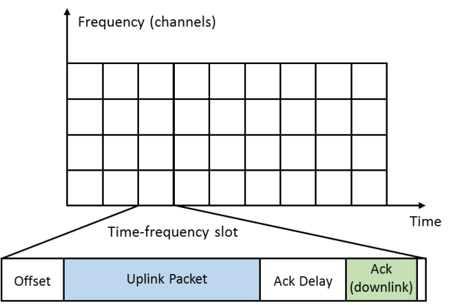
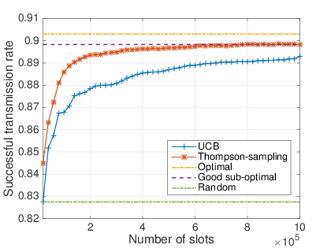
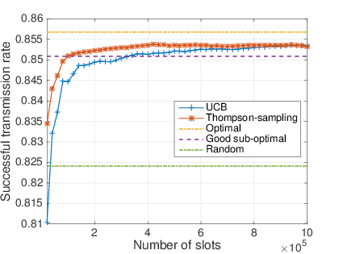
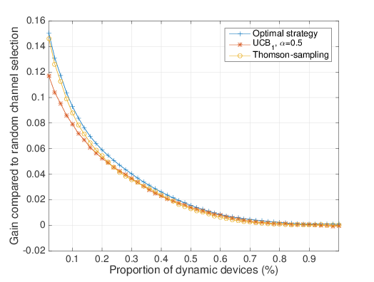
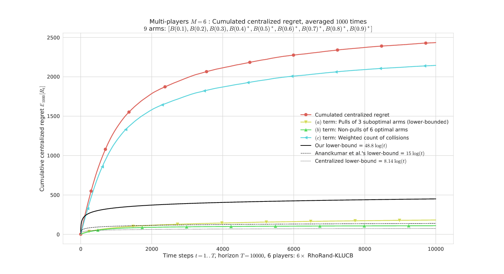

---
author:
  __Lilian Besson__ *Advised by Christophe Moy Émilie Kaufmann
title: MAB Learning in IoT Networks
subtitle: Decentralized Multi-Player Multi-Arm Bandits
institute:
  PhD Student,
  Team SCEE, IETR, CentraleSupélec, Rennes
  & Team SequeL, CRIStAL, Inria, Lille
date: SCEE Seminar  -  23 November 2017
lang: english
---

# Motivation: *Internet of Things* problem
A *lot* of IoT devices want to access to a single base station.

- Insert them in a possibly **crowded wireless network**.
- With a protocol **slotted in both time and frequency**.
- Each device has a **low duty cycle** (a few messages per day).

## Goal
- Maintain a **good Quality of Service**.
- **Without** centralized supervision!

## How?
- Use **learning algorithms**: devices will learn on which frequency they should talk!

----
# Outline and references
1. Introduction and motivation
2. Model and hypotheses
3. Baseline algorithms : to compare against naive and efficient centralized approaches
4. Two Multi-Armed Bandit algorithms : UCB, TS
5. Experimental results
6. An easier model with theoretical results
7. Perspectives and future works

Main references are my recent articles (on HAL):

- [*Multi-Armed Bandit Learning in IoT Networks and non-stationary settings*, Bonnefoi, Besson, Moy, Kaufmann, Palicot. CrownCom 2017](https://hal.inria.fr/hal-01575419),
- [*Multi-Player Bandits Models Revisited*, Besson, Kaufmann. arXiv:1711.02317](https://hal.inria.fr/hal-01629733),

----

# First model
- Discrete time t >= 1 and K radio channels (*e.g.*, 10) (*known*)

- D **dynamic** devices try to access the network *independently*
- S=S1+...+S_K **static** devices occupy the network : Si in each channel (*unknown*)

----
# Hypotheses
## Emission model
- Each device has the same *low* emission probability: each step, each device sends a packet with probability p. (this gives a duty cycle proportional to 1/p)

## Background traffic
- Each static device uses only one channel.
- Their repartition is fixed in time.

> → Background traffic, bothering the dynamic devices!

## Dynamic radio reconfiguration
- Each **dynamic device decides the channel it uses to send every packet**.
- It has memory and computational capacity to implement simple **decision algorithm**.

## Problem
- *Goal* : *maximize packet loss ratio* (= number of received `Ack`) in a *finite-space discrete-time Decision Making Problem*.
- *Solution ?* **Multi-Armed Bandit algorithms**, **decentralized** and used **independently** by each device.

----

# A naive strategy : uniformly random access
- **Uniformly random access**: dynamic devices choose uniformly their channel in the pull of K channels.
- Natural strategy, dead simple to implement.

- Simple analysis, in term of **successful transmission probability** (for every message from dynamic devices) : P(success|sent) = sum_{i=1...K} (1 - p/K)^(D-1) × (1-p)^Si × (1/K)

## No learning
- Works fine only if all channels are similarly occupied, but **it cannot learn** to exploit the best (more free) channels.

----
# Optimal centralized strategy
- If an oracle can decide to affect $D_i$ dynamic devices to channel i, the **successful transmission probability** is: P(success|sent) = sum_{i=1...K} (1 - p)^(Di - 1) × (1 - p)^Si × Di/D.

- The oracle has to solve this **optimization problem**:
    + argmax_{D1,...,DK} sum_i^K Di (1-p)^(Si + Di - 1),
    + such that sum_i^K Di = D,
    + and Di >= 0 for all 1 <= i <= K.

- We solved this quasi-convex optimization problem with *Lagrange multipliers*, only numerically.
- → Very good performance, maximizing the transmission rate of all the D dynamic devices

## But unrealistic
But **not achievable in practice**: no centralized control and no oracle!

## Now let see *realistic decentralized approaches*
- → Machine Learning ?
    - → Reinforcement Learning ?
        - → *Multi-Armed Bandit* !

## Greedy approximation
- Still very efficient
- More reasonable
- But still unachievable: this is a *baseline*

----

# Multi-Armed Bandit formulation
A dynamic device tries to collect *rewards* when transmitting :

- it transmits following a Bernoulli process (probability p of transmitting at each time step t),
- chooses a channel A(tau) in {1,...,K},
    + if `Ack` (no collision) → reward r(A(tau)) = 1,
    + if collision (no `Ack`) → reward r(A(tau)) = 0.

## Reinforcement Learning interpretation
Maximize transmission rate = **maximize cumulated rewards**
max on algorithm A of sum_{tau=1}^{horizon} r(A(tau)).

----
# Upper Confidence Bound algorithm (UCB1)
Dynamic device keep tau number of sent packets, Tk(tau) selections of channel k, Xk(tau) successful transmission in channel k.

1. For the first K steps (tau=1,...,K), try each channel *once*.
2. Then for the next steps t > K :
    - Compute the index gk(tau) := Xk(tau)/Nk(tau) + sqrt(\log(tau) / (2 Nk(tau)),
    - Choose channel A(tau) = argmax gk(tau)$,
    - Update Tk(tau+1) and Xk(tau+1).

> References: [Lai & Robbins, 1985], [Auer et al, 2002], [Bubeck & Cesa-Bianchi, 2012].

----
# Thompson Sampling : Bayesian approach
A dynamic device assumes a stochastic hypothesis on the background traffic, modeled as Bernoulli distributions.

- Rewards rk(tau) are assumed to be *i.i.d.* samples from a Bernoulli distribution Bern(mu_k).

- A **binomial Bayesian posterior** is kept on the mean availability mu_k : Bin(1 + Xk(tau), 1 + Nk(tau) - Xk(tau)).
- Starts with a *uniform prior* : Bin(1, 1) ~ U([0,1]).

1. Each step tau >= 1, draw a sample from each posterior ik(tau) ~ Bin(ak(tau), bk(tau)),
2. Choose channel A(tau) = argmax ik(tau)$,
3. Update the posterior after receiving `Ack` or if collision.

> References: [Thompson, 1933], [Kaufmann et al, 2012].

----

# Experimental setting

## Simulation parameters
- K = 10 channels,
- S + D = 10000 devices **in total**.
  Proportion of dynamic devices D/(S+D) varies,
- p = 10^-3 probability of emission, for all devices,
- Horizon = 10^6 time slots,  (about 100 messages by device)
- Various settings for (S1,...,SK) static devices repartition.

## What do we show  (for static Si)
- After a short learning time, MAB algorithms are almost as efficient as the oracle solution !
- Never worse than the naive solution.
- Thompson sampling is more efficient than UCB.
- Stationary alg. outperform adversarial ones (UCB >> Exp3).

----
# 10% of dynamic devices

----
# 30% of dynamic devices

----
# Dependence on D/(S+D)

----
# Section 6

A brief presentation of a different approach...

Theoretical results for an easier model

----
# An easier model

## Easy case
- M <= K dynamic devices **always communicating** (p=1).
- Still interesting: many mathematical and experimental results!

## Two variants
- *With sensing*: Device first senses for presence of Primary Users (background traffic), then use `Ack` to detect collisions. Model the "classical" Opportunistic Spectrum Access problem. Not exactly suited for IoT networks like LoRa or SigFox, can model ZigBee, and can be analyzed mathematically... (*cf* Wassim's and Navik's theses, 2012, 2017)
- *Without sensing*: like our IoT model but smaller scale. Still very hard to analyze mathematically.

----
# Notations for this second model

## Notations
- K channels, modeled as Bernoulli (0/1) distributions of mean mu_k, is a background traffic from *Primary Users*,
- M devices use channel Aj(t) in {1,...,K} at each time step,
- Reward: rj(t) := Y(Aj(t),t) 1(Cj(t)) = 1(uplink & `Ack`)
    + with sensing information Y(k,t) ~ Bern(mu_k),
    + collision for device j, Cj(t) = 1(*alone on arm Aj(t)*).

## Goal : *decentralized* reinforcement learning optimization!
- Each player wants to **maximize its cumulated reward**,
- With no central control, and no exchange of information,
- Only possible if : each player converges to one of the M best arms, orthogonally (without collisions)

----
# Centralized regret
## New measure of success
- Not the network throughput or collision probability,
- Now we study the **centralized regret**
  R_T(mu, M, rho) := sum_{k=1}^{M} mu_k^* T - Expectancy_mu [sum_{t=1}^T sum_{j=1}^M rj(t) ].

## Two directions of analysis
- Clearly R_T = O(T), but we want a sub-linear regret
- *What is the best possible performance of a decentralized algorithm in this setting?*
    → **Lower Bound** on regret for **any** algorithm !
- *Is this algorithm efficient in this setting?*
    → **Upper Bound** on regret for **one** algorithm !

----
# Asymptotic Lower Bound on regret

For any algorithm, decentralized or not, we have

R_T(mu, M, rho) = sum_{k in Mworst} (mu_M^* - mu_k) E_mu[Tk(T)] + sum_{k in Mbest} (mu_k - mu_M^*) E_mu[T-Tk(T)] + sum_{k=1}^{K} mu_k E_mu[C_k(T)].

## Small regret can be attained if...
1. Devices can quickly identify the bad arms M-worst, and not play them too much (*number of sub-optimal selections*),
2. Devices can quickly identify the best arms, and most surely play them (*number of optimal non-selections*),
3. Devices can use orthogonal channels (*number of collisions*).

## Lower-bounds
- The first term E_mu[Tk(T)],
  for sub-optimal arms selections, is lower-bounded,
  using technical information theory tools
  (Kullback-Leibler divergence, entropy),
- And we lower-bound collisions by... 0 : hard to do better!

## Theorem 1  [Besson & Kaufmann, 2017].
- For any uniformly efficient decentralized policy, and any non-degenerated problem mu,
- lim inf R_T(mu, M, rho) / log(T) >= M sum_{k in Mworst} (mu_M^* - mu_k) / kl(mu_k, mu_M^*).

> Where kl(x,y) := x log(x/y) + (1 - x) log((1-x)/(1-y))$ is the binary Kullback-Leibler divergence.

----

# Illustration of the Lower Bound on regret

----
# Algorithms for this easier model

## Building blocks : separate the two aspects
1. **MAB policy** to learn the best arms (use sensing Y(Aj(t),t),
2. **Orthogonalization scheme** to avoid collisions (use Cj(t)).

## Many different proposals for *decentralized* learning policies
- Recent: MEGA and MusicalChair, [Avner & Mannor, 2015], [Shamir et al, 2016]
- State-of-the-art: **RhoRand policy** and variants, [Anandkumar et al, 2011]
- **Our proposals**: [Besson & Kaufmann, 2017]
    + With sensing: **RandTopM** and **MCTopM** are sort of mixes between RhoRand and MusicalChair, using UCB indexes or more efficient index policy (KL-UCB),
    + Without sensing: Selfish use a UCB index directly on the reward rj(t) : like the first IoT model !

----

# Illustration of different algorithms

![Regret, M=6 players, K=9 arms, horizon T=5000, against 500 problems mu uniformly sampled in [0,1]^K. RhoRand < RandTopM < Selfish < MCTopM in most cases](alt/figures/MP__K9_M6_T5000_N500__4_algos/all_RegretCentralized____env1-1_8318947830261751207.png)

----
# Regret upper-bound for \MCTopM-KL-UCB

## Theorem 2  [Besson & Kaufmann, 2017].
If all M players use MCTopM with KL-UCB,
then for any non-degenerated problem mu,
there exists a problem dependent constant G(M,mu), such that the regret satisfies:
R_T(mu, M, rho) <= G(M,mu) \log(T) + o(log T).

## Remarks
- Hard to prove, we had to carefully design the MCTopM algorithm to conclude the proof,
- For the suboptimal selections, we *match our lower-bound* !
- We also *minimize the number of channel switching*: interesting as it costs energy,
- Not yet possible to know what is the best possible control of collisions...

----
# In this model
The Selfish decentralized approach = device don't use sensing, just learn on the receive acknowledgement,

- Like our first IoT model,
- It works fine in practice!
- Except... when it fails drastically!
- In small problems with M and K = 2 or 3, we found small probability of failures (*i.e.*, linear regret), and this prevents from having a generic upper-bound on regret for Selfish. Sadly...

----

# Illustration of failing cases for Selfish

![Regret for M=2 players, K=3 arms, horizon T=5000, 1000 repetitions and mu = [0.1, 0.5, 0.9]. Axis x is for regret (different scale for each), and Selfish have a small probability of failure (17 cases of R_T = Omega(T), out of 1000). The regret for the three other algorithms is very small for this ``easy'' problem.](alt/figures/MP__K3_M2_T5000_N1000__4_algos/all_HistogramsRegret____env1-1_5016720151160452442.png)

----

# Perspectives
## Theoretical results
- MAB algorithms have guarantees for *i.i.d. settings*,
- But here the collisions cancel the *i.i.d.* hypothesis,
- Not easy to obtain guarantees in this mixed setting (*i.i.d.* emissions process, "game theoretic" collisions).
- For OSA devices (always emitting), we obtained strong theoretical results,
- But harder for IoT devices with low duty-cycle...

## Real-world experimental validation ?
- Radio experiments will help to validate this. Hard !

----
# Other directions of future work
- *More realistic emission model*: maybe driven by number of packets in a whole day, instead of emission probability.

- Validate this on a *larger experimental scale*.

- Extend the theoretical analysis to the large-scale IoT model, first with sensing (*e.g.*, models ZigBee networks), then without sensing (*e.g.*, LoRaWAN networks).

- And also conclude the Multi-Player OSA analysis (remove hypothesis that objects know M, allow arrival/departure of objects, non-stationarity of background traffic etc)

----
# Conclusion
## We showed
- Simple Multi-Armed Bandit algorithms, used in a Selfish approach by IoT devices in a crowded network, help to quickly learn the best possible repartition of dynamic devices in a fully decentralized and automatic way,
- For devices with sensing, smarter algorithms can be designed, and analyze carefully.
- Empirically, even if the collisions break the *i.i.d* hypothesis, stationary MAB algorithms (UCB, TS, KL-UCB) outperform more generic algorithms (adversarial, like Exp3).

## But more work is still needed...
- **Theoretical guarantees** are still missing for the IoT model, and can be improved (slightly) for the OSA model.
- Maybe study **other emission models**.
- Implement this on **real-world radio devices** (*TestBed*).

## **Thanks!**
*Any question?*
