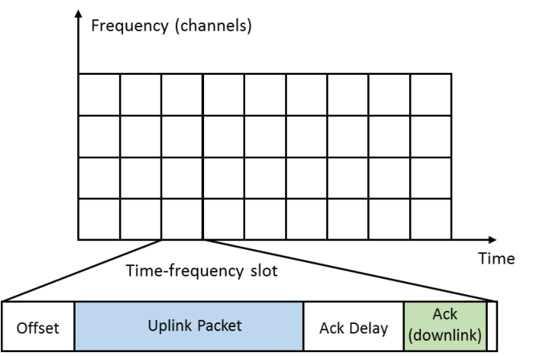
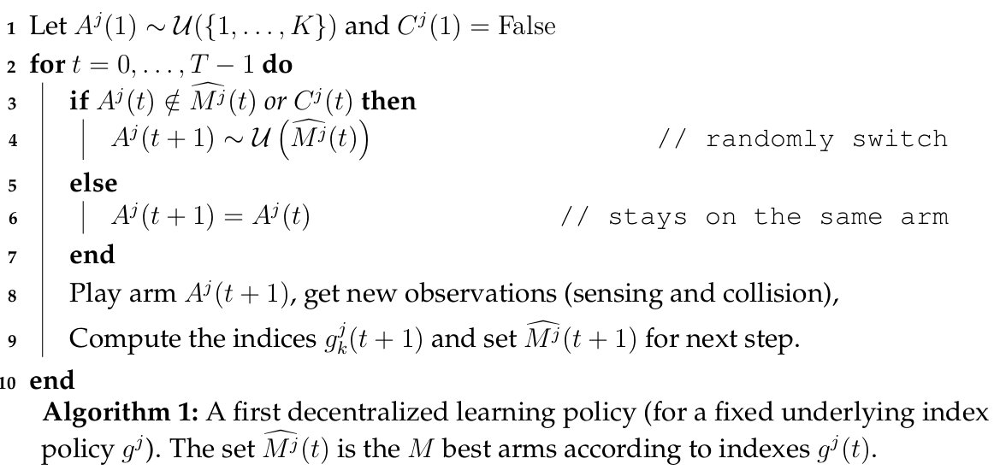
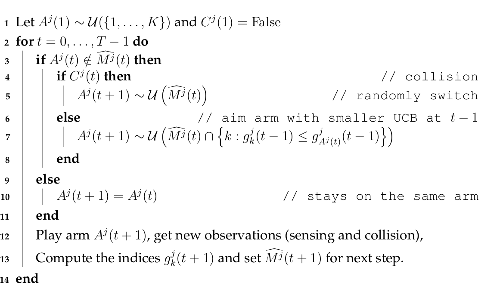
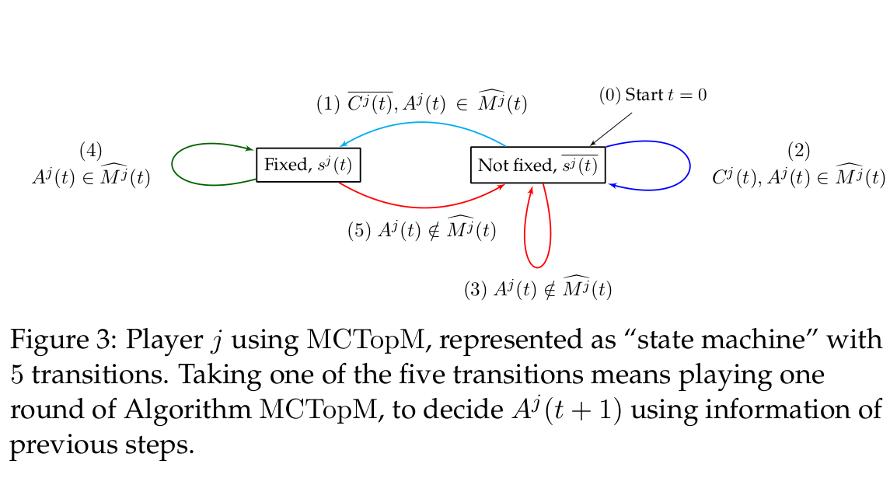
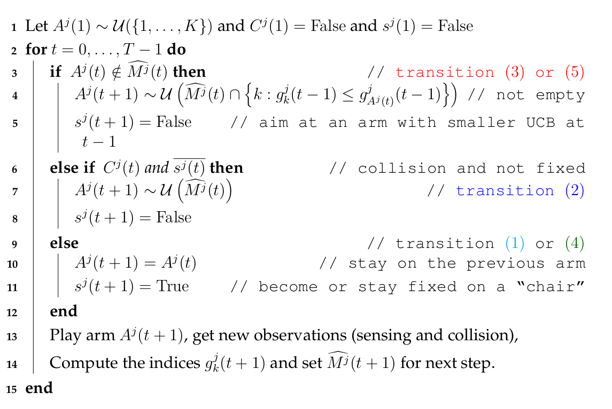
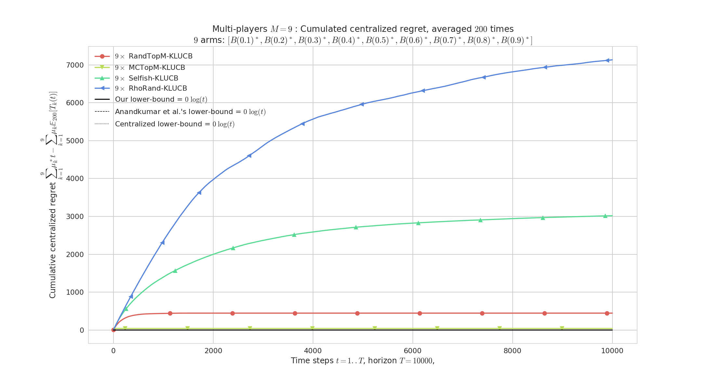
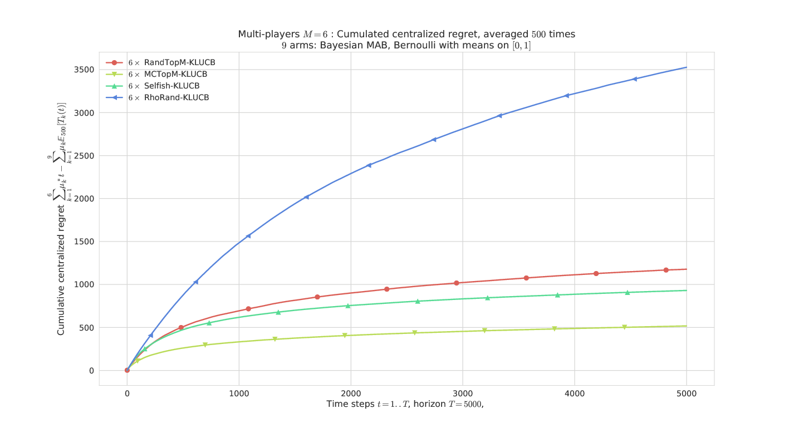
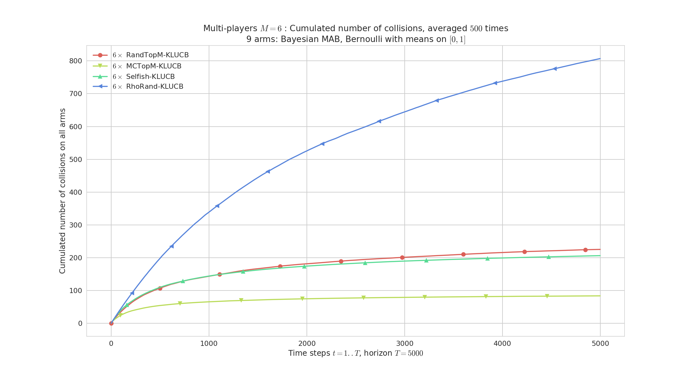
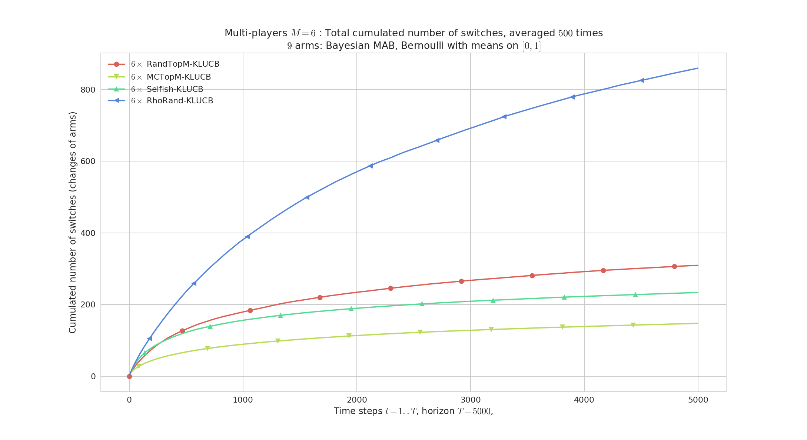
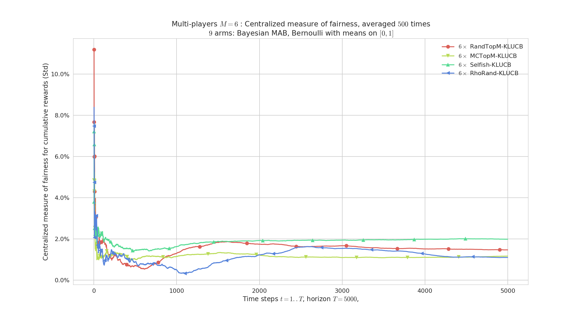

---
author:
  __Lilian Besson__ *Advised by Christophe Moy Émilie Kaufmann
title: Multi-Player Bandits Models Revisited
subtitle: Decentralized Multi-Player Multi-Arm Bandits
institute:
  PhD Student,
  Team SCEE, IETR, CentraleSupélec, Rennes
  & Team SequeL, CRIStAL, Inria, Lille
date: SequeL Seminar  -  22 December 2017
lang: english
---

# Motivation
We control some communicating devices,
they want to access to a single base station.

- Insert them in a **crowded wireless network**.
- With a protocol **slotted in both time and frequency**.

## Goal
- Maintain a **good Quality of Service**.
- **With no centralized control** as it costs network overhead.

## How?
- Devices can choose a different radio channel at each time
  → learn the best one with sequential algorithm!

----
# Outline and reference

1. Introduction
2. Our model: 3 different feedback levels
3. Decomposition and lower bound on regret
4. Quick reminder on single-player MAB algorithms
5. Two new multi-player decentralized algorithms
6. Upper bounds on regret for MCTopM
7. Experimental results
8. An heuristic (Selfish), and disappointing results
9. Conclusion

This is based on our latest article:

- "Multi-Player Bandits Models Revisited", Besson & Kaufmann. [arXiv:1711.02317](https://arXiv.org/abs/1711.02317)

----

# Our model
- K radio channels (*e.g.*, 10) (*known*)
- Discrete and synchronized time t >= 1. Every time frame t is:

## Dynamic device = dynamic radio reconfiguration
- It decides **each time** the channel it uses to send **each packet**.
- It can implement a simple **decision algorithm**.

----
# Our model
## "Easy" case
- M <= K devices **always communicate** and try to access the network,
  *independently* without centralized supervision,
- Background traffic is *i.i.d.*.

## Two variants : with or without *sensing*
1. *With sensing*:
    Device first senses for presence of Primary Users (background traffic), then use `Ack` to detect collisions.
    Model the "classical" Opportunistic Spectrum Access problem.
    Not exactly suited for *Internet of Things*, but can model ZigBee, and can be analyzed mathematically...

2. *Without sensing*: same background traffic, but cannot sense, so only `Ack` is used.
    More suited for "IoT" networks like LoRa or SigFox.
    (Harder to analyze mathematically.)

----
# Background traffic, and rewards
## *i.i.d.* background traffic
- K channels, modeled as Bernoulli (0/1) distributions of mean µ_k
  = background traffic from *Primary Users*, bothering the dynamic devices,
- M devices, each uses channel A^j(t) in {1,...,K} at time t.

## Rewards
r^j(t) := Y_{A^j(t),t} × 1(not C^j(t)) = 1(uplink & Ack).

- with sensing information for all k, Y_{k,t} ~ Bern(µ_k) in {0, 1},
- collision for device j :
  C^j(t) = 1(*alone on arm A^j(t)*).
  → joint binary reward **but not** from two Bernoulli!

----
# 3 feedback levels
r^j(t)} := Y_{A^j(t),t} × 1(not C^j(t))

1. "Full feedback": observe both Y_{A^j(t),t} *and* C^j(t) separately,
    → Not realistic enough, we don't focus on it.

2. "Sensing": first observe Y_{A^j(t),t}, *then* C^j(t) only if Y_{A^j(t),t} != 0,
    → Models licensed protocols (ex. ZigBee), our main focus.

3. "No sensing": observe only the joint Y_{A^j(t),t} × 1(not C^j(t)),
    → Unlicensed protocols (ex. LoRaWAN), harder to analyze !

But all consider the same instantaneous reward r^j(t).

----
# Goal
## Problem
- *Goal* : *minimize packet loss ratio* (= maximize nb of received `Ack`)
  in a *finite-space discrete-time Decision Making Problem*.
- *Solution ?* **Multi-Armed Bandit algorithms**,
  **decentralized** and used **independently** by each dynamic device.

## *Decentralized* reinforcement learning optimization!
- Max transmission rate = **max cumulated rewards**
  max_{text{algorithm} A}    sum_{t=1}^{T} sum_{j=1}^M r^j_{A(t)}.
- Each player wants to **maximize its cumulated reward**,
- With no central control, and no exchange of information,
- Only possible if : each player converges to one of the M best arms,
  orthogonally (without collisions).

----
# Centralized regret
## A measure of success
- Not the network throughput or collision probability,
- We study the **centralized** (expected) **regret**:

  R_T(µ, M, rho)
  := E_µ[ sum_{t=1}^T sum_{j=1}^M µ_j^* -  r^j(t)]
  = (sum_{k=1}^{M}µ_k^*) T - E_µ[sum_{t=1}^T sum_{j=1}^M r^j(t)]

## Two directions of analysis
- Clearly R_T = O(T), but we want a sub-linear regret, as small as possible!
- *How good a decentralized algorithm can be in this setting?*
  → **Lower Bound** on regret, for **any** algorithm !
- *How good is my decentralized algorithm in this setting?*
  → **Upper Bound** on regret, for **one** algorithm !

----
# Lower bound

1. Decomposition of regret in 3 terms,
2. Asymptotic lower bound of one term,
3. And for regret,
4. Sketch of proof,
5. Illustration.

----
# Decomposition on regret

## Decomposition
For any algorithm, decentralized or not, we have

R_T(µ, M, rho) = sum_{k  in  M-worst} (µ_M^* -  µ_k) E_µ[T_k(T)] + sum_{k  in  M-best} (µ_k -  µ_M^*) (T - E_µ[T_k(T)]) + sum_{k=1}^{K} µ_k E_µ[C_k(T)].

## Small regret can be attained if...

1. Devices can quickly identify the bad arms M-worst, and not play them too much
   (*number of sub-optimal selections*),
2. Devices can quickly identify the best arms, and most surely play them
   (*number of optimal non-selections*),
3. Devices can use orthogonal channels
   (*number of collisions*).

# Asymptotic Lower Bound on regret

## 3 terms to lower bound...
- The first term for sub-optimal arms selections
  is lower bounded asymptotically,
  for all  player  j, bad arm k,  lim inf (T → oo) E_µ[T_k^j(T)] / \log T >= 1 / kl(µ_k, µ_M^*),
  using technical information theory tools
  (Kullback-Leibler divergence, entropy),
- And we lower bound the rest (including collisions) by... 0
  T - E_µ[T_k(T)] >= 0   and E_µ[C_k(T)] >= 0,
  😭 we should be able to do better!

# Asymptotic Lower Bound on regret

## Theorem 1  [Besson & Kaufmann, 2017]
- For any uniformly efficient decentralized policy, and any non-degenerated problem  µ,

 lim inf (T → oo) R_T(µ, M, rho) / log(T) >= M × ( sum_{k  in  M-worst} (µ_M^* -  µ_k) / kl(µ_k, µ_M^*) ) .

Where kl(x,y) := x log(x / y) + (1 - x) log(1-x / 1-y) is the *binary* Kullback-Leibler divergence.

## Remarks
- The centralized *multiple-play* lower bound is the same without the M multiplicative factor...
  Ref: [Anantharam et al, 1987]
  → "price of non-coordination" = M = nb of player?
- Improved state-of-the-art lower bound, but still not perfect: collisions should also be controlled!

----
# Illustration of the Lower Bound on regret

[Any such lower bound is very asymptotic, usually not satisfied for small horizons. We can see the importance of the collisions!](figures/main_RegretCentralized____env3-4_2092905764868974160.png)

----
# Sketch of the proof

- Like for single-player bandit, focus on E_µ[T_k^j(T)] expected number of selections of any sub-optimal arm k.
- Same information-theoretic tools, using a "change of law" lemma. Ref: [Garivier et al, 2016]
- It improved the state-of-the-art because of our decomposition, not because of new tools.

> → See our paper for details!

----
# Single-player MAB algorithms

1. Index-based MAB deterministic policies,
2. Upper Confidence Bound algorithm : UCB,
3. Kullback-Leibler UCB algorithm : klUCB.

----
# Upper Confidence Bound algorithm UCB1
The device keep t number of sent packets, T_k(t) selections of channel k, X_k(t) successful transmissions in channel k.

1. For the first K steps (t=1,...,K), try each channel *once*.
2. Then for the next steps t > K :
    - Compute the index g_k(t) := X_k(t) / T_k(t) + sqrt{log(t) / 2 T_k(t)}
    - Choose channel A(t) =  arg max_k   g_k(t),
    - Update T_k(t+1) and X_k(t+1).

References: [Lai & Robbins, 1985], [Auer et al, 2002], [Bubeck & Cesa-Bianchi, 2012]

----
# Kullback-Leibler UCB algorithm klUCB
The device keep t number of sent packets, T_k(t) selections of channel k, X_k(t) successful transmissions in channel k.

1. For the first K steps (t=1,...,K), try each channel *once*.
2. Then for the next steps t > K :
    - Compute the index g_k(t) := sup_{q  in  [a, b]} { q : kl(X_k(t) / T_k(t), q) <= log(t) / T_k(t) }
    - Choose channel A(t) =  arg max_k   g_k(t),
    - Update T_k(t+1) and X_k(t+1).

*Why bother?* klUCB is proved to be more efficient than UCB,
and asymptotically optimal for single-player stochastic bandit.

References: [Garivier & Cappé, 2011], [Cappé & Garivier & Maillard & Munos & Stoltz, 2013]

----
# Multi-player decentralized algorithms

1. Common building blocks of previous algorithms,
2. First proposal: RandTopM,
3. Second proposal: MCTopM,
4. Algorithm and illustration.

----
# Algorithms for this easier model

## Building blocks : separate the two aspects
1. **MAB policy** to learn the best arms (use sensing Y_{A^j(t),t}),
2. **Orthogonalization scheme** to avoid collisions (use C^j(t)).

## Many different proposals for *decentralized* learning policies
- Recent: MEGA and MusicalChair, [Avner & Mannor, 2015], [Shamir et al, 2016]
- State-of-the-art: rhoRand policy and variants. [Anandkumar et al, 2011]

## **Our proposals**: [Besson & Kaufmann, 2017]
- *With sensing*: RandTopM and MCTopM are sort of mixes between rhoRand and MusicalChair, using UCB indexes or more efficient index policies (klUCB),
- *Without sensing*: Selfish use a UCB index directly on the reward r^j(t).

----
# A first decentralized algorithm

----

# The RandTopM algorithm

----
# The MCTopM algorithm

----

# The MCTopM algorithm

----
# Regret upper bound

1. Theorem,
2. Remarks,
3. Idea of the proof.

----
# Regret upper bound for MCTopM

## Theorem 2  [Besson & Kaufmann, 2017]
- If all M players use MCTopM with klUCB,
  then for any non-degenerated problem µ,
  there exists a problem dependent constant G_{M,µ}
  , such that the regret satisfies:

    R_T(µ, M, rho) \leq G_{M,µ} log(T) + \smallO{\log T}.

## How?
- Decomposition of regret controlled with two terms,
- Control both terms, both are logarithmic:
    + Suboptimal selections with the "classical analysis" on klUCB indexes
    + Collisions are harder to control...

----

# Regret upper bound for MCTopM

## Remarks
- Hard to prove, we had to carefully design the MCTopM algorithm to conclude the proof,
- The constant G_{M,µ} scales as M^3, way better than rhoRand's constant scaling as M{2M-1 \choose M},
- We also *minimize the number of channel switching*: interesting as changing arm costs energy in radio systems,
- For the suboptimal selections, we *match our lower bound* !
- Not yet possible to know what is the best possible control of collisions...

----
# Sketch of the proof

1. Bound the expected number of collisions by M times the number of collisions for non-sitted players,
2. Bound the expected number of transitions of type (3) and (5), by \bigO{\log T} using the klUCB indexes and the forced choice of the algorithm:
    g_k^j(t-1) \leq g^j_{k'}(t-1),   and}   g_k^j(t) > g^j_{k'}(t)
    when switching from k' to k,
3. Bound the expected length of a sequence in the non-sitted state by a constant,
4. So most of the times (O(T - log T)), players are sitted, and no collision happens when they are all sitted!

> → See our paper for details!

----
# Experimental results

> Experiments on Bernoulli problems µ in [0,1]^K.

1. Illustration of regret for a single problem and M = K,
2. Regret for uniformly sampled problems and M < K,
3. Logarithmic number of collisions,
4. Logarithmic number of arm switches,
5. Fairness?

----
# Constant regret if M = K

Regret, M=9 players, K=9 arms, horizon T=10000, 200 repetitions. Only RandTopM and MCTopM achieve constant regret in this saturated case (proved).

# Illustration of regret of different algorithms

Regret, M=6 players, K=9 arms, horizon T=5000, against 500 problems µ uniformly sampled in [0,1]^K. Conclusion : rhoRand < RandTopM < Selfish < MCTopM in most cases.

# Logarithmic number of collisions

Cumulated number of collisions. Also rhoRand < RandTopM < Selfish < MCTopM in most cases.

# Logarithmic number of arm switches

Cumulated number of arm switches. Again rhoRand < RandTopM < Selfish < MCTopM, but no guarantee for rhoRand.

# Fairness

Measure of fairness among player. All 4 algorithms seem fair in average, but none is fair on a single run It's quite hard to achieve both efficiency and single-run fairness!

----
# An heuristic, Selfish

For the harder feedback model, without sensing.

1. Just an heuristic,
2. Problems with Selfish,
5. Illustration of failure cases.

----
# The Selfish heuristic
The Selfish decentralized approach = device don't use sensing, just learn on the reward (acknowledgement or not, r^j(t)).

Reference: [Bonnefoi & Besson et al, 2017]

## Works fine...
- More suited to model IoT networks,
- Use less information, and don't know the value of M: we expect Selfish to not have stronger guarantees.
- It works fine in practice!

## *But why would it work?*
- Sensing was *i.i.d.* so using UCB to learn the µ_k makes sense,
- But collisions are not *i.i.d.*,
- Adversarial algorithms are more appropriate here,
- But empirically, Selfish with UCB or klUCB works much better than, *e.g.*, Exp3...

## Works fine...
- Except... when it fails drastically! 😭
- In small problems with M and K = 2 or 3, we found small probability of failures (*i.e.*, linear regret), and this prevents from having a generic upper bound on regret for Selfish.

----

# Illustration of failing cases for Selfish

![Regret for M=2, K=3, T=5000, 1000 repetitions and µ = [0.1, 0.5, 0.9]. Axis x is for regret (different scale for each), and Selfish have a small probability of failure (17/1000 cases of R_T \gg \log T). The regret for the three other algorithms is very small for this "easy" problem.](figures/MP__K3_M2_T5000_N1000__4_algos/all_HistogramsRegret____env1-1_5016720151160452442.png)

----
# Sum-up
## *Wait, what was the problem ?*
- MAB algorithms have guarantees for *i.i.d. settings*,
- But here the collisions cancel the *i.i.d.* hypothesis...
- Not easy to obtain guarantees in this mixed setting
  (*i.i.d.* emissions process, "game theoretic" collisions).

## Theoretical results
- With sensing ("OSA"), we obtained strong results: a lower bound, and an order-optimal algorithm,
- But without sensing ("IoT"), it is harder... our heuristic Selfish usually works but can fail!

----
# Other directions of future work

## Conclude the Multi-Player OSA analysis
- Remove hypothesis that objects know M,
- Allow arrival/departure of objects,
- Non-stationarity of background traffic etc

- *More realistic emission model*:
  maybe driven by number of packets in a whole day,
  instead of emission probability.

## Extend to more objects M > K
- Extend the theoretical analysis to the large-scale IoT model,
  first with sensing (*e.g.*, models ZigBee networks),
  then without sensing (*e.g.*, LoRaWAN networks).

----
# Conclusion

- In a wireless network with an *i.i.d.* background traffic in K channels,
- M devices can use both sensing and acknowledgement feedback, to learn the most free channels and to find orthogonal configurations.

## We showed 😀

- Decentralized bandit algorithms can solve this problem,
- We have a lower bound for any decentralized algorithm,
- And we proposed an order-optimal algorithm, based on klUCB and an improved Musical Chair scheme, MCTopM

## But more work is still needed... 😕

- **Theoretical guarantees** are still missing for the "IoT" model (without sensing), and can be improved (slightly) for the "OSA" model (with sensing).
- Maybe study **other emission models**...
- Implement and test this on **real-world radio devices**
  → demo (in progress) for the ICT 2018 conference!

## **Thanks!** 😀

*Any question or idea ?*
