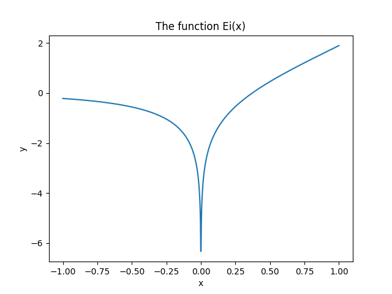
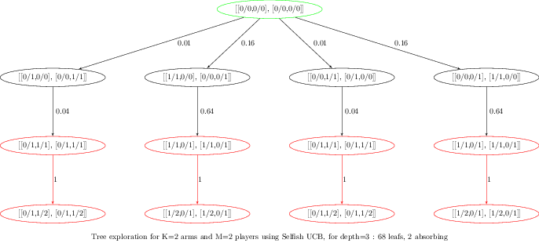
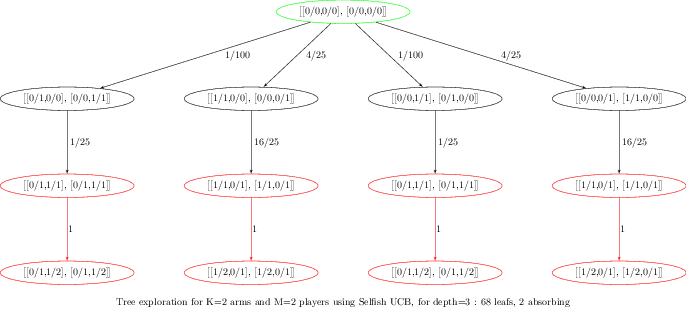
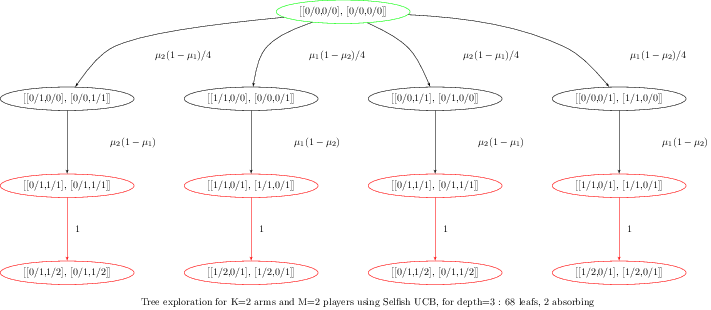

<!--
$theme: default
$size: 4:3
page_number: true
footer: GouTP @ SCEE | 18 Jan 2017 | By: Lilian Besson | Python introduction for MATLAB users
-->

# $4^{\text{th}}$ $2017/18$ GouTP @ SCEE

- *About:* **Python introduction for MATLAB users**

- *Date:* $18$th of January $2018$

- *Who:* Lilian Besson

---

# What's a *"GouTP"* ?

- **Internal monthly technical training session** :date:
- Usually: *Thursday 3pm :clock3: - 3:30pm* :clock330:
- With :coffee: coffee and :cookie: sweets : we relax while training !

  > Initiative of Quentin and Vincent :clap: in last January...
  > Continued by Rémi and Lilian :ok_hand: !

## Not only @ SCEE ?
- Currently open to the *FAST* and *AUT* teams

---

# Agenda for today $\;\;\;\;\;\;\;\;\;\;\;\;\;\;\;\;\;\;$ ==[30 min]==

1. What is Python $\;\;\;\;\;\;\;\;\;\;\;\;\;\;\;\;\;\;\;\;\;\;\;\;\;\;\;\;\;\;\;\;\;\;\;\;\;\;\;\;\;\;\;\;\;\;\;\;$ ==[5 min]==
2. Main differences in syntax and concepts $\;\;\;\;\;\;\;\;\;\;\;\;\;\;\;$ ==[5 min]==
3. Examples of problems solved Python $\;\;\;\;\;\;\;\;\;\;\;\;\;\;\;\;\;$ ==[10 min]==
4. Where can you find more information ? $\;\;\;\;\;\;\;\;\;\;\;\;\;\;\;\;\;$ ==[5 min]==

---

# 1. What is Python :snake: ?

- Developped and popular from the last $25$ years
- Open-source and free programming language
- Interpreted, multi-platform, imperative and object-oriented
- Designed and acknowledged as *simple to learn and use*
- Used worldwide: research, data science, web applications etc

### Ressources
- **Website**: python.org for the language & pypi.org for packages
- Documentation : docs.python.org (:fr: [docs.python.org/fr/3](https://docs.python.org/fr/3) translation in progress)

---

# Comparison with MATLAB

|  | Python :smiley: | MATLAB :cry:
|:-|:-:|:-:|
| **Cost** | Free :v: | Hundreds of euros / year
| **License** | Open-source | 1 year user license (no longer after your PhD!)
| **Comes from** | A non-profit foundation, and the community | MathWorks company
| **Scope** | Generic | Numeric only
| **Platform** | Any :computer: :iphone: | Desktop only :computer:
| **Usage** | Generic, worldwide :earth_americas: | Research in academia and industry

---

> But Python don't have only advantages…

|  | Python :cry: | MATLAB :smiley:
|:-|:-:|:-:|
| **Packaging** | Different solutions (`conda`, `pip`, it works fine) | Toolboxes already included
| **IDE** | Many possibilities, have to chose one (*Spyder*) | Good IDE already included
| **Support?** | Community (StackOverflow, IRC, mailing lists etc) | By MathWorks ?
| **Performances** | Interpreted, not so fast (check *Pypy* for speed)| Faster (but worse than C, Julia)
| **Documentation** | OK but very diverse | OK and inline

---

# How to install Python :arrow_down:
- On Linux and Mac OS : already installed!
- On Windows:
  + You can use the default installer from [python.org/downloads/windows](https://www.python.org/downloads/windows/) :snake:
  + Or the full installer from [anaconda.com/download](https://www.anaconda.com/download/) (:sparkles:)
- Takes about $10$ minutes... and it's free !

> :warning: Choose **Python 3** (currently 3.6.4) **not 2 !**
> :warning: Python 2 will stop :clock3: in less than 3 years (pythonclock.org)

---

# My suggestions for Python :snake:
- Use **Anaconda** to install (and upgrade) Python and packages
- Use **IPython** for the command line (:sparkles: awesome features !)
- Use:
  + **Spyder** for your IDE if you like the MATLAB interface
    (installed in Anaconda, or  github.com/spyder-ide/spyder)
  + **PyCharm** if you want "the most powerful Python IDE ever"
  + Or a good generic text editor + a plugin for Python
    (Emacs, Vim, Atom, SublimeText, **Visual Studio Code**…)
- Use **Jupyter notebooks** to write or share your experiments
  (jupyter.org, eg. github.com/Naereen/notebooks)

> More suggestions: pierreh.eu/python-setup by Pierre Haessig

---

## :package: How to install modules in Python
- If you used Anaconda, use `conda install [name]` (in a terminal) to install module `[name]`,
- Or with the standard installer, use `pip install [name]`.

## :mag: How to find the module you need ?
- Ask your colleagues :smile: !
- Look on the Internet !
- Look directly on [pypi.org](https://pypi.org) (official) or [anaconda.org](https://anaconda.org)

---

# :package: Overview of main Python modules
> Standard library is very rich, but not for scientific applications

- **Numpy** (numpy.org) for `numpy.array` for multi-dim arrays and linear algebra
- **Scipy** (scipy.org) for numerical computations (signal processing, integration, ODE integration, optimization etc)
- **Matplotlib** (matplotlib.org) for MATLAB-like 2D and 3D plots
- **pandas** for data manipulation (very powerful)
- **Scikit-Learn** (scikit-learn.org) for "classical" Machine Learning
- **Scikit-image** for 2D and generic image processing
- **Keras** (keras.io) for neural networks and deep learning 

> And many others ! Check pypi.org

---

# 2. Main differences in syntax between Python and MATLAB
> Ref: mathesaurus.sourceforge.net/matlab-python-xref.pdf

|  | Python | MATLAB
|:-|:-:|:-:|
| **File ext.** | ==`.py`== | ==`.m`==
| **Comment** | `# blabla...` | `% blabla...`
| **Indexing** | `a[0]` to `a[-1]` | `a(1)` to `a(end)`
| **Slicing** | `a[0:100]` (view) | `a(1:100)` (:warning: copy)
| **Operations** | Element-wise by default | Linear algebra by default
| **Logic** | Use `:` and indexing | Use `endif` `endfor` etc

---

|  | Python | MATLAB
|:-|:-:|:-:|
| **Help** | `help(func)` or `func?` (IPython) | `help func`
| **And** | `a and b` | `a && b`
| **Or** | `a or b` | `a || b`
| **Datatype** | `np.array` of *any* type | multi-dim doubles array 
| **Array** | `np.array([[1,2],[3,4]], dtype=float)` | `[1 2; 3 4]`
| **Size** | `np.size(a)` | `size(a)`
| **Nb Dim** | `np.ndim(a)` | `ndims(a)`
| **Last** | `a[-1]` | `a(end)`

> With `import numpy as np`

---

|  | Python | MATLAB
|:-|:-:|:-:|
| **Tranpose** | `a.T` | `a.'`
| **Conj. transpose** | `a.conj().T` | `a'`
| **Matrix** $\times$ | `a.dot(b)` or `a @ b` | `a * b`
| **Element-wise** $\times$ | `a * b` | `a .* b`
| **Element-wise** $/$ | `a / b` | `a ./ b`
| **Element-wise** ^ | `a ** 3` | `a .^ 3`
| **Zeros** | `numpy.zeros((2,3,5))` | `zeros(2,3,5)`
| **Ones** | `numpy.ones((2,3,5))` | `ones(2,3,5)`
| **Identity** | `numpy.eye(10)` | `eye(10)`
| **Range** for loops | `range(0, 100, 2)` | `1:2:100`
| **Range** for arrays | `numpy.arange(0, 100, 2)` | `1:2:100`

---

|  | Python | MATLAB
|:-|:-:|:-:|
| **Maximum** | `np.max(a)` | `max(max(a))` ?
| **Random matrix** | `np.random.rand(3,4)` | `rand(3,4)`
| $L^2$ **Norm** | `np.sqrt(v @ v)` or `L.norm(v)` | `norm(v)`
| **Inverse** | `L.inv(a)` | `inv(a)`
| **Pseudo inv** | `L.pinv(a)` | `pinv(a)`
| **Solve syst.** | `L.solve(a, b)` | `a \ b`
| **Eigen vals** | `V, D = L.eig(a)` | `[V,D]=eig(a)`
| **FFT/IFFT** | `np.fft(a)`, `np.ifft(a)` | `fft(a)`,`ifft(a)`

> With `import numpy as np; import numpy.linalg as L`

---

# 3. Scientific problems solved with Python
> Just to give examples of syntax and modules

1. $1$D numerical integration and plot
2. Solving a constraint optimization problem and plotting solution
3. Solving a linear system
4. A simple neural network
5. Symbolic computations

---

# 3.1. $1$D numerical integration and plot

> Goal : evaluate and plot the function
> $$Ei(x) = \int_{-\infty}^x \frac{\mathrm{e}^u}{u} \;\mathrm{d}u$$

- `scipy.integrate.quad` function for numerical integration
- `matplotlib.pyplot.plot` for $2$D plotting

---

```python
import numpy as np                # standard convention
import matplotlib.pyplot as plt   # standard convention
from scipy.integrate import quad  # only one function

def Ei(x, minfloat=1e-6, maxfloat=1000):
    def f(t):
        return np.exp(-t) / t
    if x > 0:
        return -1.0 * (quad(f, -x, -minfloat)[0]
                     + quad(f, minfloat, maxfloat)[0])
    else:
        return -1.0 * quad(f, -x, maxfloat)[0]

X = np.linspace(-1, 1, 1000) # 1000 points
Y = np.vectorize(Ei)(X)  # or [Ei(x) for x in X]
plt.plot(X, Y)
plt.title("The function Ei(x)")
plt.xlabel("x"); plt.ylabel("y")
plt.show()
```

---



---

# 3.3. Constraint optimization problem

---

# 3.3. Solving a linear system

---

# 3.4. A simple neural network
> Using keras (keras.io)

```python
from keras.models import Sequential
model = Sequential()

from keras.layers import Dense
model.add(Dense(units=64, activation='relu', input_dim=100))
model.add(Dense(units=10, activation='softmax'))

model.compile(loss='categorical_crossentropy',
              optimizer='sgd', metrics=['accuracy'])

# x_train and y_train are Numpy arrays
# just like in the Scikit-Learn API.
model.fit(x_train, y_train, epochs=5, batch_size=32)

# evaluate or predict using the model
loss_and_metrics = model.evaluate(x_test, y_test, batch_size=128)
classes = model.predict(x_test, batch_size=128)
```

---

# 3.5. Symbolic computations

- Almost impossible to do in MATLAB…
- Most Python code written for numerical values also works for symbolic values! Use **SymPy** module
- Powerful webtool like Wolfram|Alpha : [sympygamma.com](http://www.sympygamma.com/)
- An example from my latest article…
  + the same code works for numbers
  + or exact fractions
  + or symbols $\mu_1,\ldots,\mu_K$

---

### Example : generated graph with numbers

<center></center>

---

### Example : generated graph with fractions

<center></center>

---

### Example : generated graph with symbols

<center></center>

---

# Conclusion (1/3)

## Sum-up
- I hope you got a good introduction to Python
  + Good tutorials: www.scipy-lectures.org
- It's not hard to migrate from MATLAB to Python
- More ressources:
  + official documentation : docs.scipy.org/doc/numpy-dev/user/numpy-for-matlab-users.html
  + a good 45-minute training video : youtu.be/YkCegjtoHFQ
  + mathesaurus.sourceforge.net/matlab-numpy.html and mathesaurus.sourceforge.net/matlab-python-xref.pdf

---

# Conclusion (2/3)

## Next GouTP @ SCEE
> By Lilian
- Jupyter notebooks for teaching and research
  $\hookrightarrow$ jupyter.org

## GouTP @ FAST or AUT ?
> By Pierre Haessig

- Julia programming language (~ between Python and Matlab)
  $\hookrightarrow$ julialang.org

> By you ? Any idea is welcome!

---

# Conclusion (3/3)

> *Thanks for joining :clap: !* *Contact us if you want to do a GouTP!*

## Your mission, if you accept it... :boom:
1. *Padawan level:* Train yourself a little bit on Python :snake:
   $\hookrightarrow$ introtopython.org or learnpython.org
2. *Jedi level:* Try to solve a numerical system, from your research or teaching, in Python instead of MATLAB
3. *Master level:* From now on, try to use open-source tools for your research (Python and others)
