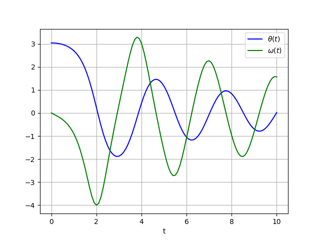
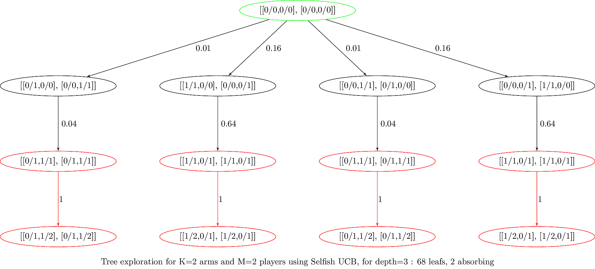
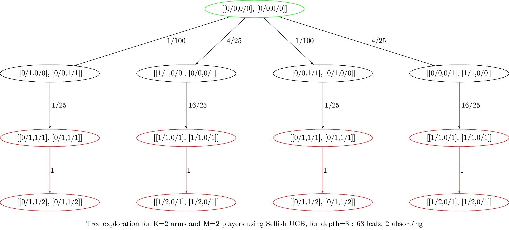
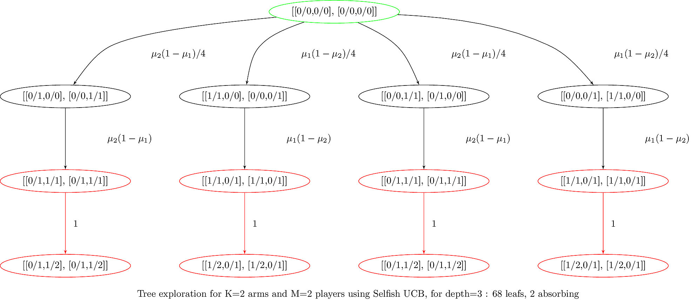

<!--
$theme: default
$size: 4:3
page_number: true
footer: GouTP @ SCEE | 18 Jan 2017 | By: Lilian Besson | Python introduction for MATLAB users
-->

<link rel="stylesheet" type="text/css" href="../common/marp-naereen.css" />


# $4^{\text{th}}$ $2017/18$ GouTP @ SCEE

- *About:* **Python introduction for MATLAB users**

- *Date:* $18$th of January $2018$

- *Who:* Lilian Besson

---

# What's a *"GouTP"* ?

- **Internal monthly technical training session** :date:
- Usually: *Thursday 3pm :clock3: - 3:30pm* :clock330:
- With :coffee: coffee and :cookie: sweets: we relax while training !

  > Initiative of Quentin and Vincent :clap: in January $2017$...
  > Continued by Rémi, Rami and Lilian :ok_hand: !

## Not only @ SCEE ?
- Currently open to the *FAST* and *AUT* teams

---

# Agenda for today $\;\;\;\;\;\;\;\;\;\;\;\;\;\;\;\;\;\;$ ==[30 min]==

1. What is Python $\;\;\;\;\;\;\;\;\;\;\;\;\;\;\;\;\;\;\;\;\;\;\;\;\;\;\;\;\;\;\;\;\;\;\;\;\;\;\;\;\;\;\;\;\;\;\;\;$ ==[5 min]==
2. Main differences in syntax and concepts $\;\;\;\;\;\;\;\;\;\;\;\;\;\;\;\;\;\;$ ==[5 min]==
3. 5 Examples of problems solved with Python $\;\;\;\;\;\;\;\;\;\;\;\;$ ==[15 min]==
4. Where can you find more information ? $\;\;\;\;\;\;\;\;\;\;\;\;\;\;\;\;\;\;\;$ ==[5 min]==

---

# 1. What is Python :snake: ?

- developed and popular from the last $25$ years
- Open-source and free programming language
- *Interpreted*, multi-platform, imperative and object-oriented
- Designed and acknowledged as *simple to learn and use*
- Used worldwide: research, data science, web applications etc

### Ressources
- **Website**: python.org for the language & pypi.org for modules
- Documentation :notebook: : docs.python.org
  (:fr: also [docs.python.org/fr/3](https://docs.python.org/fr/3) ‑ :snail: the translation in progress)

---

# Comparison with MATLAB

|  | Python :smiley: | MATLAB :cry:
|:-|:-:|:-:|
| **Cost** | Free :v: | Hundreds of **€ / year**
| **License** | Open-source | 1 year user license (no longer after your PhD!)
| **Comes from** | A non-profit foundation, and "the community" | MathWorks company
| **Scope** | Generic | Numeric only
| **Platform** | Any :computer: :iphone: | Desktop only :computer:
| **Usage** | Generic, worldwide :earth_americas: | Research in academia :mortar_board: and industry :factory:

---

> But Python is not perfect…

|  | Python :cry: | MATLAB :smiley:
|:-|:-:|:-:|
| **Modules** | Different good solutions (`conda`, `pip`) | Toolboxes already included
| **IDE** | Many possibilities, have to chose one (*Spyder*) | Good IDE already included
| **Support?** | Community (StackOverflow, IRC, mailing lists etc) | By MathWorks ?
| **Performance** | Interpreted, not so fast (check *Pypy* for speed)| Faster (but worse than C/Java/Julia)
| **Documentation** | :ok_hand: OK but very diverse | :ok_hand: OK and inline

---

# How to install Python ? :arrow_down:
- On Linux and Mac OS: already installed!
- On Windows:
  + Use the full installer from [anaconda.com/download](https://www.anaconda.com/download/) (:sparkles:)
  + Or the default installer from [python.org/downloads/windows](https://www.python.org/downloads/windows/)
- Takes about $10$ minutes… and it's free :v: !

> :warning: Choose **Python 3** (currently 3.6.4) **not 2 !**
> :warning: Python 2 will stop :clock3: in less than 3 years (pythonclock.org)

---

# My suggestions for Python :snake:
- Use **Anaconda** to install (and upgrade) Python and packages
- Use **IPython** for the command line (:sparkles: awesome features!)
- Use:
  + [**Spyder**](https://github.com/spyder-ide/spyder) for your IDE if you like the MATLAB interface
    (installed in Anaconda, or `pip install spyder`)
  + PyCharm if you want "the most powerful Python IDE ever"
  + Or a good generic text editor + a plugin for Python
    (Emacs, Vim, Atom, SublimeText, **Visual Studio Code**…)
- Use **Jupyter notebooks** to write or share your experiments
  (jupyter.org, ex: my github.com/Naereen/notebooks collection)

> More suggestions: pierreh.eu/python-setup by Pierre Haessig

---

## :package: How to install modules in Python ?
- If you used Anaconda, use `conda install [name]` (in a terminal) to install module `[name]`:
- Or with the standard installer, use `pip install [name]`.
  ```bash
  $ [sudo] pip/conda install keras  # example
  ```

## :mag: How to find the module you need ?
- Ask your colleagues :smile: !
- Look on the Internet!
- Look directly on [pypi.org](https://pypi.org) (official) or [anaconda.org](https://anaconda.org)
  ```bash
  $ pip/conda search keras  # example
  ```

---

# :package: Overview of main Python modules
> Standard library is very rich, but not for scientific applications

- **Numpy** (numpy.org) for `numpy.array` for multi-dim arrays and operations, and `numpy.linalg` module for linear algebra
- **Scipy** (scipy.org) for numerical computations (signal processing, integration, ODE integration, optimization etc)
- **Matplotlib** (matplotlib.org) for MATLAB-like 2D and 3D plots
- **pandas** for data manipulation (very powerful)
- **Scikit-Learn** (scikit-learn.org) for "classical" Machine Learning
- **Scikit-image** for 2D and generic image processing
- **Keras** (keras.io) for neural networks and deep learning 

> And many others :chart_with_upwards_trend: ! Check pypi.org

---

# 2. Main differences in syntax between Python and MATLAB
> Ref: mathesaurus.sourceforge.net/matlab-python-xref.pdf

|  | Python | MATLAB
|:-|:-:|:-:|
| **File ext.** | ==`.py`== | ==`.m`==
| **Comment** | `# blabla...` | `% blabla...`
| **Indexing** | `a[0]` to `a[-1]` | `a(1)` to `a(end)`
| **Slicing** | `a[0:100]` (view) | `a(1:100)` (:warning: copy)
| **Operations** | Element-wise by default | Linear algebra by default
| **Logic** | Use `:` and indentation | Use `end` for closing

---

|  | Python | MATLAB
|:-|:-:|:-:|
| **Help** | `help(func)` (or `func?` IPython) | `help func`
| **And** | `a and b` | `a && b`
| **Or** | `a or b` | `a || b`
| **Datatype** | `np.array` of *any* type | multi-dim `double` array 
| **New array** | `np.array([[1,2],[3,4]], dtype=float)` | `[1 2; 3 4]`
| **Size** | `np.size(a)` | `size(a)`
| **Nb Dim** | `np.ndim(a)` | `ndims(a)`
| **Last** | `a[-1]` | `a(end)`

> With the usual shortcut `import numpy as np`

---

<!-- *footer: -->

|  | Python | MATLAB
|:-|:-:|:-:|
| **Tranpose** | `a.T` | `a.'`
| **Conj. transpose** | `a.conj().T` :warning: | `a'`
| **Matrix** $\times$ | `a.dot(b)` or ==`a @ b`== | `a * b`
| **Element-wise** $\times$ | `a * b` | `a .* b`
| **Element-wise** $/$ | `a / b` | `a ./ b`
| **Element-wise** ^ | `a ** 3` | `a .^ 3`
| **Zeros** | `numpy.zeros((2,3,5))` | `zeros(2,3,5)`
| **Ones** | `numpy.ones((2,3,5))` | `ones(2,3,5)`
| **Identity** | `numpy.eye(10)` | `eye(10)`
| **Range** for loops | `range(0, 100, 2)` | `1:2:100`
| **Range** for arrays | `numpy.arange(0, 100, 2)` | `1:2:100`

---

|  | Python | MATLAB
|:-|:-:|:-:|
| **Maximum** | `np.max(a)` | `max(max(a))` ?
| **Random matrix** | `np.random.rand(3,4)` | `rand(3,4)`
| $L^2$ **Norm** | `np.sqrt(v @ v)` or `L.norm(v)` | `norm(v)`
| **Inverse** | `L.inv(a)` | `inv(a)`
| **Pseudo inv** | `L.pinv(a)` | `pinv(a)`
| **Solve syst.** | `L.solve(a, b)` | `a \ b`
| **Eigen vals** | `V, D = L.eig(a)` | `[V,D]=eig(a)`
| **FFT/IFFT** | `np.fft(a)`, `np.ifft(a)` | `fft(a)`,`ifft(a)`

> With `import numpy as np; import numpy.linalg as L`

---

# 3. Examples of problems solved with Python
> Just to give some real examples of syntax and use of modules

1. $1$D numerical integration and plot
2. Solving a $2^{\text{nd}}$ order Ordinary Differential Equation
3. Solving a constraint optimization problem and plotting solution
4. A simple neural network
5. Symbolic computations

---

# 3.1. $1$D numerical integration and plot

> Goal : evaluate and plot [this function](https://reference.wolfram.com/language/ref/ExpIntegralEi.html), on $[-1, 1]$ :
> $$\mathrm{Ei}(x) := \int_{-\infty}^x \frac{\mathrm{e}^u}{u} \;\mathrm{d}u$$

## How to?
Use modules!

- `numpy` for maths functions and arrays
- `scipy.integrate.quad` function for numerical integration
- `matplotlib.pyplot.plot` for $2$D plotting

---

```python
import numpy as np                # standard convention
import matplotlib.pyplot as plt   # standard convention
from scipy.integrate import quad  # need only 1 function

def Ei(x, minfloat=1e-6, maxfloat=1000):
    def f(t):
        return np.exp(-t) / t
    if x > 0:
        return -1.0 * (quad(f, -x, -minfloat)[0]
                     + quad(f, minfloat, maxfloat)[0])
    else:
        return -1.0 * quad(f, -x, maxfloat)[0]


X = np.linspace(-1, 1, 1000) # 1000 points
Y = np.vectorize(Ei)(X)      # or [Ei(x) for x in X]
plt.plot(X, Y)               # MATLAB-like interface !
plt.title("The function Ei(x)")
plt.xlabel("x"); plt.ylabel("y")
plt.savefig("figures/Ei_integral.png")
plt.show()
```

---


---

# 3.2. Solving a $2^{\text{nd}}$ order ODE

> Goal : solve and plot the differential equation of a pendulum:
> $$\theta''(t) + b \,\theta'(t) + c \,\sin(\theta(t)) = 0$$
> For $b = 1/4$, $c = 5$, $\theta(0) = \pi - 0.1$, $\theta'(0)=0$, $t\in[0,10]$

## How to?
Use modules!

- `scipy.integrate.odeint` function for ODE integration
- `matplotlib.pyplot.plot` for $2$D plotting

---

```python
import numpy as np
import matplotlib.pyplot as plt
from scipy.integrate import odeint   # use Runge-Kutta 4

def pend(y, t, b, c):  # function definition
    return np.array([y[1], -b*y[1] - c*np.sin(y[0])])

b, c = 0.25, 5.0  # tuple assignment
y0 = np.array([np.pi - 0.1, 0.0])
t = np.linspace(0, 10, 101)  # on [0,10] with 101 points

sol = odeint(pend, y0, t, args=(b, c))

plt.plot(t, sol[:, 0], 'b', label=r'$\theta(t)$')# blue
plt.plot(t, sol[:, 1], 'g', label=r'$\omega(t)$')# green
plt.legend(loc='best')
plt.xlabel('t')
plt.grid()
plt.savefig("figures/Pendulum_solution.png")
plt.show()
```

---



---

# 3.3. Constraint optimization problem

> Goal: minimize a function under linear inequality constraints:
> $$f(x,y) := (x - 1)^2 + (y - 2.5)^2$$
> $$\text{such that } \begin{cases}x \geq 0 \text{ and } y \geq 0 \\ x - 2y + 2 \geq 0 \\ - x - 2y + 6 \geq 0 \\ x + 2y + 2 \geq 0\end{cases}$$

## How to?

- `scipy.optimize.minimize` function for black-box minimization

---

# 3.3. Constraint optimization problem

```python
from scipy.optimize import minimize

def obj(x):
    return (x[0] - 1)**2 + (x[1] - 2.5)**2

x0 = (2, 0)  # first guess

bnds = ((0, None), (0, None))  # [0, +oo) for x and y

cons = ({'type': 'ineq', 'fun': lambda x: x[0]-2*x[1]+2},
        {'type': 'ineq', 'fun': lambda x:-x[0]-2*x[1]+6},
        {'type': 'ineq', 'fun': lambda x:-x[0]+2*x[1]+2})


res = minimize(obj, x0, method='SLSQP', bounds=bnds,
               constraints=cons)
print("Minimum is", res.x)  # Minimum is (1.4, 1.7)
```

---

# 3.4. A simple 2-layer neural network
> Using keras (keras.io) it's very simple and concise :sunglasses: !

```python
from keras.models import Sequential
model = Sequential()

from keras.layers import Dense
model.add(Dense(units=64, activation='relu', input_dim=100))
model.add(Dense(units=10, activation='softmax'))

model.compile(loss='categorical_crossentropy',
              optimizer='sgd', metrics=['accuracy'])

# x_train and y_train: numpy arrays like in Scikit-Learn
model.fit(x_train, y_train, epochs=5, batch_size=32)

# evaluate or predict using the model
loss_and_metrics = model.evaluate(x_test, y_test, batch_size=128)
classes = model.predict(x_test, batch_size=128)
```

---

# 3.5. Symbolic computations

- MATLAB has the [Symbolic Math Toolbox](https://www.mathworks.com/pricing-licensing.html?prodcode=SM) (for $400$€/year)…
- Python has the **SymPy** module (sympy.org)
- Ex: Powerful webapp : [sympygamma.com](http://www.sympygamma.com/) (like Wolfram|Alpha)
- :sparkles: Lots of Python code written for numerical values can work directly for symbolic values!

##### a. A few basic examples

##### b. A second example from my latest research article…
  + the same code works for numbers, or exact fractions
  + or symbols $\mu_1,\ldots,\mu_K$ !

---

# 3.5.a. A few basic examples
> Using sympy (sympy.org)

```python
from sympy import *     # usually a bad habit
x, t, z, nu = symbols('x t z nu')

diff(sin(x)*exp(x), x)  # exp(x)*sin(x) + exp(x)*cos(x)

integrate(exp(x)*sin(x) + exp(x)*cos(x), x)  # exp(x)*sin(x)

integrate(sin(x**2), (x, -oo, oo))  # sqrt(2)*sqrt(pi)/2

limit(sin(x)/x, x, 0)   # 1

y = Function('y')
dsolve(Eq(y(t).diff(t, t) - y(t), exp(t)), y(t))
# Eq(y(t), C2*exp(-t) + (C1 + t/2)*exp(t))
```

> See [docs.sympy.org](http://docs.sympy.org) for more examples


---

### 3.5.b. Example : generated graph with numbers



> Graph saved a DOT file and to a TikZ graph with [dot2tex](https://github.com/Naereen/dot2tex)

---

### 3.5.b. Example : generated graph with fractions



> <span style="font-size: 22px">Source: [banditslilian.gforge.inria.fr/docs/complete_tree_exploration_for_MP_bandits.html](http://banditslilian.gforge.inria.fr/docs/complete_tree_exploration_for_MP_bandits.html)</span>

---

### 3.5.b. Example : generated graph with symbols



---

# Conclusion (1/3)

## Sum-up
- I hope you got a good introduction to Python :ok_hand:
  + Good tutorials: www.scipy-lectures.org
- It's not hard to migrate :airplane: from MATLAB to Python
- More ressources :notebook: :
  + official documentation: docs.scipy.org/doc/numpy-dev/user/numpy-for-matlab-users.html
  + a good 45-minute training video : youtu.be/YkCegjtoHFQ
  + mathesaurus.sourceforge.net/matlab-numpy.html and mathesaurus.sourceforge.net/matlab-python-xref.pdf

---

# Conclusion (2/3)

## Next GouTP @ ==SCEE==
> By Lilian Besson :wave:
- **Jupyter notebooks** for teaching and research
  $\hookrightarrow$ see jupyter.org if you are curious

## GouTP @ ==FAST== or ==AUT== ?
> By Pierre Haessig ?

- **Julia programming language** (~ between Python and Matlab)
  $\hookrightarrow$ see julialang.org if you are curious

> :point_right: By *you*? Any idea is welcome! :smiley:

---

# Conclusion (3/3)

> *Thanks for joining :clap: !*
> *Contact us if you want to do a GouTP !*

## Your mission, if you accept it… :boom:
1. *Padawan level :* Train yourself a little bit on Python :snake:
   $\hookrightarrow$ python.org or introtopython.org or learnpython.org
2. *Jedi level :* Try to solve a numerical system, from your research or teaching, in Python instead of MATLAB
3. *Master level :* From now on, try to use (only?) open-source tools for your research (Python and others)
