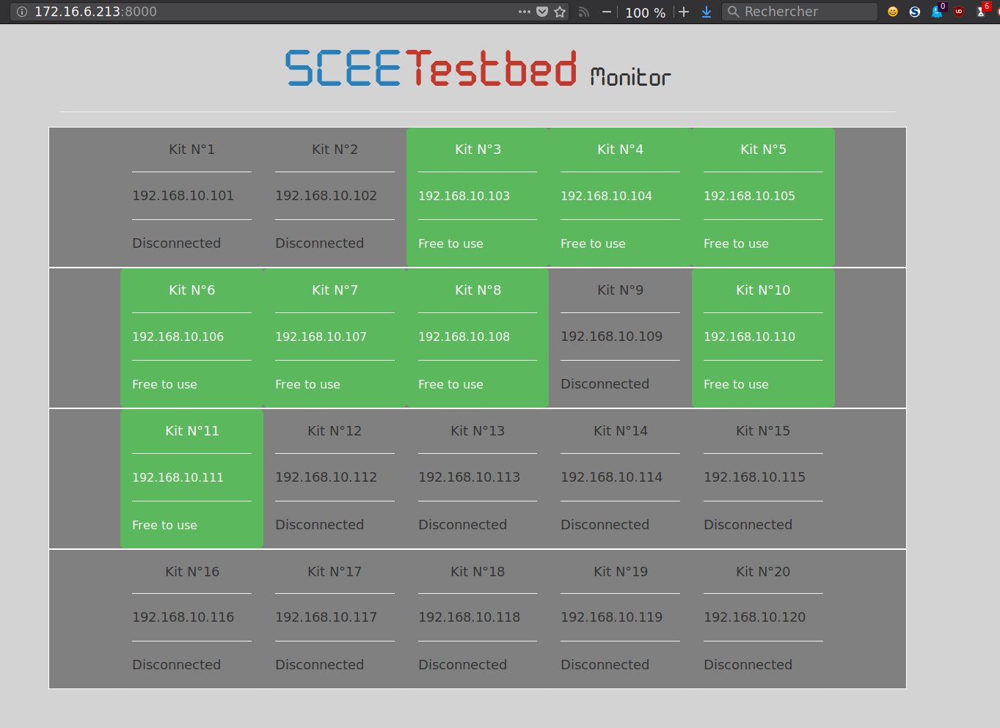

<!--
$theme: default
$size: 4:3
page_number: true
footer: GouTP @ SCEE | 8 March 2017 | By: Lilian Besson | Introduction to Jupyter notebooks
-->

<link rel="stylesheet" type="text/css" href="../common/marp-naereen.css" />


# $4^{\text{th}}\;\;$ $2017/18$ GouTP @ SCEE

- *About:* **Introduction to Jupyter notebooks**

- *Date:* $8$th of March $2018$

- *Who:* [Lilian Besson](https://GitHub.com/Naereen/slides/)

<br><br>

## Open source content?
> Note: slides are online: `github.com/Naereen/slides/tree/master/
  2018_03__Jupyter_notebooks_are_awesome__GouTP_at_Supelec`

---

# What's a *"GouTP"* ?

- **Internal monthly technical training session** :date:
- Usually: on *Thursday*, at *3pm :clock3: - 3:30pm* :clock330:
- With :coffee: coffee, :tea: tea and :cookie: sweets: we relax while training !

  > Initiative of Quentin and Vincent :clap: in January 2017...
  > Continued by Rémi, Muhammad, Rami and Lilian :ok_hand: !

<br><br>

## Not only @ SCEE :smiley: ?
- Currently open to the *FAST* and *AUT* teams

---

# Agenda for today $\;\;\;\;\;\;\;\;\;\;\;\;\;\;\;\;\;\;$ ==[30 min]==

1. Quick presentation of internal tools @ SCEE $\;\;\;\;\;\;\;\;\;\;\;\,$ ==[5 min]==
2. What are the Jupyter notebook tools ? $\;\;\;\;\;\;\;\;\;\;\;\;\;\;\;\;\;\;$ ==[10 min]==
3. Demo time $\;\;\;\;\;\;\;\;\;\;\;\;\;\;\;\;\;\;\;\;\;\;\;\;\;\;\;\;\;\;\;\;\;\;\;\;\;\;\;\;\;\;\;\;\;\;\;\;\;\;\;\;\,$ ==[10 min]==
4. Sharing your notebooks online or as PDF $\;\;\;\;\;\;\;\;\;\;\;\;\;\;\,$ ==[5 min]==

<br>

## Please :pray:
Ask questions and interupt me if you want! 

---

# 1. Presentation of internal tools @ SCEE

- Welcome to our new PhD student and interns :raised_hand_with_fingers_splayed: !
- You met (almost) everybody this week !
- You will be more and more familiar with the research themes of our team…

<br><br>

## $\hookrightarrow$ Let see a few tools that can make your life easier!

---

<!-- *footer: -->

# Website
- [www-scee.rennes.supelec.fr](http://www-scee.rennes.supelec.fr/) was created by Rémi and Aymeric
- It is maintained mainly by Rémi : we need help!


## New comers, please
- send a short summary of your research interest with links to your LinkedIn, Google Scholar profile (or other sites). Picture: *if you want*
- **to Rémi and I** so we add you on the website

---

# Internal Wiki
- We have a MediaWiki running locally on http://172.16.6.219/
- Welcome pack : can be useful in your first days here!
  http://172.16.6.219/mediawiki/index.php/Welcome_to_SCEE
- Anyone can edit, it is maintained by Rémi and I
- Participate if you have anything to change (create an account, edit!)


---

# Workstations (Windows & GNU/Linux)

- 2 Windows 7 workstations, with MATLAB
  + WS1 : `172.16.6.211`
  + WS2 : `172.16.6.212`
- 1 GNU/Linux (Ubuntu) workstation, with Python, GNU Radio…
  + WS3 : `172.16.6.213`
- Powerful machines: 12 cores, 32 Gb of RAM, lots of storage…
- Monitoring: http://172.16.6.219:8000 (ask us for ==id/passwd==)
  (please check for use load, before launching heavy simulations)

## :tipping_hand_woman: Ask for an account if you need
- To run computations, or to use the TestBed
- Ask to *Muhammad for Windows*, to *me for GNU/Linux*

---


---

# USRP TestBeds
- We have 8 USRP cards that can be used from GNU Radio Companion on the WS3
- See more on http://172.16.6.219/mediawiki/index.php/Main_Page#Hardware

## Monitoring
- http://172.16.6.213:8000 (made by Quentin)
- let you see the IP of each USRP card
- and who uses what in real time

## Advice
- If you need to use the USRP, discuss with Rémi and Lilian before

---



---

# 2. "Project Jupyter", ==jupyter.org==


---

# 2. What are Jupyter notebooks?

## Technical aspect
1. A file format, ==`.ipynb`==  (just JSON with constraints)
2. An editor in your browser (see it during ==demo time==)
3. Tools to convert `.ipynb` files to scripts, HTML, slides, PDF etc.

## Practical aspect
4. A very good way to interact with your code
5. Create smart document with text, maths, code, output and figures, all included in one file
6. Easy to share online and with colleagues

---

# How to learn ?

## Online
- Try without installing anything ? $\longrightarrow$ At [try.jupyter.org](https://try.jupyter.org/)

## On your laptop
1. Install it
2. Then start:
   ```bash
   # from your console
   $ jupyter notebook
   ```

> If you installed Python with Anaconda, it should be in your system menu *by default* (along *Spyder*, *IPython* and *IPython QT Console*)…


---

# How to install it ?

Install it (you need Python) from https://jupyter.org/install.html.

```bash
$ conda install jupyter  # if you use Anaconda/conda
$ pip install jupyter    # for the system-wide Python & pip
```

## How to start it
```sh
$ jupyter notebook # from your console
...
Copy/paste this URL into your browser when you connect
for the first time, to login with a token:
http://localhost:8888/?token=44450caacdbe3ecddc21e02e66a6b5162cdd2d86dccd5264
```

- It should open http://localhost:8888/notebooks/ in your browser
- Or open the link in your terminal

---

# Only for Python :cry: ??
- No: supports naitively Julia, Python and R (**Ju + Py + R = Jupyter**)
- Dozens of "kernels" allow you to use Jupyter with *almost* any language ! (for free). Installation is usually simple & fast.

## Partial list :memo:
- Interpreted languages: :shell: Bash, :camel: Caml/OCaml, Lua etc
- :boom: But also compiled languages : C++, C, Go, Java !
- :smiley: and of course Wolfram Mathematica and MATLAB
  > even if they have their own notebook tools now.

## Complete list of "kernels"
> See [github.com/jupyter/jupyter/wiki/Jupyter-kernels](https://github.com/jupyter/jupyter/wiki/Jupyter-kernels)

---

# 3. ==Demo time==

I will show you quickly all this…

---

<!-- *footer: -->

# [Internally](https://jupyter.readthedocs.io/en/latest/architecture/visual_overview.html), it's quite complicated, don't care


---

# Conclusion (1/3)

## Sum-up
- I hope you got a good introduction to Jupyter :ok_hand:
  + Official documentation: 
  + Good tutorials: www.datacamp.com/community/tutorials/tutorial-jupyter-notebook

---

# Conclusion (2/3)

## Next GouTP @ ==SCEE==
- Any request or suggestion ?

## GouTP @ ==FAST== or ==AUT== ?
> By Pierre Haessig ?

- **Julia programming language** (~ between Python and Matlab)
  $\hookrightarrow$ see julialang.org if you are curious

## We need participants!
> :point_right: By *you*? Any idea is welcome! :smiley:

---

# Conclusion (3/3)

> *Thanks for joining :clap: !*
> *Contact us if you want to do a GouTP !*

<br>

## Your mission, if you accept it… :boom:
1. *Padawan level :* next time you program in Python (or other language), think about **Jyputer**. Can it help you being more efficient?
2. *Jedi level :* Try to use **Jupyter** when you will have to share or show some piece of code?
3. *Master level :* From now on, try to use (only?) open-source tools for your research (Python and others)…
