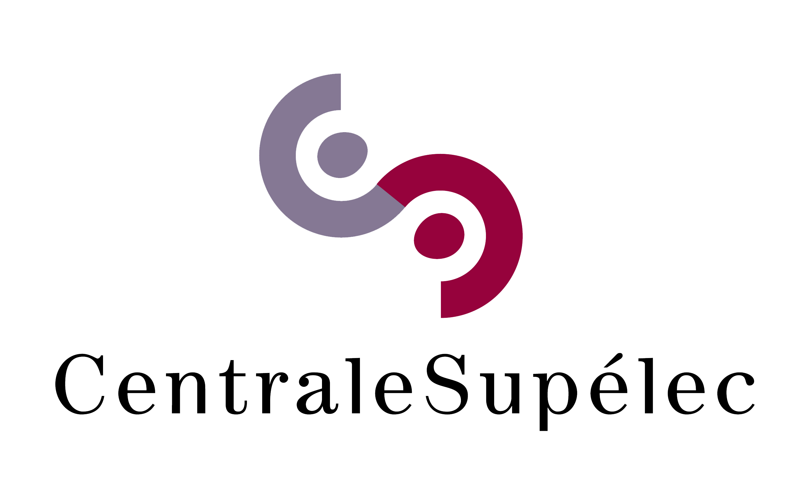

<!--
$theme: default
$size: 4:3
page_number: true
footer: Aggregation of MAB Learning Algorithms for OSA | 16th April 2017 | By: Lilian Besson
-->

<!-- <link rel="stylesheet" type="text/css" href="../common/marp-naereen.css" /> -->

### IEEE WCNC: **« Aggregation of Multi-Armed Bandits Learning Algorithms for Opportunistic Spectrum Access »**

- *Date* :date: : $16$th of April $2018$

- *Who:* [Lilian Besson](https://GitHub.com/Naereen/slides/) :wave: , PhD Student in France, co-advised by

| *Christophe Moy*   @ CentraleSupélec  & IETR, Rennes | *Émilie Kaufmann*   @ Inria, Lille |
|:---:|:---:|
|   |  |

> See our paper [`https://hal.inria.fr/hal-01705292`](https://hal.inria.fr/hal-01705292)

---

# Introduction

- Cognitive Radio (CR) is known for being one of the possible solution to tackle the spectrum scarcity issue
- Opportunistic Spectrum Access (OSA) is a good model for CR in **licensed bands**

- Online learning strategies, mainly using multi-armed bandits (MAB) algorithms, were recently proved to be efficient `[Jouini 2010]`
- But there is many different MAB algorithms: which one should you chose in practice?

$\Longrightarrow$ we propose to use an online learning algorithm to also decide
which algorithm to use, to be more robust and adaptive to unknown environments.

---

# Outline :timer_clock: ==[15 min]==

1. Opportunistic Spectrum Access ==[3 min]==
2. Multi-Armed Bandits ==[3 min]==
3. MAB algorithms ==[3 min]==
4. Aggregation of MAB algorithms  ==[3 min]==
5. Illustration ==[3 min]==

 

### Please :pray:
Ask questions *at the end* if you want!

---

# 1. Opportunistic Spectrum Access ==[3 min]==

- Spectrum scarcity is a well-known problem
- Different range of solutions…
- Cognitive Radio is one of them
- Opportunistic Spectrum Access is a kind of cognitive radio

---

# Formalize the communication model
## with an image!

---

# 2. Multi-Armed Bandits ==[3 min]==

## Model:
- There is $K \geq 2$ resources (*e.g.*, channels), called **arms**
- Each time slot $t=1,\ldots,T$, you must chose one arm, denoted $A(t)\in\{1,\ldots,K\}$
- You receive some reward $r(t) \sim \nu_k$ when playing $k = A(t)$
- **Goal:** maximize your sum reward $\sum\limits_{t=1}^{T} r(t)$

## Why is it famous?
Simple but good model for **exploration/exploitation** dilemma.

---

# 3. MAB algorithms ==[3 min]==

- Main idea
- 1st example: UCB algorithm
- 2nd example: Thompson Sampling
- (Take slides from ALT slides)

---

# Multi-Armed Bandit algorithms
## Often *index* based:
- Keep *index* $I_k(t) \in \mathbb{R}$ for each arm $k=1,\ldots,K$
- Always play $A(t) = \arg\max I_k(t)$
- $I_k(t)$ should represent our belief of the *quality* of arm $k$ at time $t$

## First example: "Follow the Leader"
- $X_k(t) := \sum\limits_{s < t} r(s) \bold{1}(A(s)=k)$ sum reward from arm $k$
- $N_k(t) := \sum\limits_{s < t} \bold{1}(A(s)=k)$ number of samples of arm $k$
- And use $I_k(t) = \hat{\mu}_k(t) := \frac{X_k(t)}{N_k(t)}$.

---

# 1st example of algorithm
## *Upper Confidence Bounds* algorithm (UCB)
- Instead of using $I_k(t) = \frac{X_k(t)}{N_k(t)}$, add an exploration term
$$ I_k(t) = \frac{X_k(t)}{N_k(t)} + \sqrt{\frac{\alpha \log(t)}{2 N_k(t)}} $$
- Small $\alpha$: focus on **exploitation**
- Large $\alpha$: focus on **exploration**

## Problem
- How to chose "the good $\alpha$" ?

---

# 2nd example of algorithm
## *Thompson sampling* (TS)
- Chose an initial belief on $\mu_k$ (uniform) and a prior $p^t$ (*e.g.*, a Beta prior on $[0,1]$)
- At each time, update the prior $p^{t+1}$ from $p^t$ using Bayes theorem
- And use $I_k(t) \sim p^t$ as *random* index

## Example with Beta prior, for binary rewards
- $p^t = \mathrm{Beta}(1 + \text{nb successes}, 1 + \text{nb failures})$.
- Mean of $p^t$ $= \frac{1 + X_k(t)}{2 + N_k(t)} \simeq \hat{\mu}_k(t)$.

## Problem
- How to chose "the good prior" ?

---

# 4. Aggregation of MAB algorithms ==[3 min]==

## Problem
- Why commit to one algorithm?
- How to chose which algorithm to use?

## Solutions 
- Offline benchmarks
- Or online selections from a pool of algorithms

## Aggregation?
> Not a new idea, studied from the 90s in the machine learning community.

- Also use online learning to *select the best algorithm*!

---

## 4.1. Basic idea for online aggregation
If you have $\mathcal{A}_1,\ldots,\mathcal{A}_N$ different algorithms

- At time $t=0$, start with a uniform distribution $\pi^0$ on $[1,\ldots,N]$
  (to represent the **trust** in each algorithm)
- At time $t$, choose $a^t \sim \pi^t$, then play with $\mathcal{A}_{a^t}$
- Compute next distribution $\pi^{t+1}$ from $\pi^t$:
  + increase $\pi^{t+1}_{a^t}$ if choosing $\mathcal{A}_{a^t}$ gave a good reward
  + or decrease it

## Problems
1. How to increase $\pi^{t+1}_{a^t}$ ?
2. What information should we give to which algorithms?

---

# 5. Illustration ==[3 min]==

- Blabla
- Blabla
- Blabla

---

# Conclusion

> Thanks for listening!

### See our paper
[`https://hal.inria.fr/hal-01705292`](https://hal.inria.fr/hal-01705292)