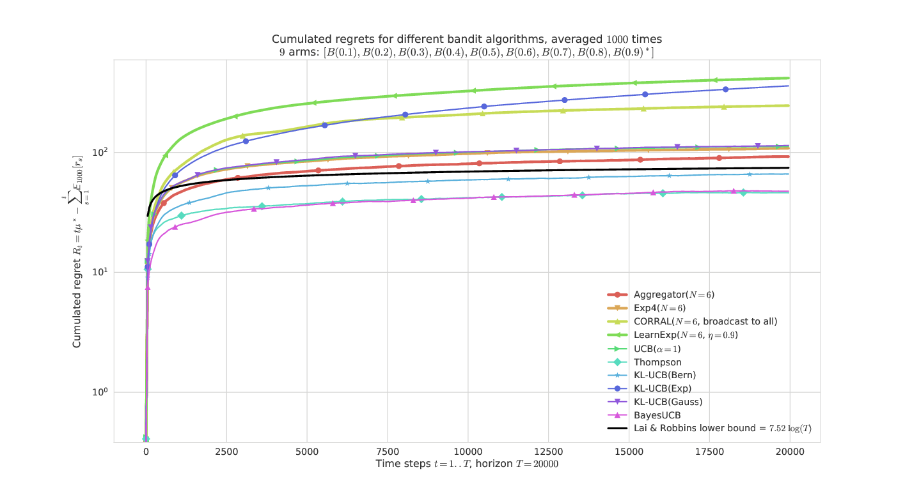
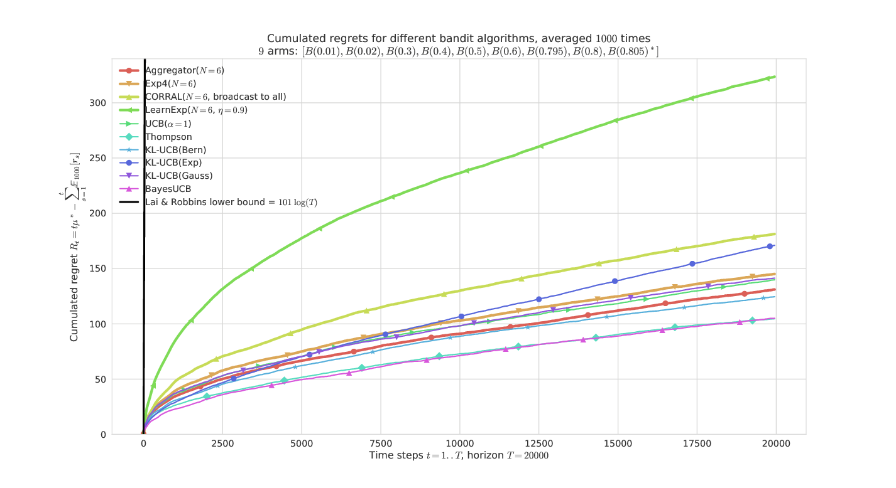
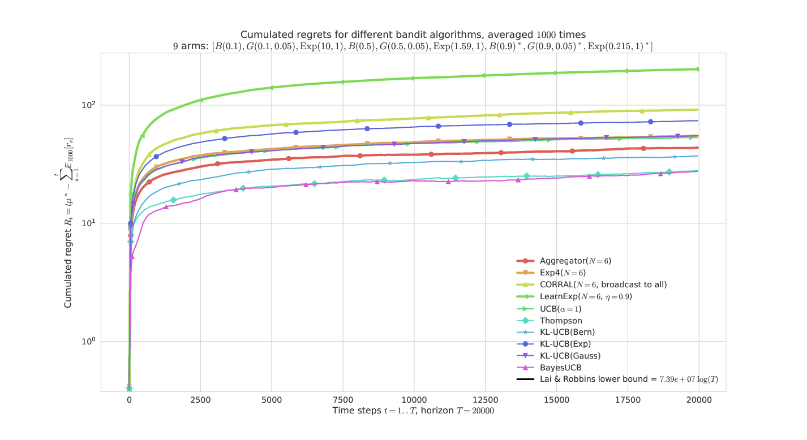

---
author:
  \textbf{Lilian Besson} \newline
  \emph{Advised by} \and Christophe Moy \and Émilie Kaufmann
smallauthor: Lilian Besson
title: Aggregation of MAB Learning Algorithms for OSA
institute:
  PhD Student \newline
  Team SCEE, IETR, CentraleSupélec, Rennes \newline
  \& Team SequeL, CRIStAL, Inria, Lille
smallinstitute: CentraleSupélec \& Inria
date: IEEE WCNC -  16th April 2018
smalldate: IEEE WCNC -  16/04/18
lang: en-US
babel-lang: english
handout: false
numbersections: true
section-titles: false
fontsize: 12pt
toc: false
include-before:
  \section*{\hfill{}CentraleSupélec Rennes \& Inria Lille\hfill{}}
  \subsection*{\hfill{}Team {:} SCEE @ IETR \& SequeL @ CRIStAL\hfill{}}
---

\section{\hfill{}0. Introduction and motivation\hfill{}}

\subsection{\hfill{}0.1. Title\hfill{}}

### IEEE WCNC: **« Aggregation of Multi-Armed Bandits Learning Algorithms for Opportunistic Spectrum Access »**

- *Date* : $16$th of April $2018$

- *Who:* [Lilian Besson](https://GitHub.com/Naereen/slides/) , PhD Student in France, co-advised by

| *Christophe Moy*   @ CentraleSupélec  & IETR, Rennes | *Émilie Kaufmann*   @ Inria, Lille |
|:---:|:---:|
|   |  |

> See our paper [`HAL.Inria.fr/hal-01705292`](https://hal.inria.fr/hal-01705292)

---

\subsection{\hfill{}0.2. Objective\hfill{}}

# Introduction

- Cognitive Radio (CR) is known for being one of
  the possible solution to tackle the spectrum scarcity issue
- Opportunistic Spectrum Access (OSA) is a good model
  for CR problems in **licensed bands**

- Online learning strategies, mainly using multi-armed bandits (MAB) algorithms, were recently proved to be efficient `[Jouini 2010]`
- But there is many different MAB algorithms…
  which one should you choose in practice?

$\Longrightarrow$ we propose to use an online learning algorithm to also decide
which algorithm to use, to be more robust and adaptive to unknown environments.

---

\subsection{\hfill{}0.3. Outline\hfill{}}

# Outline

1. Opportunistic Spectrum Access
2. Multi-Armed Bandits
3. MAB algorithms
4. Aggregation of MAB algorithms
5. Illustration

  

### Please
Ask questions *at the end* if you want!

---

\section{\hfill{}1. Opportunistic Spectrum Access\hfill{}}

\subsection{\hfill{}1.1. OSA\hfill{}}

# 1. Opportunistic Spectrum Access

- Spectrum scarcity is a well-known problem
- Different range of solutions…
- Cognitive Radio is one of them
- Opportunistic Spectrum Access is a kind of cognitive radio

---

\subsection{\hfill{}1.2. Model\hfill{}}

# Communication & interaction model

- Primary users are occupying $K$ radio channels
- Secondary users can sense and exploit free channels:
  want to **explore** the channels, and learn to **exploit** the best one
- Discrete time for everything $t\geq1,t\in\mathbb{N}$

---

\section{\hfill{}2. Multi-Armed Bandits\hfill{}}

# 2. Multi-Armed Bandits

## Model
- Again $K \geq 2$ resources (*e.g.*, channels), called **arms**
- Each time slot $t=1,\ldots,T$, you must choose one arm, denoted $A(t)\in\{1,\ldots,K\}$
- You receive some reward $r(t) \sim \nu_k$ when playing $k = A(t)$
- **Goal:** maximize your sum reward $\sum\limits_{t=1}^{T} r(t)$
- Hypothesis: rewards are stochastic, of mean $\mu_k$. *E.g.*, Bernoulli

## Why is it famous?
Simple but good model for **exploration/exploitation** dilemma.

---

\section{\hfill{}3. MAB algorithms\hfill{}}

# 3. MAB algorithms

- Main idea: index $I_k(t)$ to approximate the quality of each arm $k$
- First example: *UCB algorithm*
- Second example: *Thompson Sampling*

---

\subsection{\hfill{}3.1.  Index based algorithms\hfill{}}

# 3.1 Multi-Armed Bandit algorithms
### Often *index* based
- Keep *index* $I_k(t) \in \mathbb{R}$ for each arm $k=1,\ldots,K$
- Always play $A(t) = \arg\max I_k(t)$
- $I_k(t)$ should represent our belief of the *quality* of arm $k$ at time $t$

### Example: "Follow the Leader"
- $X_k(t) := \sum\limits_{s < t} r(s) \bold{1}(A(s)=k)$ sum reward from arm $k$
- $N_k(t) := \sum\limits_{s < t} \bold{1}(A(s)=k)$ number of samples of arm $k$
- And use $I_k(t) = \hat{\mu}_k(t) := \frac{X_k(t)}{N_k(t)}$.

---

\subsection{\hfill{}3.2. UCB algorithm \hfill{}}

# 3.2 First example of algorithm  *Upper Confidence Bounds* algorithm (UCB)
- Instead of using $I_k(t) = \frac{X_k(t)}{N_k(t)}$, add an exploration term
$$ I_k(t) = \frac{X_k(t)}{N_k(t)} + \sqrt{\frac{\alpha \log(t)}{2 N_k(t)}} $$

### Parameter $\alpha$: tradeoff exploration *vs* exploitation
- Small $\alpha$: focus more on **exploitation**
- Large $\alpha$: focus more on **exploration**

### Problem: how to choose "the good $\alpha$" for a certain problem?

---

\subsection{\hfill{}3.3. Thompson sampling algorithm \hfill{}}

# 3.3 Second example of algorithm   *Thompson sampling* (TS)
- Choose an initial belief on $\mu_k$ (uniform) and a prior $p^t$ (*e.g.*, a Beta prior on $[0,1]$)
- At each time, update the prior $p^{t+1}$ from $p^t$ using Bayes theorem
- And use $I_k(t) \sim p^t$ as *random* index

### Example with Beta prior, for binary rewards
- $p^t = \mathrm{Beta}(1 + \text{nb successes}, 1 + \text{nb failures})$.
- Mean of $p^t$ $= \frac{1 + X_k(t)}{2 + N_k(t)} \simeq \hat{\mu}_k(t)$.

### How to choose "the good prior" for a certain problem?

---

\section{\hfill{}4. Aggregation of MAB algorithms\hfill{}}

# 4. Aggregation of MAB algorithms

## Problem
- How to choose which algorithm to use?
- But also… Why commit to one only algorithm?

## Solutions
- Offline benchmarks?
- Or online selections from a pool of algorithms?

## $\hookrightarrow$ Aggregation?
> Not a new idea, studied from the 90s in the ML community.

- Also use online learning to *select the best algorithm*!

---

## 4.1 Basic idea for online aggregation
If you have $\mathcal{A}_1,\ldots,\mathcal{A}_N$ different algorithms

- At time $t=0$, start with a uniform distribution $\pi^0$ on $\{1,\ldots,N\}$
  (to represent the **trust** in each algorithm)
- At time $t$, choose $a^t \sim \pi^t$, then play with $\mathcal{A}_{a^t}$
- Compute next distribution $\pi^{t+1}$ from $\pi^t$:
  + increase $\pi^{t+1}_{a^t}$ if choosing $\mathcal{A}_{a^t}$ gave a good reward
  + or decrease it otherwise

## Problems
1. How to increase $\pi^{t+1}_{a^t}$ ?
2. What information should we give to which algorithms?

---

\subsection{\hfill{}4.2. The Exp4 algorithm\hfill{}}

## 4.2 Overview of the *Exp4* aggregation algorithm
> For rewards in $r(t) \in [-1,1]$.

- Use $\pi^t$ to choose randomly the algorithm to trust, $a^t \sim \pi^t$
- Play its decision, $A_{\text{aggr}}(t) = A_{a^t}(t)$, receive reward $r(t)$
- And give feedback of observed reward $r(t)$ only to this one
- Increase or decrease $\pi^t_{a^t}$ using an exponential weight:
  $$ \pi^{t+1}_{a^t} := \pi^{t}_{a^t} \times \exp\left(\eta_t \times \frac{r(t)}{\pi^t_{a^t}}\right).$$
- Renormalize $\pi^{t+1}$ to keep a distribution on $\{1,\ldots,N\}$
- Use a sequence of decreasing *learning rate*  $\eta_t = \frac{\log(N)}{t \times K}$
  (cooling scheme, $\eta_t \to 0$ for $t\to\infty$)

---

\subsection{\hfill{}Unbiased estimates?\hfill{}}

## Use an *unbiased* estimate of the rewards
Using directly $r(t)$ to update trust probability yields a biased estimator

- So we use instead $\hat{r}(t) = r(t) / \pi^t_{a}$ if we trusted algorithm $\mathcal{A}_a$
- This way

$$\mathbb{E}[\hat{r}(t)] = \sum\limits_{a=1}^N \mathbb{P}(a^t = a) \mathbb{E}[r(t) / \pi^t_{a}]$$
$$= \mathbb{E}[r(t)] \sum\limits_{a=1}^N \frac{\mathbb{P}(a^t = a)}{\pi^t_{a}} = \mathbb{E}[r(t)]
$$

---

\subsection{\hfill{}4.3. Our Aggregator algorithm\hfill{}}

## 4.3 Our *Aggregator* aggregation algorithm

Improves on *Exp4* by the following ideas:

- First let each algorithm vote for its decision $A_1^t,\ldots,A_N^t$
- Choose arm $A_{\text{aggr}}(t) \sim p_j^{t+1} := \sum\limits_{a=1}^N \pi_a^t \mathbf{1}(A_a^t = j)$

- Update trust for each of the trusted algorithm, not only one
  (*i.e.*, if $A_a^t = A_{\text{aggr}}^t$)
  $\hookrightarrow$ faster convergence

- Give feedback of reward $r(t)$ to *each* algorithm!
  (and not only the one trusted at time $t$)
  $\hookrightarrow$ each algorithm have more data to learn from

---

\section{\hfill{}5. Some illustrations\hfill{}}

# 5. Some illustrations

- Artificial simulations of stochastic bandit problems
- Bernoulli bandits but not only
- Pool of different algorithms (UCB, Thompson Sampling etc)
- Compared with other state-of-the-art algorithms for *expert aggregation* (Exp4, CORRAL, LearnExp)
- What is plotted it the *regret* for problem of means $\mu_1,\ldots,\mu_K$ :
  $$ R_T^{\mu}(\mathcal{A}) = \max_k (T \mu_k) - \sum_{t=1}^T \mathbb{E}[r(t)] $$
- Regret is known to be lower-bounded by $C(\mu) \log(T)$
- and upper-bounded by $C'(\mu) \log(T)$ for efficient algorithms

---

\subsection{\hfill{}5.1. On a simple Bernoulli problem\hfill{}}

# On a simple Bernoulli problem

---

\subsection{\hfill{}5.2. On a "hard" Bernoulli problem\hfill{}}

# On a "hard" Bernoulli problem

---

\subsection{\hfill{}5.3. On a mixed problem\hfill{}}

# On a mixed problem

---

\section{\hfill{}6. Conclusion\hfill{}}

\subsection{\hfill{}6.1. Summary\hfill{}}

# Conclusion (1/2)

- Online learning can be a powerful tool for Cognitive Radio, and many other real-world applications
- Many formulation exist, a simple one is the Multi-Armed Bandit
- Many algorithms exist, to tackle different situations
- It's hard to know before hand which algorithm is efficient for a certain problem…
- Online learning can also be used to select *on the run*
  which algorithm to prefer, for a specific situation!

---

\subsection{\hfill{}6.2. Summary \& Thanks\hfill{}}

# Conclusion (2/2)

- Our algorithm **Aggregator** is efficient and easy to implement
- For $N$ algorithms $\mathcal{A}_1,\ldots,\mathcal{A}_N$, it costs $\mathcal{O}(N)$ memory,
  and $\mathcal{O}(N)$ extra computation time at each time step
- For stochastic bandit problem, it outperforms empirically
  the other state-of-the-arts (Exp4, CORRAL, LearnExp).

### See our paper
[`HAL.Inria.fr/hal-01705292`](https://hal.inria.fr/hal-01705292)

### See our code for experimenting with bandit algorithms
Python library, open source at [`SMPyBandits.GitHub.io`](https://SMPyBandits.GitHub.io)

## **Thanks for listening!** \Smiley[1.2]
