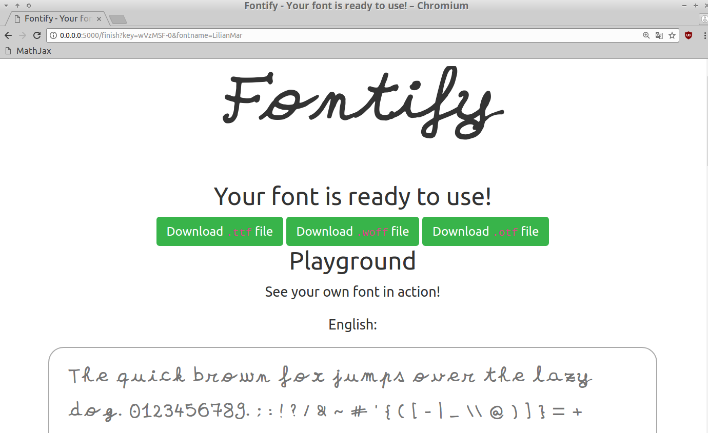

----

# Présentation personnelle

## Rapidement, je suis...
- Français, $25$ ans, je viens des Hautes-Alpes (Briançon),
- Normalien de l'ENS Cachan ($2011-2016$), diplômé en *mathématiques* et *informatique* (agrégation en $2014$, master MVA en $2016$).

. . .

## Avant et maintenant...
- *Avant* : stages de recherche en $2012$, $2013$, et $2016$, un an d'enseignement en $2014$-$2015$,
- *En thèse* depuis octobre $2016$, basé à Rennes, avec un financement ministériel ("contrat doctoral spécifique normalien"),
- Passionné par l'enseignement et la programmation, je souhaite *enseigner* l'informatique après ma thèse.

----

# Contexte et sujet {.allowframebreaks}

## Historique de l'équipe SCEE sur ce sujet
- Thèse de Wassim Jouini ($2008$-$2012$), *"Contribution to learning and decision making under uncertainty for Cognitive Radio"*,
- Thèse de Navikkumar Modi ($2014$-$2017$), *"Machine Learning and Statistical Decision Making for Green Radio"*,
- $10$ ans d'expertise de l'équipe, notamment Christophe Moy, Yves Louët et Jacques Palicot,
- $\implies$ suite des thèses de Wassim et Navikkumar.

----

# Exemples de projets personnels en $2017$-$18$

> Aperçu de certains projets reliés à la thèse (de près ou de loin)...

----

# Exemples de projets personnels en $2017$-$18$ I

- Quelques petits projets\footnote{Cf. \urlb{GitHub.com/Naereen/fix-iocaml-notebook-exports-to-pdf} et \urlb{GitHub.com/Naereen/Jupyter-NBConvert-OCaml}} pour faciliter l'utilisation des Notebooks Jupyter avec le langage OCaml (utilisé en option info en prépa et pour l'agrég).\newline
    $\hookrightarrow$ utilisé pour mon enseignement\footnote{Cf. \urlb{nbviewer.jupyter.org/github/Naereen/notebooks/tree/master/agreg/TP_Programmation_2017-18/}} (et à l'avenir, j'espère) !

----

# Exemples de projets personnels en $2017$-$18$ I

{width=50%}{width=50%}

----

# Exemples de projets personnels en $2017$-$18$ II

- Modules Python et Julia\footnote{Cf. \urlb{GitHub.com/Naereen/Lempel-Ziv_Complexity} et \urlb{GitHub.com/Naereen/LempelZiv.jl}} pour calculer la complexité de Lempel-Ziv sur des chaînes binaires. Environ 500 téléchargements...

```python
>>> from lempel_ziv_complexity import lempel_ziv_complexity
>>> s = '1001111011000010'
>>> lempel_ziv_complexity(s)
6     # 6 car s = 1 / 0 / 01 / 1110 / 1100 / 0010
```

```python
>>> %timeit lempel_ziv_complexity(s)
6.1 µs ± 33.6 ns per loop (mean ± std. dev. of 7 runs)
>>> %timeit lempel_ziv_complexity_cython(s)  # rapide !
132 ns ± 2.55 ns per loop (mean ± std. dev. of 7 runs)
```

----

# Exemples de projets personnels en $2017$-$18$ III

- Implémentation pédagogique\footnote{Cf. \urlb{GitHub.com/Naereen/Tiny-Prolog-in-OCaml}} d'un sous-ensemble du langage Prolog, en OCaml, pour mes élèves d'agrég.

```prolog
pair(o).    # nombre entier pair
pair(s(s(X))) <-- pair(X).
```

```prolog
blanc(jeannot).  # famille de lapins !
longOreilles(jeannot).
blanc(Y) <-- enfant(jeannot,Y).
enfant(X,filsYeuxB(X)) <-- longOreilles(X),dentPropres(X).
yeuxBleux(filsYeuxB(X)) <-- longOreilles(X),dentPropres(X).
dentPropres(X) <-- blanc(X).
```

----

# Exemples de projets personnels en $2017$-$18$ IV

- Un peu de traitement d'images et de programmation web pour une application web qui produit une police cursive "personnalisée", à partir d'un petit échantillon d'écriture manuscrite\footnote{Cf. \urlb{GitHub.com/Naereen/Fontify}}.\newline
    $\hookrightarrow$ But : une version "manuscrite" de mon manuscrit de thèse... (\alert{pour le plaisir})\newline
    \begin{Huge}\Fontify{Exemple : Fontify}\end{Huge}

----

# Exemples de projets personnels en $2017$-$18$ IV

{width=30%}{width=30%}{width=45%}

----

# Exemples de projets personnels en $2017$-$18$ V

- Formation et expérimentations en apprentissage par $Q$-renforcement profond ("deep $Q$-reinforcement learning", DQL) pour apprendre à jouer à un jeu vidéo à partir des pixels de l'écran.
    + Exemple avec des jeux ATARI (classique) et NES (dont un Mario\footnote{Cf. \urlb{GitHub.com/Naereen/gym-nes-mario-bros}} qui n'a jamais été traité avant, **Mario Bros.** -- $1986$).
    + But : j'aimerai trouver une application des bandits pour accélérer la convergence de tels réseaux, ou une application de tels réseaux pour de la radio intelligente... (pas simple)
    + \alert{Encore en cours}... (ce n'est pas simple)

----

# Exemples de projets personnels en $2017$-$18$ V

{width=100%}