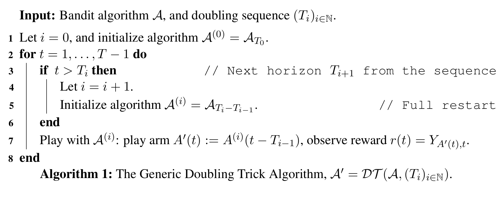

# Comité de Suivi Individuel du Doctorant
- Doctorant : Lilian Besson
- Titre de la thèse : \newline
  *"Apprentissage statistique séquentiel pour la radio cognitive multi-joueurs"*
- Dates : 1er octobre $2016$ à septembre $2019$.\pause\newline
  \alert{Soutenance ? Prévue pour juin $2019$ (si possible !)}
- Encadrement :

    \vspace*{10pt}
    \begin{tabular}{lll}
    Directeur de thèse : & \textbf{Christophe Moy} & à Rennes \\
    Co-encadrante : & \textbf{Émilie Kaufmann} & à Lille \\
    \end{tabular}

. . .

- Comité de suivi : **Patrick Maillé** \& **Rémi Gribonval** \newline
  Merci !

----

# Contexte et sujet

## Contexte thématique
- Télécom radio et *radio intelligente* (*"cognitive radio"*),
- Réseaux plus efficaces, plus écologiques etc,
- Réseaux avec beaucoup d'objets connectés ("**I**nternet **o**f **T**hings"),
- Apprentissage statistique séquentiel et par renforcement, problèmes et algorithmes de *bandit*, pour résoudre les problèmes d'optimisation combinatoire dans des contextes discrets en temps et fréquence.

----

# Double encadrement

Avec **Émilie Kaufmann**, CR au CNRS travaillant à Inria Lille (équipe SequeL, laboratoire CRIStAL) :

- Total de $3$ *visites* de Lilian à Lille depuis septembre $2017$ \newline
  ($1+2+1$ semaines)
- $4$ visites prévues en mai, juin, octobre et décembre $2018$ \newline
  ($1+1+1+2$ semaines)

- *Projets en commun* : \alert{moins qu'en 1ère année} (aucun entre Émilie et Christophe), mais davantage entre Émilie et moi,

- *Financements* :
    + financement PEPS "BIO" du CNRS obtenu par Émilie et moi (pour $2017$),
    + projet ANR "BADASS" (Lille),
    + et dotation SCEE (pour $2018$).

----

# Mon sujet
- *"Apprentissage statistique séquentiel pour la radio cognitive multi-joueurs"*.
- Buts :
    + continuer l'étude théorique des algorithmes étudiés et des difficultés intrinsèques des problèmes considérés,
    + étendre ces travaux à différents modèles dans le cas multi-joueurs, et grand nombre d'objets (IoT).
- Applications :
    + utiliser dynamiquement des zones vacantes du spectre radio,
    + insérer plus d'objets dans un réseau pré-existant,
    + garantir l'optimalité des solutions proposées, etc.

----

# Recherches en cours et collaborations ($1/2$)

## Avec Christophe \hfill{} (aspects radio intelligente)
- Poser des modèles réalistes et utiles pour les réseaux IoT,
- Vérifier en pratique (simulation et implémentation réelle) l'intérêt des algorithmes d'apprentissage (type bandit) dans le modèle classique OSA et dans de nouveau modèle multi-joueurs et IoT.

## Avec Émilie \hfill{} (aspects théoriques)
- Analyser les performances de différents algorithmes mono- et multi-joueurs dans différents modèles (*e.g.*, preuves de bornes supérieures sur le *regret*),
- et les difficultés intrinsèques de ces problèmes (bornes $\inf$).

----

# Recherches en cours et collaborations ($2/2$)

## Avec Rémi Bonnefoi (autre doctorant dans l'équipe SCEE)
Démo\footnote{\tiny Cf. \urlb{Bitbucket.org/scee_ietr/multi-arm-bandit-learning-for-lora-networks-with-grc}} réalisée ensemble :

<!-- FIXME check link ! -->

- Présentée en juin à la conférence ICT $2018$ (St-Malo) :
- Basée sur notre article CROWNCOM $2017$,
- **"MALIN"**: **M**ulti-**A**rmed bandits **L**earning in **I**oT **N**etworks,
- Avec GNU Radio + Python + C++,
- Avec des cartes USRP (via notre TestBed),
- Rien de révolutionnaire, juste une illustration (et vérification) de nos travaux théoriques...

> En fait : simple sur le papier, mais compliqué en vrai \Sadey{} !

----

# Publications depuis l'an dernier I

## Aperçu "numérique"
- $3$ communications dans des conférences internationales\footnote{Cf. \urlb{perso.crans.org/besson/me/}},
- $1$ envoyée,
- $1$ en relecture,
- $1$ bibliothèque de code, publiée en accès libre...

----

# Publications depuis l'an dernier II

## $2$ posters, chacun présentés $2$ fois :
1. Pour\footnote{\tiny Cf. \urlb{Bitbucket.org/scee_ietr/phd-student-day-ietr-2017-bonnefoi-and-besson}} mon article CROWNCOM $2017$
    + Journée des Doctorants (IETR) @ Rennes, juillet $2017$,
    + Atelier @ Lille, septembre $2017$ ("*bandits \& privacy"*\footnote{\tiny Cf. \urlb{team.inria.fr/magnet/workshop-on-decentralized-machine-learning-optimization-and-privacy/}}).
2. Pour\footnote{\tiny Cf. \urlb{bitbucket.org/lbesson/phd-student-day-ietr-2018}} mon article ALT $2018$
    + Atelier @ Rotterdam, mai $2018$ ("*applications of bandits"*\footnote{\tiny Cf. \urlb{www.erim.eur.nl/e-code-erasmus-centre-for-optimization-of-digital-experiments/workshop-on-multi-armed-bandits-and-learning-algorithms/}}),
    + Journée des Doctorants (IETR) @ Vannes, juin $2018$.

<!-- FIXME check URL of 2nd poster -->

----

# Publications depuis l'an dernier III

## $9$ présentations !
- Conférences\footnote{Planches et code source en accès libre. Cf. \urlb{perso.crans.org/besson/publis/slides/}} :
    + CROWNCOM @ Lisbonne,
    + ALT @ Lanzarote,
    + IEEE WCNC @ Barcelone,
- Séminaires :
    + SCEE @ Rennes ($\times 2$),
    + ENSAI @ Rennes,
    + SequeL @ Lille ($\times 2$),
- Bonus : journée GDR ISIS @ Paris.

----

# Publications depuis l'an dernier IV

1. Un article\footnote{Cf. \urlb{HAL.Inria.fr/hal-01575419}} "maths et télécom et simulations" avec Rémi B.
    + Présenté à la conférence européenne **CROWNCOM** $2017$ (septembre, Lisbonne).
    + *Best paper award!* \Smiley{} (mais toute petite conférence...)
    + Publié, \alert{mais aucune nouvelle pour la version longue}...

. . .

\vspace*{5pt}

2. Un article\footnote{Cf. \urlb{HAL.Inria.fr/hal-01629733}} "maths et théorie + télécom" avec Émilie, avec une nouvelle borne inférieure et de meilleures bornes supérieures pour l'algorithme $\rho^{\mathrm{Rand}}$ et deux nouveaux algorithmes $\mathrm{RandTopM}$, $\mathrm{MCTopM}$ (OSA multi-joueur décentralisé).
    + Présenté à la conférence **ALT** $2018$ (avril, Lanzarote).
    + Poster présenté à un atelier international à Rotterdam (fin mai).

----

# Publications depuis l'an dernier V

3. Un article\footnote{Cf. \urlb{HAL.Inria.fr/hal-01705292}} "machine learning + télécom" exposant l'intérêt de l'agrégation d'algorithmes de bandit pour des problèmes de radio cognitive.
    + Présenté à la conférence **IEEE WCNC** $2018$ (avril, Barcelone).
    + Bon retour des relecteurs et à la conférence \Smiley{} !
    + \alert{Mais difficile d'obtenir des résultats théoriques}

. . .

\vspace*{5pt}

4. Un article\footnote{Cf. \urlb{HAL.Inria.fr/hal-01736357}} "maths et théorie" avec Émilie, étudiant le "doubling trick" (voir plus tard). Pas de lien direct avec les télécoms.
    + *Envoyé* à la conférence **COLT** $2018$ (juillet, Stockholm).
    + \alert{Retours pas excellents, on attends encore la réponse finale...}

----

# Publications depuis l'an dernier VI

5. Ma bibliothèque d'algorithmes de bandits (mono- et multi-joueurs),
    + Environ $65$ algorithmes mono-joueur, $15$ multi joueurs,
    + $5$ environments d'expérimentations,
    + Code sur `GitHub.com/SMPyBandits/SMPyBandits`,
    + Documentation complète sur `SMPyBandits.GitHub.io`.
    + Publié sur MLOSS (`MLOSS.org/software/view/710`).
    + Déjà $\sim 1000$ vues en $3$ mois...

\vspace*{5pt}

6. Et un article\footnote{Cf. \urlb{perso.crans.org/besson/articles/SMPyBandits.pdf}} présentant la bibliothèque, \alert{bientôt envoyé au JMLR MLOSS} (revue en ligne, en accès libre).

----

# Présentation de quelques résultats de recherche

Je préfère présenter un seul des travaux, le plus récent.

\vspace*{15pt}

## Publication associée
"**What Doubling Tricks Can and Can't Do for Multi-Armed Bandits**", Lilian Besson \& Emilie Kaufmann, Feb $2018$.

> En accès libre : `HAL.Inria.fr/hal-01736357`

----

# "Doubling trick" : rapide présentation

## Horizon $T$ : mieux de ne pas la connaître !
- En apprentissage séquentiel, expériences de $t=1$ à $t=T$,
- Pour des applications réelles, les algorithmes ne doivent pas connaître l'horizon... (ex : essais cliniques, pubs en ligne, radio intelligente etc).
- Mais beaucoup sont développés avec "la théorie en tête", et dépendent de la valeur de $T$ !

. . .

## But ?

- $\hookrightarrow$ Peut-on transformer un algorithme $\mathcal{A}$ dépendant de $T$ et le rendre \alert{indépendant de l'horizon} $\mathcal{A}'$ ?
- $\implies$ **Oui !**
- Une technique classique : "doubling trick" !

----

# Algorithme du "Doubling trick"

<!--  -->
<!-- WARNING if not converting to LaTeX -->

<!-- FIXME how to use babel[french] here and have the keywords (Input, for, do, if, then, end) in French here ? -->
\begin{algorithm}[H]
% XXX Options
\LinesNumbered  % XXX Option to number the line
\DontPrintSemicolon
% \RestyleAlgo{boxed}
% XXX Input, data and output
\KwIn{Algorithme de bandit $\mathcal{A}$, et une suite $(T_i)_{i\in\mathbb{N}}$.}
% \KwData{Données}
% \KwResult{Résultat}
\BlankLine
% XXX Algorithme
Soit $i = 0$, et initialise l'algorithme $\mathcal{A}^{(0)} = \mathcal{A}_{T_0}$.\;
\For{$t = 1, \dots, T-1$}{
\If(\tcp*[f]{Horizon suivante $T_{i+1}$ dans la suite}){
$t > T_i$
}{
Horizon suivante : $i = i + 1$\;
Initialise $\mathcal{A}^{(i)} = \mathcal{A}_{T_i - T_{i-1}}$
\tcp*[f]{Départ à vide}
}
Joue selon $\mathcal{A}^{(i)}$ : choisit le bras $A'(t) := A^{(i)}(t - T_{i-1})$\;
Observe la récompense $r(t) = Y_{A'(t), t}$\;
Lui donner cette observation.
}
\caption{$\mathcal{A}' = \mathrm{DT}(\mathcal{A}, (T_i)_{i\in\mathbb{N}})$.}
\label{algo:DTr}
\end{algorithm}

----

# Deux "doubling" : géométrique et exponentiel

- $T_0 \in \mathbb{N}$, $(T_i)_{i\in\mathbb{N}}$ croissante et divergente
<!-- - ($\to+\infty$ pour $i\to\infty$). -->
- "Indice du dernier terme" : $L_T := \min\{ i \in\mathbb{N} : T_i > T\}$.

## Géométrique
- Pour un paramètre $b > 1$,
- $T_i := \lfloor T_0 b^i\rfloor$,
- $L_T = \lceil \log_b\left( \frac{T}{T_0} \right) \rceil = \mathcal{O}( \log(T) )$.

## Exponentiel
- Pour deux paramètres $a, b > 1$,
- $T_i := \lfloor \frac{T_0}{a} a^{b^i}\rfloor$,
- $L_T = \lceil \log_b\left( \log_a\left( \frac{T}{T_0/a} \right) \right) \rceil = \mathcal{O}( \log(\log(T)) )$.

----

# Regret et but
## Regret ?
- $R_T(\mathcal{A}_T)$ mesure la performance moyenne de l'algorithme $\mathcal{A}$ (qui peut connaître $T$), sur une expérience d'horizon $T$.
- $R_T(\mathcal{A}) := \sum_{t=1}^T \mu^* - \mathbb{E}[\mu_{A(t)}]$ pour un problème à $K$ bras de moyennes $\mu_1,\dots,\mu_K$, de meilleur bras $\mu^* := \arg\max_k \mu_k$ et si $A(t)$ est le choix de l'algorithme à l'instant $t$.

. . .

## But : *conserver* des bornes de regret !
- Si $\mathcal{A}$ vérifie une borne de regret, *e.g.*, $R_T(\mathcal{A}_T) \leq f(T)$
- Alors la version indépendante de $T$, $\mathrm{DT}(\mathcal{A})$, vérifie une borne similaire, avec une perte constante $\ell$, \alert{ou non} :
    + $R_T(\mathrm{DT}(\mathcal{A})) \leq \ell(\text{paramètres pb}) \times f(T)$ : bien !
    + $R_T(\mathrm{DT}(\mathcal{A})) \leq \ell(\text{paramètres pb}) \times g(T)$ : \alert{moins bien} ! (pour $g(T) \gg f(T)$).

----

# Types de bornes
> $c > 0$ est une constante dépendant des paramètres $\mu_1,\dots,\mu_K$ du problème, mais **pas** de $T$.

1. Regret indépendant des paramètres ("adversarial bandits")
    $$R_T(\mathcal{A}_T) \leq c \; \sqrt{T}$$

2. Regret dépendant des paramètres ("stochastic bandits")
    $$R_T(\mathcal{A}_T) \leq c \; \log(T)$$

## Forme générique
- \alert{$R_T(\mathcal{A}_T) \leq c \; (\log T)^{\delta} T^{\gamma}$}
    + $\delta=0,\gamma>0$ (adverse),
    + ou $\delta>0,\gamma=0$ (stochastique),
    + ou $\delta>0,\gamma>0$ (hybride !). E.g. : $\sqrt{T \log(T)}$.

----

# Résultats avec un "doubling" géométrique

> Avec des horizons $T_i := \lfloor T_0 b^i\rfloor$.

## Conserve bien $R_T \leq \sqrt{T}$ \hfill\Smiley
- Perte constante $\ell(b,\gamma) = \frac{b^{\gamma}(b-1)^{\gamma}}{b^{\gamma}-1} > 1$,
- $\hookrightarrow$ en connaissant $\gamma$, on choisit $b^*$ pour minimiser la perte.

## Conserve pas bien $R_T \leq \log(T)$ \hfill\Sadey
- \alert{On sait que ça ne peut pas marcher !}
- On a une borne inférieure : transforme ${(\log T)}^{\delta}$ en ${(\log T)}^{\delta\alert{+1}}$.

----

# Résultats avec un "doubling" exponentiel

> Avec des horizons $T_i := \lfloor \frac{T_0}{a} a^{b^i}\rfloor$.

## Conserve *peut-être* $R_T \leq \sqrt{T}$ \hfill\Sey
- \alert{Pas encore de borne sup ou inf convaincante},
- Transforme $\leq T^{\gamma}$ en $T^{\alert{b} \gamma}$, pas génial ($b > 1$)...
- Borne inf a la forme inverse, $\geq T^{\gamma}$ en $T^{\frac{\gamma}{\alert{b}}}$...

## Conserve bien $R_T \leq \log(T)$ \hfill\Smiley
- Perte constante $\ell(\delta, b) = \frac{b^{2\delta}}{b^{\delta}-1} > 1$ (*e.g.*, $\geq 4$ pour $\delta=1$),
- $\hookrightarrow$ en connaissant $\delta$, on choisit $b^*$ pour minimiser la perte.

----

# Illustration

{width=105%}

----

# Questions encore ouvertes

- Un schéma ($(T_i)_{i\in\mathbb{N}}$) intermédiaire qui conviendrait pour les trois types de bornes ?
- Une autre approche "plus intelligente" qui permettrait d'obtenir des meilleures garanties ?
- Empiriquement : choisir des paramètres ($T_0, b$ ou $T_0,a,b$) n'est pas simple, comment bien les choisir ?

## Question bonus
- \alert{Où publier cet article (si refusé à COLT $2018$) ?}\newline
  $\hookrightarrow$ NIPS $2018$ ?

----

# Applications de ce travail I
- Très générique !
- Donne une meilleure compréhension théorique de cette technique très utilisée depuis $\sim$ 20 ans (au moins).
- Justifie quelques articles qui utilisent le "doubling trick" sans justifier plus qu'une note de bas de page disant "on ne perd rien qu'une constante multiplicative dans le regret"...
- Donne une méthode simple pour choisir les valeurs de $T_0,b$ ou $T_0,a,b$ ($\hookrightarrow$ minimiser la perte constante $\ell$ !).

----

# Applications de ce travail II

## En radio intelligente ? Oui aussi !
1. Si on utilise un algorithme $\mathcal{A}_T$ très efficace dans son contexte, mais qui dépend de $T$ (*e.g.*, *Approximated Finite-Horizons Gittins Index*, $\mathrm{KLUCB}^{++}$, en bandits mono-joueur, *Musical Chair* en bandits multi-joueurs, etc),
2. Si on sait quel genre de garantie on espère (contexte stochastique, ou adverse, ou hybride),\pause
3. $\implies$ Alors on peut savoir quel "doubling trick" utiliser pour rendre son algorithme indépendant de $T$ le plus efficacement possible (on connaît $\delta,\gamma$ alors on choisit $T_0,b$ ou $T_0,a,b$ pour minimiser la perte constante $\ell$...).

----

# Autres activités

> Mais aussi...

----

# Autres activités ($1/5$) : Formations

Pour la thèse, il faut suivre des formations...
J'ai déjà fait $60$ sur les $72$ heures exigées.

> Encore quelques heures à faire, ce sera bouclé d'ici octobre !

- Scientifiques :
    + Présentations à des conférences et ateliers,
    + Présentation à la Journée des Doctorants de l'IETR en juin,

- Générales ou professionnelles :
    + À l'Université de Rennes 1, \alert{mais peu sont proposés}...
    + Formations internes (GouTP) à CentraleSupélec Rennes ? \alert{Pas sûr que "ça passe"}...

----

# Autres activités ($2/5$) : Enseignements I

Par plaisir et pour (espérer) valider mon stage d'agrégation, j'enseigne :

- $24$h/an de TD/TP à l'*ENSAI*, en informatique théorique\footnote{Cf. \urlb{perso.crans.org/besson/ensai-2017/}}, pour le cours "Algorithmique et Calculabilité" de David Cachera, au niveau L3 (1ère année d'école d'ingénieur).

- $48$h/an de TD/oraux à l'*ENS de Rennes*, en informatique théorique, pour la classe de préparation à l'agrégation de maths\footnote{Cf. \urlb{perso.crans.org/besson/agreg-2017/}} (option info), au niveau M2 (3ème année d'ENS). $15$ séances d'entraînement aux oraux d'informatique (leçons et modélisation), TP de programmation, et oraux blancs.

----

# Autres activités ($2/5$) : Enseignements II

J'ai obtenu la même mission pour $2019$.

\vspace*{15pt}

> Plus un éventuel poste de PRAG à l'ENS de Rennes pour continuer chez eux après ma thèse... A suivre !

----

# Relectures ($3/5$)

## "Review" \hfill{} Pas officiellement (bien sûr)
- Un article pour NIPS $2017$ en juillet (pour aider une amie),
- Un article pour ICML $2018$ en février (pour aider Émilie),
- Deux rapports de projet de recherche d'un cours de "Reinforcement Learning" du master MVA (pour aider Émilie), en janvier $2017$ et $2018$ (sur un de nos articles !).

## Coups de main
- Trois relectures d'articles de Rémi B. (novembre $2016$, mars $2017$ et $2018$),
- Relectures de morceaux des thèses de Navikkumar Modi (SCEE, mai $2017$), Claire Vernade (Télécom, octobre $2017$), et bientôt Rémi B. (SCEE, automne $2018$).

----

# Autres activités variées ($4/5$)

- Accueil des nouveaux @ SCEE (stagiaires, doctorants, post-doc \& ATER).

- Administration système pour nos machines de calcul dans l'équipe SCEE ($3$ "*workstations*", $15$ utilisateurs).

. . .

- En charge des "GouTP", nos formations mensuelles @ SCEE (et aux autres équipes @ CentraleSupélec). \alert{Franc succès !}
    + J'ai donné $5$ formations\footnote{Cf. \urlb{perso.crans.org/besson/publis/slides/}} depuis le lancement en janvier $2017$.

- Programmeur passionné, j'essaie de contribuer régulièrement à des projets personnels\footnote{Cf. \urlb{Bitbucket.org/lbesson} et \urlb{GitHub.com/Naereen}} et des grands projets *open-source*, surtout en Bash, OCaml, Python et Julia (*e.g.*, bibliothèques `tensorflow`, `keras`, `sphinx-doc`, `scikit-monaco` etc).

----

# Objectifs de recherche pour $2018$

> Petit aperçu...

----

# Objectifs de recherche pour $2018$ I

1. J'aimerai aussi faire un *"survey"* sur les algorithmes de bandits,
    + en les écrivant tous avec la même structure (initialisation, choix, récompenses, etc), basé sur `SMPyBandits`.
    + Il y en a une trentaine pour l'aspect mono-joueur (et beaucoup de variantes), et une quinzaine pour l'aspect multi-joueurs,
    + et je les ai tous implémenté et documenté sous une même organisation logique (approche objet).\pause
    + \alert{Pas sûr où publier ça si je l'écris}... Idées ?
    + Un doctorant @ Inria Grenoble voudrait collaborer avec moi sur ça. ([Valentin Reis](http://freux.fr/index.html))
    + (en fait, j'aimerai que le rapport s'écrive "tout seul" à partir de ma bibliothèque, pas sûr de comment m'y prendre…)

----

# Objectifs de recherche pour $2018$ II

2. Un algorithme générique pour s'adapter à des \alert{récompenses bornées dans un intervalle inconnu}.
    + *Difficile*,
    + Déjà très étudié, j'ai besoin de plus travailler l'état de l'art,
    + Motivation très utile en radio : apprentissage par renforcement avec des SNIR, des puissances reçus, etc. Ces mesures sont toujours bornées mais pouvoir s'adapter à leur amplitude peut améliorer les performances.

----

# Objectifs de recherche pour $2018$ III

3. Un algorithme générique pour s'adapter à des problèmes avec $K$ bras mais seulement $s < K$ ayant des moyennes positives (bandits parcimonieux, "sparse").
    + *Déjà pas mal travaillé dessus* (juillet $2017$, mars $2018$),
    + Le problème est montré "difficile" si $s$ n'est pas connu (en résumé : on ne peut pas faire mieux que si $s=K$, *i.e.*, un algorithme "sparsity aware" ignorant $s$ ne peut pas faire mieux qu'un algorithme classique),
    + Et ça me semble assez dur à utiliser en radio intelligente, si $s$ doit être connu...

  $\hookrightarrow$ un court article à EWRL $2018$ (octobre, Lille) ?

----

# Objectifs de recherche pour $2018$ IV

4. Travailler encore un peu sur les bandits multi-joueurs, notamment pour :
    + découvrir le nombre de joueurs \hfill{} (\Smiley{} j'ai ce qu'il faut),
    + autoriser des arrivées/départs de joueurs, de temps en temps ?
    + autoriser des environments stochastiques *par morceaux* ?
    + étudier des variantes du modèles (*e.g.*, avec écoute des autres joueurs, cf. article de Sumit Darak et al @ IEEE WCNC $2018$)...
    + intégrer des perturbateurs (*jammers*, cf. un [autre article de Sumit Darak et al, arXiv:1803.06810](https://arxiv.org/pdf/1803.06810.pdf))...

  $\hookrightarrow$ un article à IEEE WCNC $2019$ ?

----

# Objectifs de recherche pour $2018$ V

5. J'ai envie de travailler encore plus sur des approches "black-box wrapper algorithms" : un algorithme générique $\mathcal{W}$, qui transforme $\mathcal{A}$ avec *telle faiblesse* en un algorithme $\mathcal{A}' = \mathcal{W}(\mathcal{A})$ sans cette faiblesse.
    + Agrégation, "Doubling Trick", "Sparse Wrapper", "Unknown range wrapper", etc. Déjà plusieurs de mes travaux rentrent dans ce cadre !
    + $\implies$ \alert{Je verrai bien ma une bonne partie de ma thèse entièrement orientée autour de cette idée...}

----

# Objectifs de recherche pour $2018$

> Discussion sur des idées de directions ?

----

# Conclusion \& Perspectives

> Bilan...

\vspace*{15pt}

> Perspectives...

----

# Conclusion \& Perspectives {.allowframebreaks}

## Une première moitié de thèse efficace

- De la *recherche*, à CentraleSupélec Rennes et Inria Lille, avec mes encadrants (Christophe Moy, Émilie Kaufmann) et un autre doctorant (Rémi Bonnefoi),
- $5$ *articles* terminés, dont $3$ publiés et présentés (uniquement des conférences),
- d'autres *objectifs* bientôt et pour la suite,
- des *visites* régulières à Lille et Paris,
- des *conférences* et *ateliers* ailleurs en Europe.

## Mais aussi pour $2019$...

- La même charge d'*enseignement*, à l'ENS de Rennes et l'ENSAI,
- encore quelques heures de *formations* (générales) à Rennes,
- et quelques *conférences* à l'étranger ?
    + Atelier à Rotterdam en mai,
    + ICT à St-Malo en juin,
    + COLT à Stockholm en juillet ?
    + EWRL à Lille en octobre ?
    + URSI AP-RASC à New Delhi en mars $2019$ ?
    + IEEE WCNC à Marrakech en avril $2019$ ?

----

# Merci

Déjà la moitié de ma thèse.

Et \alert{beaucoup de choses à faire pour la suite \& fin...}

\vfill{}

\begin{center}\begin{Huge} \Fontify{Merci ! :-)} \end{Huge}\end{center}

> *À l'année prochaine... \alert{pour la soutenance !?}*
