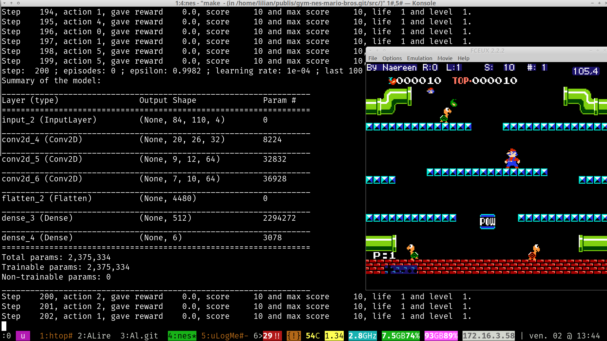

# Comité de Suivi Individuel du Doctorant
- Doctorant : Lilian Besson
- Titre de la thèse : \newline
  *"Apprentissage statistique séquentiel pour la radio cognitive multi-joueurs"*
- Dates : 1er octobre $2016$ à septembre $2019$.\pause\newline
  \alert{Soutenance ? Prévue pour juin $2019$ (si possible !)}
- Encadrement :

    \vspace*{10pt}
    \begin{tabular}{lll}
    Directeur de thèse : & \textbf{Christophe Moy} & à Rennes \\
    Co-encadrante : & \textbf{Émilie Kaufmann} & à Lille \\
    \end{tabular}

. . .

- Comité de suivi : **Patrick Maillé** \& **Rémi Gribonval** \newline
  Merci !

----

# Présentation personnelle

## Rapidement, je suis...
- Français, $25$ ans, je viens des Hautes-Alpes (Briançon),
- Normalien de l'ENS Cachan ($2011-2016$), diplômé en *mathématiques* et *informatique* (agrégation en $2014$, master MVA en $2016$).

. . .

## Avant et maintenant...
- *Avant* : stages de recherche en $2012$, $2013$, et $2016$, un an d'enseignement en $2014$-$2015$,
- *En thèse* depuis octobre $2016$, basé à Rennes, avec un financement ministériel ("contrat doctoral spécifique normalien"),
- Passionné par l'enseignement et la programmation, je souhaite *enseigner* l'informatique après ma thèse.

----

# Contexte et sujet {.allowframebreaks}

## Historique de l'équipe SCEE sur ce sujet
- Thèse de Wassim Jouini ($2008$-$2012$), *"Contribution to learning and decision making under uncertainty for Cognitive Radio"*,
- Thèse de Navikkumar Modi ($2014$-$2017$), *"Machine Learning and Statistical Decision Making for Green Radio"*,
- $10$ ans d'expertise de l'équipe, notamment Christophe Moy, Yves Louët et Jacques Palicot,
- $\implies$ suite des thèses de Wassim et Navikkumar.

## Contexte thématique
- Télécom radio et *radio intelligente* (*"cognitive radio"*),
- Réseaux plus efficaces, plus écologiques etc,
- Réseaux avec beaucoup d'objets connectés ("**I**nternet **o**f **T**hings"),
- Apprentissage statistique séquentiel et par renforcement, problèmes et algorithmes de *bandit*, pour résoudre les problèmes d'optimisation combinatoire dans des contextes discrets en temps et fréquence.

----

# Double encadrement

Avec **Émilie Kaufmann**, CR au CNRS travaillant à Inria Lille (équipe SequeL, laboratoire CRIStAL) :

- Total de $3$ *visites* de Lilian à Lille depuis septembre $2017$
  ($1+2+1$ semaines)
- $4$ visites prévues en mai, juin, octobre et décembre $2018$
  ($1+1+1+2$ semaines)

- *Projets en commun* : moins qu'en 1ère année (aucun entre Émilie et Christophe), mais davantage entre Émilie et moi,

- *Financements* : financement PEPS "BIO" du CNRS obtenu par Émilie et moi (pour $2017$), projet ANR "BADASS" (Lille), et dotation SCEE (pour $2018$).

----

# Mon sujet
- *"Apprentissage statistique séquentiel pour la radio cognitive multi-joueurs"*
- Buts :
    + continuer l'étude théorique des algorithmes étudiés et des difficultés intrinsèques des problèmes considérés,
    + étendre ces travaux à différents modèles dans le cas multi-joueurs, et grand nombre d'objets (IoT).
- Applications :
    + utiliser dynamiquement des zones vacantes du spectre radio,
    + insérer plus d'objets dans un réseau pré-existant,
    + garantir l'optimalité des solutions proposées, etc.

----

# Recherches en cours et collaborations ($1/2$)

## Avec Christophe Moy \hfill{} (aspects radio intelligente)
- Poser le bon modèle pour les réseaux IoT,
- Vérifier en pratique (simulation et implémentation réelle) l'intérêt des algorithmes d'apprentissage (type bandit) dans le modèle classique OSA et dans de nouveau modèle multi-joueurs et IoT.

## Avec Émilie Kaufmann \hfill{} (aspects théoriques)
- Analyser les performances de différents algorithmes mono- et multi-joueurs dans différents modèles (*e.g.*, preuves de bornes supérieures sur le *regret*),
- et les difficultés intrinsèques de ces problèmes (bornes $\inf$).

----

# Recherches en cours et collaborations ($2/2$)

## Avec Rémi Bonnefoi (autre doctorant dans l'équipe SCEE)
Démo réalisée ensemble, présentée en juin à la conférence ICT $2018$ (St-Malo) :

- Basée sur notre article CROWNCOM $2017$,
- **"MALIN"**: **M**ulti-**A**rmed bandits **L**earning in **I**oT **N**etworks,
- Avec GNU Radio + Python + C++,
- Avec des cartes USRP (via notre TestBed),
- Rien de révolutionnaire, juste une illustration (et vérification) de nos travaux théoriques...

> En une phrase : c'est simple sur le papier, mais vraiment compliqué en vrai !

----

# Publications depuis le début de ma thèse I

## Aperçu "numérique"
- $3$ articles publiés,
- $1$ envoyé,
- $1$ en relecture,
- $1$ bibliothèque publiée en accès libre...

----

# Publications depuis le début de ma thèse II

## $2$ posters
- Chacun présentés $2$ fois (JdD @ Rennes juillet $2017$, Workshop @ Lille septembre $2017$, Workshop @ Rotterdam mai $2018$, JdD Vannes juin $2018$).

## $9$ présentations
- Conférences : CROWNCOM @ Lisbonne, ALT @ Lanzarote, IEEE WCNC @ Barcelone,
- Séminaires : ENSAI @ Rennes, SCEE @ Rennes ($\times 2$), SequeL @ Lille ($\times 2$),
- Journée GDR ISIS @ Paris.

----

# Publications depuis le début de ma thèse III

1. Un *article*\footnote{Cf. \urlb{HAL.Inria.fr/hal-01575419}} "maths et télécom et simulations" avec Rémi Bonnefoi.
    + Présenté à la conférence européenne **CrownCom** $2017$ (septembre, Lisbonne).
    + *Best paper award!* (mais toute petite conférence)
    + Publié, \alert{mais aucune nouvelle pour la version longue}...

\vspace*{5pt}

2. Un *article*\footnote{Cf. \urlb{HAL.Inria.fr/hal-01629733}} "maths et théorie + télécom" avec Émilie Kaufmann, avec de nouvelles bornes inférieures et de meilleures bornes supérieures pour l'algorithme $\rho^{\mathrm{Rand}}$ et deux nouveaux algorithms RandTopM, MCTopM (OSA multi-joueur décentralisé).
    + Présenté à la conférence **ALT** $2018$ (avril, Lanzarote).
    + Poster présenté à un atelier international à Rotterdam (fin mai).

----

# Publications depuis le début de ma thèse IV

3. Un *article*\footnote{Cf. \urlb{HAL.Inria.fr/hal-01705292}} "machine learning for télécom" exposant l'intérêt de l'agrégation d'algorithmes de bandit pour des problèmes de radio cognitive.
    + Présenté à la conférence **IEEE WCNC** $2018$ (avril, Barcelone).

\vspace*{10pt}

4. Un *article*\footnote{Cf. \urlb{HAL.Inria.fr/hal-01736357}} "maths et théorie" avec Émilie Kaufmann, étudiant le "doubling trick" (voir plus tard). Pas de lien direct avec les télécoms.
    + Envoyé à la conférence **COLT** $2018$ (juillet, Stockholm).
    + Retour pas excellent, on attends la réponse finale...

----

# Publications depuis le début de ma thèse III

5. Ma bibliothèque d'algorithmes de bandits (simple et multi-joueurs), `SMPyBandits`,
    + Documentation complète sur `SMPyBandits.GitHub.io`.
    + Publié sur MLOSS (`MLOSS.org/software/view/710`).
    + Déjà $\sim 1000$ vues en $3$ mois...

\vspace*{10pt}

6. Et un article présentant la bibliothèque, en accès libre\footnote{Cf. \urlb{perso.crans.org/besson/articles/SMPyBandits.pdf}}, bientôt envoyé au JMLR MLOSS (journal en ligne).

----

# Présentation de quelques résultats de recherche

Je préfère présenter un seul des travaux, le plus récent.

## Publication associée
**What Doubling Tricks Can and Can't Do for Multi-Armed Bandits**, Lilian Besson \& Emilie Kaufmann, Feb 2018.

> En accès libre : `HAL.Inria.fr/hal-01736357`

----

# "Doubling trick" : rapide présentation

## Horizon $T$ : mieux de ne pas la connaître !
- En apprentissage séquentiel, expériences de $t=1$ à $t=T$,
- Pour des applications réelles, les algorithmes ne doivent pas connaître l'horizon... (essais cliniques, pubs en ligne, radio intelligente etc)
- Mais beaucoup sont développés avec principalement la théorie en tête, et dépendent de la valeur de $T$ !

. . .

## But ?

- $\hookrightarrow$ Peut-on transformer un algorithme dépendant de $T$ et le rendre indépendant de l'horizon ?
- $\implies$ **Oui !**
- Une technique classique : "doubling trick" !

----

# Algorithme du "Doubling trick"

<!--  -->

\begin{algorithm}[H]
% XXX Options
\LinesNumbered  % XXX Option to number the line
\DontPrintSemicolon
% \RestyleAlgo{boxed}
% XXX Input, data and output
\KwIn{Algorithme de bandit $\mathcal{A}$, et suite $(T_i)_{i\in\mathbb{N}}$.}
% \KwData{Données}
% \KwResult{Résultat}
\BlankLine
% XXX Algorithme
Soit $i = 0$, et initialise l'algorithme $\mathcal{A}^{(0)} = \mathcal{A}_{T_0}$.\;
\For{$t = 1, \dots, T-1$}{
\If(\tcp*[f]{Horizon suivante $T_{i+1}$ dans la suite}){
$t > T_i$
}{
Horizon suivante : $i = i + 1$.\;
Initialise l'algorithme $\mathcal{A}^{(i)} = \mathcal{A}_{T_i - T_{i-1}}$.
\tcp*[f]{Départ à vide}
}
Joue selon $\mathcal{A}^{(i)}$ : choisis le bras $A'(t) := A^{(i)}(t - T_{i-1})$, observe la récompense $r(t) = Y_{A'(t), t}$. \nllabel{line:internalTimer_DTr}
}
\caption{L'algorithme de "Doubling Trick" générique, $\mathcal{A}' = \mathrm{DT}(\mathcal{A}, (T_i)_{i\in\mathbb{N}})$.}
\label{algo:DTr}
\end{algorithm}

----

# Deux "doubling" : géométrique et exponentiel

- $T_0 \in \mathbb{N}$, $(T_i)_{i\in\mathbb{N}}$ croissant et divergeante ($\to+\infty$ pour $i\to\infty$).
- "Dernier terme" : $L_T := \min\{ i \in\mathbb{N} : T_i > T\}$.

## Géométrique
- Pour un paramètre $b > 1$,
- $T_i := \lfloor T_0 b^i\rfloor$,
- $L_T = \lceil \log_b\left( \frac{T}{T_0} \right) \rceil = \mathcal{O}( \log(T) )$.

## Exponentiel
- Pour deux paramètres $a, b > 1$,
- $T_i := \lfloor \frac{T_0}{a} a^{b^i}\rfloor$,
- $L_T = \lceil \log_b\left( \log_a\left( \frac{T}{T_0/a} \right) \right) \rceil = \mathcal{O}( \log(\log(T)) )$.

----

# Regret et but
## Regret ?
- $R_T(A_T)$ mesure la performance moyenne de l'algorithme $A$ (qui peut connaître $T$), sur une expérience d'horizon $T$.
- $R_T(A) := \sum_{t=1}^T \mu^* - \mathbb{E}[\mu_{A(t)}]$ pour un problème à $K$ bras de moyennes $\mu_1,\dots,\mu_K$, $\mu^* := \arg\max_k \mu_k$ et $A(t)$ le choix de l'algorithme à l'instant $t$.

. . .

## But : conserver des bornes de regret !
- Si $A$ vérifie une borne de regret, *e.g.*, $R_T(A_T) \leq f(T)$
- Alors la version indépendante de $T$, $\mathrm{DT}(A)$, vérifie une borne similaire, avec un coût constant ou non
    + $R_T(\mathrm{DT}(A)) \leq \ell(\text{paramètres pb}) \times f(T)$ : bien !
    + $R_T(\mathrm{DT}(A)) \leq \ell(\text{paramètres pb}) \times g(T)$ : \alert{moins bien} ! (pour $g(T) \gg f(T)$).

----

# Types de bornes
> $c > 0$ est une constante dépendant des paramètres $\mu_1,\dots,\mu_K$ du problème, mais **pas** de $T$.

## Indépendant des paramètres ("adversarial bandits")
- $R_T(A_T) \leq c \sqrt{T}$

## Dépendant des paramètres ("stochastic bandits")
- $R_T(A_T) \leq c \log(T)$

## Forme générique
- \alert{$R_T(A_T) \leq c (\log T)^{\delta} T^{\gamma}$}
    + $\delta=0,\gamma>0$ (adverse),
    + ou $\delta>0,\gamma=0$ (stochastique),
    + ou $\delta>0,\gamma>0$ (hybride !).

----

# Résultats avec un "doubling" géométrique

## Conserve bien $R_T \leq \sqrt{T}$ \hfill\Smiley
- Perte constante $\ell(b,\gamma) = \frac{b^{\gamma}(b-1)^{\gamma}}{b^{\gamma}-1} > 1$.

## Conserve pas bien $R_T \leq \log(T)$ \hfill\Sadey
- \alert{On sait que ça ne peut pas marcher !}
- On a une borne inférieure : transforme ${(\log T)}^{\delta}$ en ${(\log T)}^{\delta\alert{+1}}$.

----

# Résultats avec un "doubling" exponentiel

## Conserve *peut-être* $R_T \leq \sqrt{T}$ \hfill\Sey
- \alert{Pas encore de borne sup ou inf convaincante},
- Transforme $\leq T^{\gamma}$ en $T^{\alert{b} \gamma}$, pas génial ($b > 1$)...
- Borne inf a la forme inverse, $\geq T^{\gamma}$ en $T^{\frac{\gamma}{\alert{b}}}$...

## Conserve bien $R_T \leq \log(T)$ \hfill\Smiley
- Perte constante $\ell(\delta, b) = \frac{b^{2\delta}}{b^{\delta}-1} > 1$ ($\geq 4$ pour $\delta=1$).

----

# Questions encore ouvertes

- Un schéma intermédiaire qui conviendrait pour les trois types de bornes ?
- Une autre approche "plus intelligente" qui permettrait d'obtenir des meilleures garanties ?
- Empiriquement : choisir des paramètres ($T_0, b$ ou $T_0,a,b$) n'est pas simple, comment bien les choisir ?

## Question bonus
- \alert{Où publier cet article ?}

----

# Applications de ce travail
- Très générique !
- Donne une meilleure compréhension théorique de cette technique très utilisée depuis $\sim$ 20 ans (au moins).
- Justifie un nombre déraisonnable d'articles qui utilisent le "doubling trick" sans justifier plus qu'une note de bas de page disant "on ne perd rien qu'une constante multiplicative dans le regret" (sans preuve)...

----

# Applications de ce travail

## En radio intelligente ? Oui aussi !
1. Si Alice utilise un algorithme $A_T$ très efficace dans son contexte, mais qui dépend de $T$ (*e.g.*, *Approximated Finite-Horizons Gittins Index* en bandits simple joueur, *Musical Chair* en bandits multi-joueurs, etc),
2. Si elle sait quel genre de garantie elle espère (contexte stochastique, ou adverse, ou hybride),\pause
3. $\implies$ Alors elle peut savoir quel "doubling trick" utiliser pour rendre son algorithme indépendant de $T$ le plus efficacement possible (on connaît $\delta,\gamma$ alors on choisit $T_0,b$ ou $T_0,a,b$ pour minimiser la perte constante $\ell$...).

----

# Objectifs de recherche pour $2018$

> Petit aperçu...

----

# Objectifs de recherche pour $2018$ I

1. J'aimerai aussi faire un *"survey"* sur les algorithmes de bandits,
    + en les écrivant tous avec la même structure (initialisation, choix, récompense, etc), basé sur mon environnement de simulation.
    + Il y en a une trentaine pour l'aspect mono-joueur (et beaucoup de variantes), et une quinzaine pour l'aspect multi-joueurs,
    + et je les ai tous implémenté et documenté sous une même organisation logique (approche objet).
    + \alert{Pas sûr d'où publier ça si je l'écris}...
    + Un doctorant @ Inria Grenoble voudrait collaborer avec moi sur ça. ([Valentin Reis](http://freux.fr/index.html))

----

# Objectifs de recherche pour $2018$ II

2. Un algorithme générique pour s'adapter à des récompenses bornées dans un intervalle inconnu.
    + *Difficile*,
    + Motivation très utile en radio : apprentissage par renforcement avec des SNIR, des puissances reçus, etc. Ces mesures sont bornées mais pouvoir s'adapter à leur amplitude peut améliorer les performances.

\vspace*{10pt}

3. Un algorithme générique pour s'adapter à des problèmes avec $K$ bras mais seulement $s < K$ ayant des moyennes positives (bandits parcimonieux, "sparse").
    + *Déjà pas mal travaillé dessus*,
    + Semble assez dur à utiliser en radio intelligente.

----

# Objectifs de recherche pour $2018$ II

4. Travailler encore un peu sur les bandits multi-joueurs, notamment pour : découvrir le nombre de joueurs, autoriser des arrivées/départs de joueurs, intégrer des perturbateurs (*jammers*, cf. article de Sumit Darak @ IEEE WCNC $2018$)...

\vspace*{10pt}

5. J'ai envie de travailler encore plus sur des approches "black-box wrapper algorithms" : un algorithme générique $\mathcal{W}$, qui transforme $\mathcal{A}$ avec *telle faiblesse* en un algorithme $\mathcal{A}' = \mathcal{W}(\mathcal{A})$ sans cette faiblesse.
    + Agrégation, "Doubling Trick", "Sparse Wrapper", "Unknown range wrapper", etc. Déjà plusieurs de mes travaux rentrent dans ce cadre !
    + $\implies$ Je verrai bien ma thèse orientée entièrement autour de cette idée...

----

# Présentation de quelques directions de recherches

> Discussion sur des idées de directions...

----

# Autres activités

Mais aussi...

----

# Autres activités ($1/4$) : Formations

Pour la thèse, il faut suivre des formations...
J'ai presque tout fait des $72$ heures exigées. Il me reste :

- Scientifiques :
    + Présentations à des conférences et ateliers,
    + Présentation à la Journée des Doctorants de l'IETR en juin,

- Générales ou professionnelles :
    + À l'Université de Rennes 1, \alert{mais peu sont proposés}...
    + Formations internes (GouTP) à CentraleSupélec Rennes ? \alert{Pas sûr que "ça passe"}...

> Encore quelques heures à faire, ce sera bouclé d'ici octobre !

----

# Autres activités ($2/4$) : Enseignements I

Par passion et pour (espérer) valider mon stage d'agrégation, j'enseigne :

- $24$h/an de TD/TP à l'*ENSAI*, en informatique théorique\footnote{Cf. \urlb{perso.crans.org/besson/ensai-2017/}}, pour le cours "Algorithmique et Calculabilité" de David Cachera, au niveau L3 (2ème année d'école d'ingénieur).

- $48$h/an de TD/oraux à l'*ENS de Rennes*, en informatique théorique, pour la classe de préparation à l'agrégation de maths\footnote{Cf. \urlb{perso.crans.org/besson/agreg-2017/}} (option info), au niveau M2 (3ème année d'ENS). $15$ séances d'entraînement aux oraux d'informatique (leçons et modélisation), TP de programmation, et oraux blancs.

----

# Autres activités ($2/4$) : Enseignements II

> J'ai obtenu la même mission pour $2019$.
> Plus un éventuel poste de PRAG à l'ENS de Rennes pour continuer ensuite... A suivre !

----

# Autres activités variées ($3/4$)

- Administration système pour nos machines de calcul dans l'équipe SCEE (3 "*workstations*", 15 utilisateurs).

- En charge des "GouTP", nos formations internes à SCEE (et aux autres équipes du bâtiment), base mensuelle.
    + $5$ formations\footnote{Cf. \urlb{perso.crans.org/besson/publis/slides/}} depuis le lancement en janvier $2017$. \alert{Franc succès !}

- Programmeur passionné, j'essaie de contribuer régulièrement à des projets personnels\footnote{Cf. \urlb{Bitbucket.org/lbesson} et \urlb{GitHub.com/Naereen}} et des grands projets *open-source*, surtout en Bash, OCaml, Python et Julia (*e.g.*, bibliothèques `tensorflow`, `keras`, `sphinx-doc`, `scikit-monaco` etc).

----

# Exemples de projets personnels en $2017-18$ I

- Quelques petits projets\footnote{Cf. \urlb{GitHub.com/Naereen/fix-iocaml-notebook-exports-to-pdf} et \urlb{GitHub.com/Naereen/Jupyter-NBConvert-OCaml}} pour faciliter l'utilisation des Notebooks Jupyter avec le langage OCaml (utilisé en option info en prépa et pour l'agrég).\newline
    $\hookrightarrow$ utilisé pour mon enseignement\footnote{Cf. \urlb{nbviewer.jupyter.org/github/Naereen/notebooks/tree/master/agreg/TP_Programmation_2017-18/}} (et à l'avenir, j'espère) !

{width=40%}{width=40%}

----

# Exemples de projets personnels en $2017-18$ II

- Modules Python et Julia\footnote{Cf. \urlb{GitHub.com/Naereen/Lempel-Ziv_Complexity} et \urlb{GitHub.com/Naereen/LempelZiv.jl}} pour calculer la complexité de Lempel-Ziv sur des chaînes binaires. Environ 500 téléchargements...

```python
>>> from lempel_ziv_complexity import lempel_ziv_complexity
>>> s = '1001111011000010'
>>> lempel_ziv_complexity(s)
6  # because s = 1 / 0 / 01 / 1110 / 1100 / 0010
```

```python
>>> %timeit lempel_ziv_complexity(s)
6.1 µs ± 33.6 ns per loop (mean ± std. dev. of 7 runs)
>>> %timeit lempel_ziv_complexity_cython(s)  # plus rapide!
132 ns ± 2.55 ns per loop (mean ± std. dev. of 7 runs)
```

----

# Exemples de projets personnels en $2017-18$ III

- Implémentation pédagogique\footnote{Cf. \urlb{GitHub.com/Naereen/Tiny-Prolog-in-OCaml}} d'un sous-ensemble du langage Prolog, en OCaml, pour mes élèves d'agrég.

```prolog
even(o).
even(s(s(X))) :- even(X).
```

```prolog
whiteFur(bugsBunny).
longEars(bugsBunny).
whiteFur(Y) :- child(bugsBunny,Y).
child(X,sonWithBlueEyes(X)) :- longEars(X),cleanTeeth(X).
blueEyes(sonWithBlueEyes(X)) :- longEars(X),cleanTeeth(X).
cleanTeeth(X) :- whiteFur(X).
```

----

# Exemples de projets personnels en $2017-18$ IV

- Un peu de traitement d'images et de programmation web pour une application web qui créée une police manuscrite "personnelle" à partir d'un échantillon d'écriture manuscrite\footnote{Cf. \urlb{GitHub.com/Naereen/Fontify}}.\newline
    But : une version "manuscrite" de mon manuscrit de thèse...\newline
    \Fontify{Exemple : Fontify}

{width=30%}{width=30%}{width=30%}

----

# Exemples de projets personnels en $2017-18$ V

- Formation et expérimentations en apprentissage par renforcement profond ("deep reinforcement learning") pour apprendre à jouer à un jeu vidéo à partir des pixels de l'écran.
    + Exemple avec des jeux ATARI (classique) et NES (dont un Mario\footnote{Cf. \urlb{GitHub.com/Naereen/gym-nes-mario-bros}} qui n'a jamais été traité comme ça avant).
    + Encore en cours (c'est pas simple)...

{width=80%}

----

# Conclusion \& Perspectives

----

# Conclusion \& Perspectives {.allowframebreaks}

## Une première moitié de thèse efficace

- De la *recherche*, à CentraleSupélec Rennes et Inria Lille, avec mes encadrants (Christophe Moy, Émilie Kaufmann) et un autre doctorant (Rémi Bonnefoi),
- $5$ *articles* terminés, dont $3$ publiés et présentés (uniquement des conférences),
- d'autres *objectifs* bientôt et pour la suite,
- des *visites* régulières à Lille et Paris,
- des *conférences* et *ateliers* ailleurs en Europe.

## Mais aussi pour $2019$...

- La même charge d'*enseignement*, à l'ENS de Rennes et l'ENSAI,
- encore quelques heures de *formations* (générales) à Rennes,
- et quelques *conférences* prévues à l'étranger
    + Atelier à Rotterdam en mai,
    + ICT à St-Malo en juin,
    + COLT à Stockholm en juillet ?
    + AISTATS à Okinawa en avril $2019$ ?
    + IEEE WCNC à Marrakech en avril $2019$ ?

----

# Merci

Déjà la moitié de ma thèse.

Et beaucoup de choses à faire pour la suite...

\vfill{}

\begin{center}\begin{Huge} \Fontify{Merci ! !} \end{Huge}\end{center}

> *À l'année prochaine... \alert{pour la soutenance !?}*
