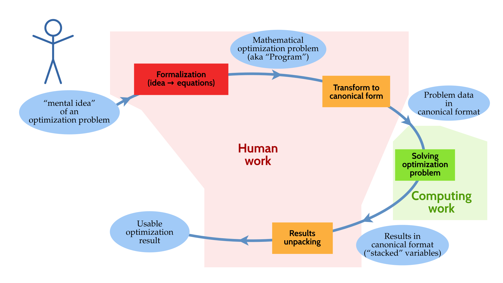

<!--
$theme: default
$size: 4:3
page_number: true
footer: « Julia, my new computing friend? » | 14 June 2018, IETR@Vannes | By: L. Besson & P. Haessig
-->

<link rel="stylesheet" type="text/css" href="common/marp-naereen.css" />


---

# « Julia, my new friend for computing and optimization? »

- **Intro to the Julia programming language, for MATLAB users**

- *Date:* 14th of June 2018

- *Who:* Lilian Besson & Pierre Haessig
   (SCEE & AUT team @ IETR / CentraleSupélec campus Rennes)

<center></center>

---

<!-- *template: break -->

# Agenda for today [30 min]

1. What is Julia? [5 min]
2. Comparison with MATLAB [5 min]
3. Two examples of problems solved Julia [5 min]
4. Longer ex. on optimization with JuMP [13min]
5. Links for more information ?  [2 min]

---

# 1. What is Julia ?

- **Open-source and free programming language** (MIT license)
	- Developed since [2012](https://julialang.org/blog/2012/02/why-we-created-julia) (creators: MIT researchers)
	- Growing popularity worldwide, in research, data science, finance etc…
	- Multi-platform: Windows, Mac OS X, GNU/Linux...
- Designed for *performance*:
	- Interpreted *and* compiled, very efficient
	- Easy to run your code in parallel (multi-core & cluster)

- Designed to be *simple to learn and use*:
	- Easy syntax, dynamic typing (MATLAB & Python-like)
<!--	- Inline documentation -->

---

# Ressources
- **Website**:
    + [`JuliaLang.org`](https://julialang.org/) for the language
    + & [`Pkg.JuliaLang.org`](https://pkg.julialang.org/) for packages
- Documentation : [`docs.JuliaLang.org`](https://docs.julialang.org/en/latest/)

<center>

---

# Comparison with MATLAB (1/3)

|  | Julia :smiley: | MATLAB :cry:
|:-|:-:|:-:|
| **Cost** | Free :v: | Hundreds of euros / year
| **License** | Open-source | 1 year user license (no longer after your PhD!)
| **Comes from** | A non-profit foundation, and the community | MathWorks company
| **Scope** | Mainly numeric | Numeric only
| **Performances** | Very good performance | Faster than Python, slower than Julia

---

# Comparison with MATLAB (2/3)

|  | Julia | MATLAB
|:-|:-:|:-:|
| **Packaging** | `Pkg` manager included. Based on `git` + GitHub, very easy to use | Toolboxes already included but :moneybag: have to pay if you wat more!
| **Editor/IDE** | [*Jupyter*](https://jupyter.org/) is recommended ([*Juno*](http://junolab.org/) is also good) | Good IDE already included
| **Parallel computations** | Very easy, low overhead cost | Possible, high overhead

---

# Comparison with MATLAB (3/3)

|  | Julia | MATLAB
|:-|:-:|:-:|
| **Usage** | Generic, worldwide :earth_americas: | Research in academia and industry
| **Fame** | Young but starts to be known | Old and known... In decline :chart_with_downwards_trend: ?
| **Support?** | Community$^1$: StackOverflow, [Forum](https://discourse.julialang.org/)  | By MathWorks
| **Documentation** | OK and growing, inline/online | OK, inline/online

> Note$^1$: [Julia Computing, Inc.](https://juliacomputing.com/) (founded 2015 by Julia creators) offer paid licenses ([JuliaPro](https://juliacomputing.com/products/juliapro.html) Enterprise) with professional support.

---

# How to install Julia :arrow_down: (1/2)
- You can try online *for free* on [`JuliaBox.com`](https://www.juliabox.com/)

- On Linux, Mac OS or Windows:
  + You can use the default installer :package:
    from the website [`JuliaLang.org/downloads`](https://julialang.org/downloads/)
- Takes about 4 minutes... and it's free !

> You also need Python 3 to use Jupyter :sparkles:, I suggest to use
> :snake: [`Anaconda.com/download`](https://www.anaconda.com/download/) if you don't have Python yet.

---

# How to install Julia :arrow_down: (2/2)


1. Select the binary of your platform :package:
2. Run the binary :running: !
3. Wait :clock130:…
4. Done :ok_hand: ! Test with `julia` in a terminal

---

# Different tools to use Julia
- Use `julia` for the command line for short experiments
  
- Use the *Juno* IDE to edit large projects

> Demo time :watch: !

---

# Different tools to use Julia
- Use **Ju***pyter* notebooks to write or share your experiments
  (examples: [`github.com/Naereen/notebooks`](https://github.com/Naereen/notebooks/))
  

> Demo time :watch: !

---

## :package: How to install modules in Julia ?
- Installing is **easy** !
```julia
julia> Pkd.add("IJulia")  # installs IJulia
```

- Updating also!
```julia
julia> Pkg.update()
```

## :mag: How to find the module you need ?
- First… ask your colleagues :smile: !
- Complete list on [`Pkg.JuliaLang.org`](https://pkg.julialang.org)

---

# :package: Overview of famous Julia modules

- Plotting:
    + [`Winston.jl`](https://github.com/JuliaGraphics/Winston.jl) for easy plotting like MATLAB
    + [`PyPlot.jl`](https://github.com/JuliaPy/PyPlot.jl) interface to Matplotlib (Python)
- The [JuliaDiffEq](http://juliadiffeq.org) collection for **differential equations**
- The [JuliaOpt](https://www.juliaopt.org/) collection for **optimization**
- The [JuliaStats](http://juliastats.github.io) collection for **statistics**
- And many more!

> Find more specific packages on [`GitHub.com/svaksha/Julia.jl`](https://github.com/svaksha/Julia.jl/)

---

# Many packages, and a quickly growing community

[](https://pkg.julialang.org/pulse.html)

> Julia is still in development, in version v0.6 but version 1.0 is planned soon!

---

<!-- *template: break -->

# 2. Main differences in syntax between Julia and MATLAB
> Ref: [`CheatSheets.QuanteCon.org`](https://cheatsheets.quantecon.org/)

---

# 2. Main differences in syntax between Julia and MATLAB
> Ref: [`CheatSheets.QuanteCon.org`](https://cheatsheets.quantecon.org/)

|  | Julia | MATLAB
|:-|:-:|:-:|
| **File ext.** | `.jl` | `.m`
| **Comment** | `# blabla...` | `% blabla...`
| **Indexing** | `a[1]` to `a[end]` | `a(1)` to `a(end)`
| **Slicing** | `a[1:100]` (view) | `a(1:100)` (:warning: copy)
| **Operations** | Linear algebra by default | Linear algebra by default
| **Block** | Use `end` to close all blocks | Use `endif` `endfor` etc

---

|  | Julia | MATLAB
|:-|:-:|:-:|
| **Help** | `?func` | `help func`
| **And** | `a & b` | `a && b`
| **Or** | `a | b` | `a || b`
| **Datatype** | `Array` of *any* type | multi-dim doubles array
| **Array** | `[1 2; 3 4]` | `[1 2; 3 4]`
| **Size** | `size(a)` | `size(a)`
| **Nb Dim** | `ndims(a)` | `ndims(a)`
| **Last** | `a[end]` | `a(end)`

---

|  | Julia | MATLAB
|:-|:-:|:-:|
| **Tranpose** | `a.'` | `a.'`
| **Conj. transpose** | `a'` | `a'`
| **Matrix** x | `a * b` | `a * b`
| **Element-wise** x | `a .* b` | `a .* b`
| **Element-wise** / | `a ./ b` | `a ./ b`
| **Element-wise** ^ | `a ^ 3` | `a .^ 3`
| **Zeros** | `zeros(2, 3, 5)` | `zeros(2, 3, 5)`
| **Ones** | `ones(2, 3, 5)` | `ones(2, 3, 5)`
| **Identity** | `eye(10)` | `eye(10)`
| **Range** | `range(0, 100, 2)` or `1:2:100` | `1:2:100`

---

|  | Julia | MATLAB
|:-|:-:|:-:|
| **Maximum** | `max(a)` | `max(max(a))` ?
| **Random matrix** | `rand(3, 4)` | `rand(3, 4)`
| $L^2$ **Norm** | `norm(v)` | `norm(v)`
| **Inverse** | `inv(a)` | `inv(a)`
| **Solve syst.** | `a \ b` | `a \ b`
| **Eigen vals** | `V, D = eig(a)` | `[V,D]=eig(a)`
| **FFT/IFFT** | `fft(a)`, `ifft(a)` | `fft(a)`,`ifft(a)`

> Very close to MATLAB for linear algebra!

---

# 3. Scientific problems solved with Julia
> Just to give examples of syntax and modules

1. 1D numerical integration and plot
2. Solving a $2^{\text{nd}}$ order Ordinary Differential Equation

---

# 3.1. $1$D numerical integration and plot

> Exercise: evaluate and plot this function on $[-1, 1]$ :
> $$\mathrm{Ei}(x) := \int_{-x}^{\infty} \frac{\mathrm{e}^u}{u} \;\mathrm{d}u$$

## How to?
Use packages and everything is easy!

- [`QuadGK.jl`](https://github.com/JuliaMath/QuadGK.jl) for integration
- [`Winston.jl`](https://github.com/JuliaGraphics/Winston.jl) for $2$D plotting

---

```julia
using QuadGK

function Ei(x, minfloat=1e-3, maxfloat=100)
    f = t -> exp(-t) / t  # inline function
    if x > 0
        return quadgk(f, -x, -minfloat)[1]
             + quadgk(f, minfloat, maxfloat)[1]
    else
        return quadgk(f, -x, maxfloat)[1]
    end
end

X = linspace(-1, 1, 1000)  # 1000 points
Y = [ Ei(x) for x in X ]   # Python-like syntax!

using Winston
plot(X, Y)
title("The function Ei(x)")
xlabel("x"); ylabel("y")
savefig("figures/Ei_integral.png")
```

---


---

# 3.2. Solving a $2^{\text{nd}}$ order ODE

> Goal: solve and plot the differential equation of a pendulum:
> $$\theta''(t) + b \,\theta'(t) + c \,\sin(\theta(t)) = 0$$
> For $b = 1/4$, $c = 5$, $\theta(0) = \pi - 0.1$, $\theta'(0)=0$, $t\in[0,10]$

## How to?
Use packages!

- [`DifferentialEquations.jl`](https://github.com/JuliaDiffEq/DifferentialEquations.jl) function for ODE integration
- [`Winston.jl`](https://github.com/JuliaGraphics/Winston.jl) for $2$D plotting

---

```julia
using DifferentialEquations

b, c = 0.25, 5.0
y0 = [pi - 0.1, 0]

# macro magic!
pend2 = @ode_def Pendulum begin
  dθ = ω  # ← yes, this is UTF8, θ and ω in text
  dω = (-b * ω) - (c * sin(θ))
end

prob = ODEProblem(pend, y0, (0.0, 10.0))
sol = solve(prob)         # ↑ solve on interval [0,10]
t, y = sol.t, hcat(sol.u...)'

using Winston
plot(t, y[:, 1], t, y[:, 2])
title("2D Differential Equation")
savefig("figures/Pendulum_solution.png")
```

---


---

<!-- *template: break -->

# Examples


1. **Iterative computation**: signal filtering
2. **Optimization**: robust regression on RADAR data

---

<!-- *template: break -->

# Ex. 1: Iterative computation

Objective:

* show the efficiency of Julia's Just-in-Time (JIT) compilation
* but also its fragility...

*Note: you can find companion notebooks on [GitHub](https://github.com/pierre-haessig/julia-presentation-ietr2018/tree/master/filter%20example)*

---

# Iterative computation: signal filtering

The classical saying:

> *« Vectorized code often runs much faster than the corresponding code containing loops. »* (cf. [MATLAB doc](https://mathworks.com/help/matlab/matlab_prog/vectorization.html))

does not hold for Julia, because of its **Just-in-Time compiler**.

## Example of a computation that cannot be vectorized
Smoothing of a signal $\{u_k\}_{k\in\mathbb{N}}$:

$$ y_k = ay_{k-1} + (1-a) u_k, \;\;\;\; k\in\mathbb{N}^+ $$


Parameter $a$ tunes the smoothing (none: $a=0$, strong $a\to1^-$).

==:boom: Iteration (`for` loop) **cannot** be avoided.==

<!-- NB : Matlab also has JIT https://fr.mathworks.com/products/matlab/matlab-execution-engine.html but it may not work well in all cases -->

---

# Signal filtering in Julia :ok_hand:

```julia
function smooth(u, a)
    y = zeros(u)

    y[1] = (1-a)*u[1]
    for k=2:length(u)  # this loop is NOT slow!
        y[k] = a*y[k-1] + (1-a)*u[k]
    end

    return y
end
```


---

<!-- *footer: -->

# Performance of the signal filter

| Implementation        | Time for $10 \,\mathrm{Mpts}$   | notes |
|-----------------------|----------------------|-------|
| Julia  :sparkles:     | $50-70\,\mathrm{ms}$ | **Fast! Easy!** :ok_hand:     |
| Octave native         | $88000\,\mathrm{ms}$  | **slow!!** :snail::snail::snail: |
| SciLab native         | $7800\,\mathrm{ms}$  | **slow!!** :snail::snail: |
| Python native         | $4400\,\mathrm{ms}$  | **slow!** :snail: |
| SciPy's `lfilter`     | $70\,\mathrm{ms}$    | many lines of C |
| Python + `@numba.jit` | $50\,\mathrm{ms}$    | since $2012$    |

> ```python
> @numba.jit  # <- factor ×100 speed-up!
> def smooth_jit(u, a):
>     y = np.zeros_like(u)
>     y[0] = (1-a)*u[0]
>     for k in range(1, len(u)):
>         y[k] = a*y[k-1] + (1-a)*u[k]
>     return y
>```

---

# Conclusion on the performance

For this simple iterative computation:

* Julia performs very well, much better than native Python
* but it's possible to get the same with fresh Python tools ([Numba](http://numba.pydata.org/))
* more realistic examples are needed


---

# Fragility of Julia's JIT Compilation :boom:

The efficiency of the compiled code relies on **type inference**.

```julia
function smooth1(u, a)
    y = 0
    for k=1:length(u)
        y = a*y + (1-a)*u[k]
    end
    return y
end
```

```julia
function smooth2(u, a)
    y = 0.0   # <- difference is here!
    for k=1:length(u)
        y = a*y + (1-a)*u[k]
    end
    return y
end
```

---

# An order of magnitude difference :snail:vs:running_man:

```julia
julia> @time smooth1(u, 0.9);
  0.212018 seconds (30.00 M allocations: 457.764 MiB ...)
```
```julia
julia> @time smooth2(u, 0.9);
  0.024883 seconds (5 allocations: 176 bytes)
```

### Fortunately, Julia gives a good diagnosis tool :hammer_and_wrench:

```julia
julia> @code_warntype smooth1(u, 0.9);
...  # ↓ we spot a detail
y::Union{Float64, Int64}
...
```
`y` is ==either== `Float64` or `Int64` when it should be just `Float64`.

Cause: initialization `y=0` vs. `y=0.0`!

---

<!-- *template: break -->

# Ex. 2: Optimization in Julia

Objective: demonstrate **JuMP**, a Modeling Language for Optimization in Julia.

* Some researchers migrate to Julia just for this!
* I use JuMP for **my research** (energy management)

*Note: you can find companion notebooks on [GitHub](https://github.com/pierre-haessig/julia-presentation-ietr2018/tree/master/regression%20example)*

---

# Optimization problem example

Example problem: identifying the sea clutter in Weather Radar data.

* is a **robust regression** problem
    * $\hookrightarrow$ is an optimization problem!

<br>
<div class="detail">
An « IETR-colored » example, inspired by:

* Radar data+photo: P.-J. Trombe *et al.*, « Weather radars – the new eyes for offshore wind farms?,» *Wind Energy*, 2014.
* Regression methods: S. Boyd and L. Vandenberghe, *Convex Optimization*. Cambridge University Press, 2004. (Example 6.2).
</div>

---

# Weather radar: the problem of sea clutter


<center>
</center>

Given $n$ data points $(x_i, y_i)$, fit a linear trend:

$$\hat{y} = a.x + b$$

An **optimization problem** with two parameters: $a$ (slope), $b$ (intercept)

---

# Regression as an optimization problem

The parameters for the trend $(a,b)$ should minimize a criterion $J$
which penalizes the residuals $r_i = y_i - \hat{y} = y_i - a.x + b$:

$$J(a,b) = \sum_i \phi(r_i)$$

where $\phi$ is the *penaly function*, to be chosen:

* $\phi(r) = r^2$: quadratic deviation $\rightarrow$ least squares regression
* $\phi(r) = \lvert r \rvert$: absolute value deviation
* $\phi(r) = h(r)$: [Huber loss](https://en.wikipedia.org/wiki/Huber_loss)
* ...

---

# :wrench: Choice of penalty function
The choice of the loss function influences:

* the optimization result (fit quality)
    + *e.g.*, in the presence of outliers
* the properties of optimization problem: convexity, smoothness

### Properties of each function


* quadratic: convex, smooth, heavy weight for strong deviations
* absolute value: convex, not smooth
* Huber: a mix of the two

---

# :hammer_and_wrench: How to solve the regression problem?

## Option 1: a big bag of tools

A specific package for each type of regression:

* « least square toolbox » ($\rightarrow$ [MultivariateStats.jl](https://github.com/JuliaStats/MultivariateStats.jl))
* « least absolute value toolbox » ($\rightarrow$ [quantile regression](https://github.com/pkofod/QuantileRegression.jl/))
* « Huber toolbox » (*i.e.*, robust regression $\rightarrow$ ??)
* ...


## Option 2: the « One Tool »

$\Longrightarrow$ a **Modeling Language for Optimization**

+ more **freedom to explore variants** of the problem

---

<!-- *template: break -->

# Modeling Languages for Optimization

*Purpose: make it easy to **specify** and **solve** optimization problems without expert knowledge*.

---

<!--
# <span style="font-size:0.8em;">Tasks for solving a practical optimization problem </span>


---

# <span style="font-size:0.8em;">Tasks for solving a practical optimization problem </span>



---

# <span style="font-size:0.8em;">Tasks for solving a practical optimization problem </span>


-->

# JuMP: optimization modeling in Julia

- The [JuMP](https://github.com/JuliaOpt/JuMP.jl) package offers a domain-specific modeling language for mathematical optimization.

JuMP **interfaces with many optimization solvers**: open-source (Ipopt, GLPK, Clp, ECOS...) and commercial (CPLEX, Gurobi, MOSEK...).

- Other Modeling Languages for Optimization:

  + Standalone software: AMPL, GAMS
  + Matlab: YALMIP ([previous seminar](http://pierreh.eu/efficient-tools-seminar/)), CVX
  + Python: Pyomo, PuLP, CVXPy

<br>

> Claim: JuMP is **fast**, thanks to Julia's [metaprogramming](https://docs.julialang.org/en/stable/manual/metaprogramming/#Metaprogramming-1) capabilities (generation of Julia code within Julia code).

---

# :chart_with_upwards_trend: Regression with JuMP — common part

- Given `x` and `y` the $300$ data points:

```julia
m = Model(solver = ECOSSolver())

@variable(m, a)
@variable(m, b)

res = a*x .- y + b
```

`res` (« residuals ») is an Array of $300$ elements of type `JuMP.GenericAffExpr{Float64,JuMP.Variable}`, *i.e.*, a semi-symbolic affine expression.

- Now, we need to specify the penalty on those residuals.

---

# Regression choice: least squares regression

$$\min \sum_i r_i^2$$

Reformulated as a [Second-Order Cone Program](https://en.wikipedia.org/wiki/Second-order_cone_programming) (SOCP):


$$\min j, \quad \text{such that} \; \lVert r \rVert_2 \leq j$$


```julia
@variable(m, j)
@constraint(m, norm(res) <= j)
@objective(m, Min, j)
```
(SOCP problem $\Longrightarrow$ [ECOS](https://github.com/embotech/ecos) solver)

---

# Regression choice: least absolute deviation

$$\min \sum_i \lvert r_i \rvert $$

Reformulated as a [Linear Program](https://en.wikipedia.org/wiki/Linear_programming) (LP)

$$\min \sum_i t_i, \quad \text{such that} \; -t_i \leq r_i \leq t_i$$

```julia
@variable(m, t[1:n])
@constraint(m, res .<= t)
@constraint(m, res .>= -t)
@objective(m, Min, sum(t))
```

---
# Solve! :gear:


```julia
julia> solve(m)
[solver blabla... ⏳ ]
:Optimal  # hopefully
```

```julia
julia> getvalue(a), getvalue(b)
(-1.094, 127.52)  # for least squares
```


Observations:
* least abs. val., Huber :white_check_mark:
* least squares :negative_squared_cross_mark:

---

# JuMP: summary :scroll:

A modeling language for optimization, *within Julia*:

* gives access to all classical optimization solvers
* very fast (claim)
* gives freedom to explore many variations of an optimization problem (fast prototyping)

:spiral_notepad: More on optimization with Julia:

* [JuliaOpt](http://www.juliaopt.org/): host organization of JuMP
* [Optim.jl](http://julianlsolvers.github.io/Optim.jl/stable/): implementation of classics in Julia (*e.g.*, Nelder-Mead)
* [JuliaDiff](http://www.juliadiff.org/): Automatic Differentiation to compute gradients,
  thanks to Julia's strong capability for code introspection

---

# Conclusion (1/2)

## Sum-up
- I hope you got a good introduction to Julia :ok_hand:
- It's not hard to migrate from MATLAB to Julia
- Good start:
  [`docs.JuliaLang.org/en/stable/manual/getting-started`](https://docs.julialang.org/en/stable/manual/getting-started/)
- Julia is fast!
- Free and open source!
- Can be very efficient for some applications!

---

# Conclusion (2/2)

> *Thanks for joining :clap: !*
 
## Your mission, if you accept it... :boom:
1. :baby: *Padawan level:* Train yourself a little bit on Julia
   $\hookrightarrow$ [`JuliaBox.com`](https://www.juliabox.com/) ? Or install it on your laptop!
   And read [introduction in the Julia manual](https://docs.julialang.org/en/stable/manual/introduction/)!
2. :woman_student: *Jedi level:* Try to solve a numerical system, from your research or teaching, **in Julia instead of MATLAB**
3. :crossed_swords: *Master level:* From now on, try to use open-source & free tools for your research (Julia, Python and others)… :money_mouth_face:

<span class="fontify">Thank you ! !</span>
