# $1^{\text{st}}\;\;$ $2018/19$ GouTP @ SCEE

- *About:* **Searching and Organizing Your Bibliographic References**

- *Date:* $25$th of October $2018$ :date:

- *Who:* [Lilian Besson](https://GitHub.com/Naereen/slides/) and [Bastien Trotobas](https://github.com/BastienTr/slides/) and [Nabil Zeraneh](TODO) :hand:

<br><br>

### Open source content :notebook: ?
> Note: slides are online: `github.com/Naereen/slides/tree/master/
  2018_10__Looking_for_and_organizing`
  `_your_bibliographic_references__GouTP_at_CentraleSupelec`

---

# What's a *"GouTP"* ?

- **Internal monthly technical training session** :date:
- Usually: on *Thursday*, at *3pm :clock3: - 3:30pm* :clock330:
- With :coffee: coffee, :tea: tea and :cookie: sweets: we relax while training !

  > Initiative of Quentin and Vincent :clap: in January 2017...
  > Continued by Rémi, Muhammad, Rami and Lilian :ok_hand: !

<br><br>

## Not only @ SCEE :smiley: ?
- Now open to all the PhD students of CentraleSupélec, campus of Rennes.

---

# Agenda for today :timer_clock:

1. Quick presentation of internal tools @ SCEE
2. How to look for bibliographic references?
3. How to organize your references: Zotero, JabRef & others.

<br>

## Please :pray:
Ask questions and interrupt me if you want!

---

# 1. Presentation of internal tools @ SCEE

- Welcome to our new PhD student and interns :raised_hand_with_fingers_splayed: !
- You met (almost) everybody this week !
- You will become familiar with the research themes of our team…

<br><br>

### $\hookrightarrow$ Let see a few :hammer_and_wrench: tools that can make your life easier!

---

<!-- *footer: -->

# Website :spider_web:
- [www-scee.rennes.supelec.fr](http://www-scee.rennes.supelec.fr/) was created by Rémi and Aymeric
- It is maintained by Karim and Majed


## New comers, please :pray:
- send a short summary of your research interest with links to your LinkedIn, Google Scholar profile (or other sites). Picture: *if you want*
- **to Karim and Majed** so we add you on the website

---

<!-- *footer: -->

# Internal Wiki :memo:
- We have a MediaWiki running locally on http://172.16.6.219/
- Welcome pack : can be useful in your first days here!
  http://172.16.6.219/mediawiki/index.php/Welcome_to_SCEE
- Anyone can edit, it is maintained by Bastien and Lilian
- Participate if you have anything to change (create an account, edit!)


---

<!-- *footer: -->

# Workstations :computer: (Windows & GNU/Linux)

- 2 Windows 7 workstations, with MATLAB
  + WS1 : `172.16.6.211`
  + WS2 : `172.16.6.212`
- 1 GNU/Linux (Ubuntu) workstation, with Python, GNU Radio…
  + WS3 : `172.16.6.213`
- Powerful machines: 12 cores, 32 Gb of RAM, lots of storage…
- Monitoring :mag: : http://172.16.6.219:8000 (ask us for id/passwd)
  (please check for use load, before launching heavy simulations)

## :tipping_hand_woman: Ask for an account if you need
- To run computations, or to use the TestBed
- Ask to *Rami for Windows*, to *Lilian for GNU/Linux*

---


---

<!-- *footer: -->

# USRP TestBeds :phone:
- We have 8 USRP cards that can be used from GNU Radio Companion on the WS3
- See more on http://172.16.6.219/mediawiki/index.php/Main_Page#Hardware

## Monitoring :mag:
- http://172.16.6.213:8000 (made by Quentin)
- let you see the IP of each USRP card
- and who uses what in real time

## :tipping_hand_woman: Advice
- If you need to use the USRP, *discuss with Nabil and Lilian before*

---


---

# 2. How to look for bibliographic references?

## :warning: Do we need references?
- Yes

## :warning: But just for the paper right?
- No: you need references *at every step* of our research job!

## :warning: How to find references?
- We will see some techniques

---

## Reading papers
- Each research paper has a list of references
- This always gives an easy way to find new references: just go read every quoted paper!

---

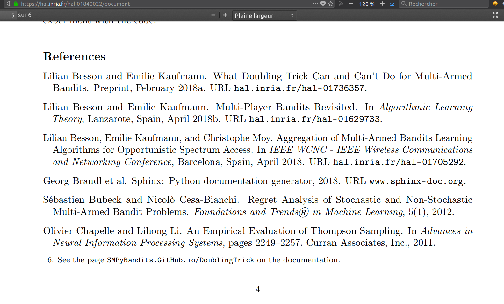

---

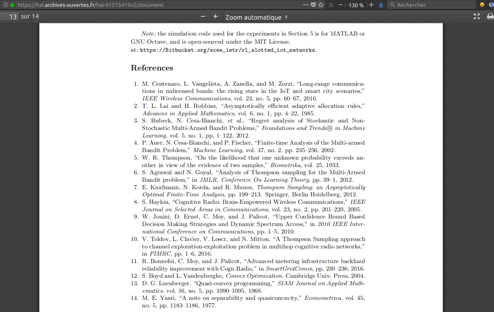

---

## Looking by keyword

- Try to look for some keywords, in Google Scholar, Google, DuckDuckGo, ResearchGate etc
- :warning: Some keywords will give *a lot* of results!
- Filter by language! Filter by date!
- Combine keywords!

---

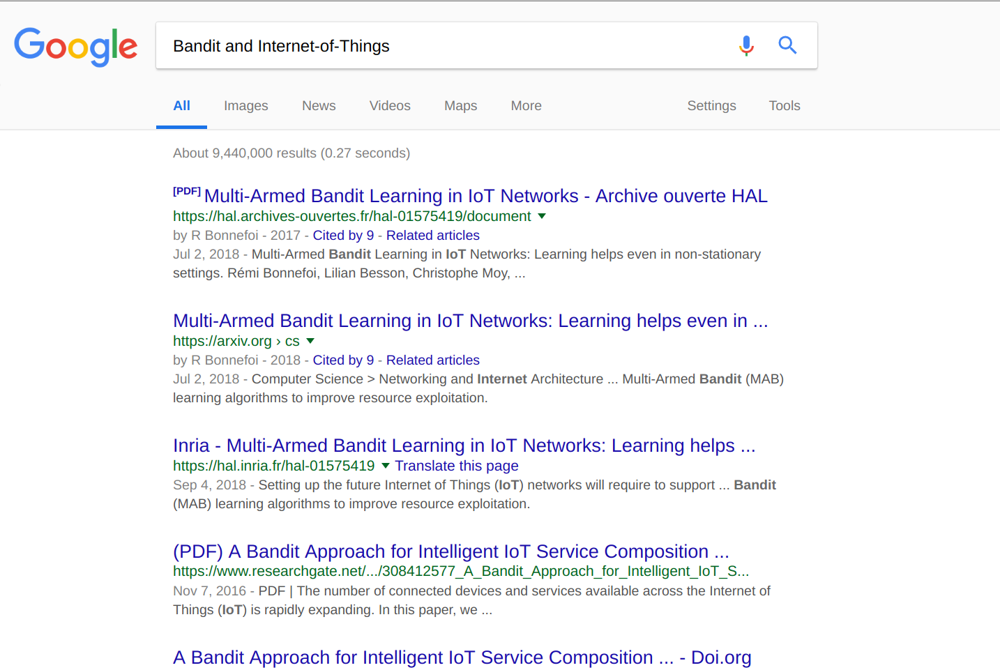

---

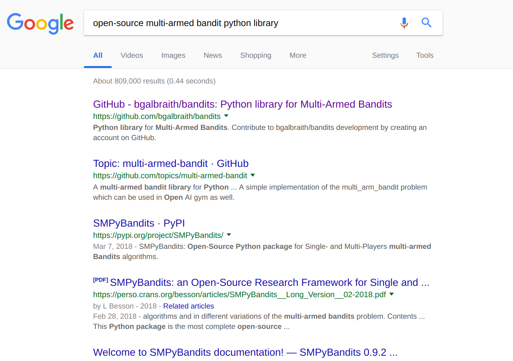

---

## Looking by author

- If you know an author, it's easy to find his/her work
- It usually gives good references on related work!

## Example?
- For examples, with my advisor Émilie Kaufmann…

---

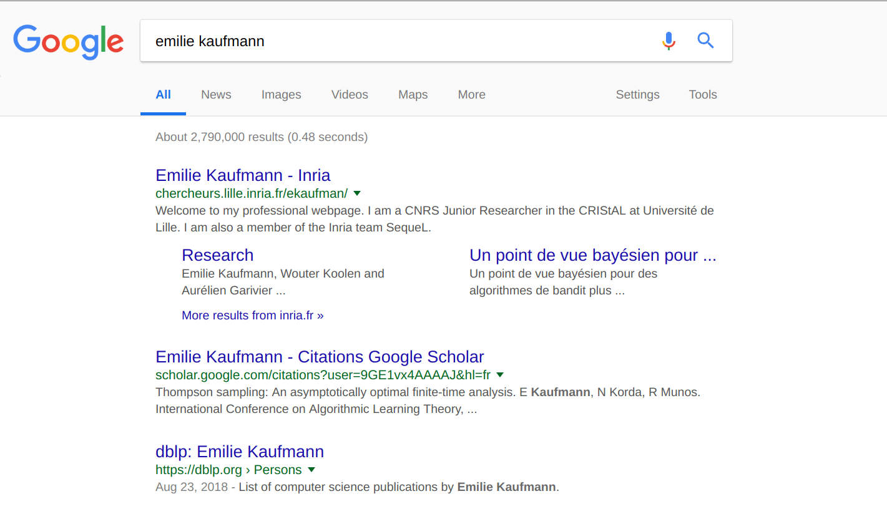

---

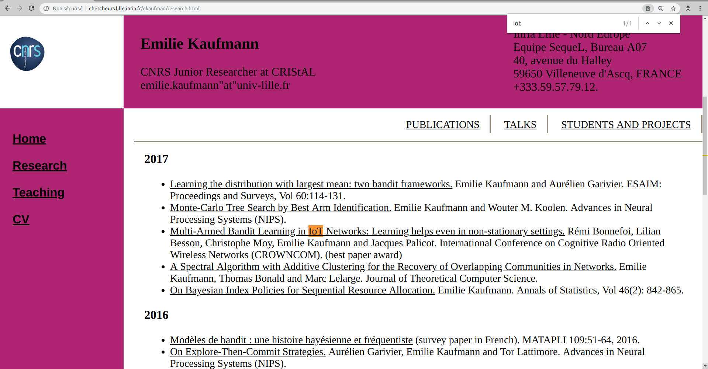

---

## Google Scholar

- Many researchers have a Google Scholar profile
- But it is also very useful to look for new references

---

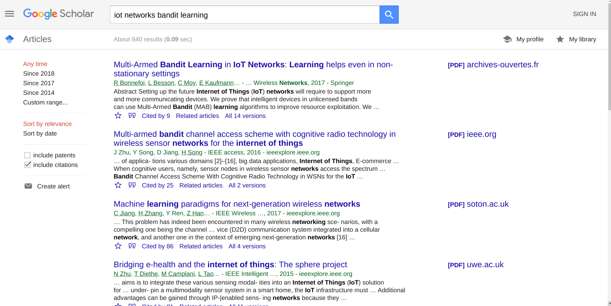

---

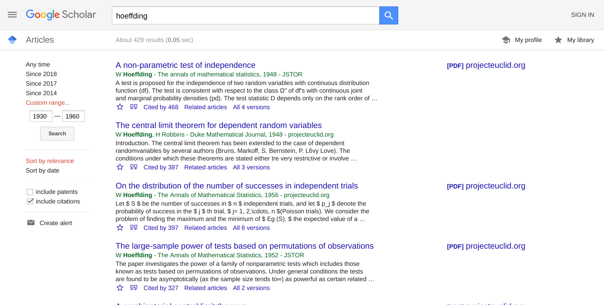

---

## ResearchGate

- Many researchers have a ResearchGate profile
- But it is also very useful to look for new references
- (same, just less popular than Google Scholar)

### :warning: Warning!
- :warning: they have a very aggressive copyright policy!
- Suggestion: do as Rémi:
  only upload a one-page PDF that links to the HAL version

---

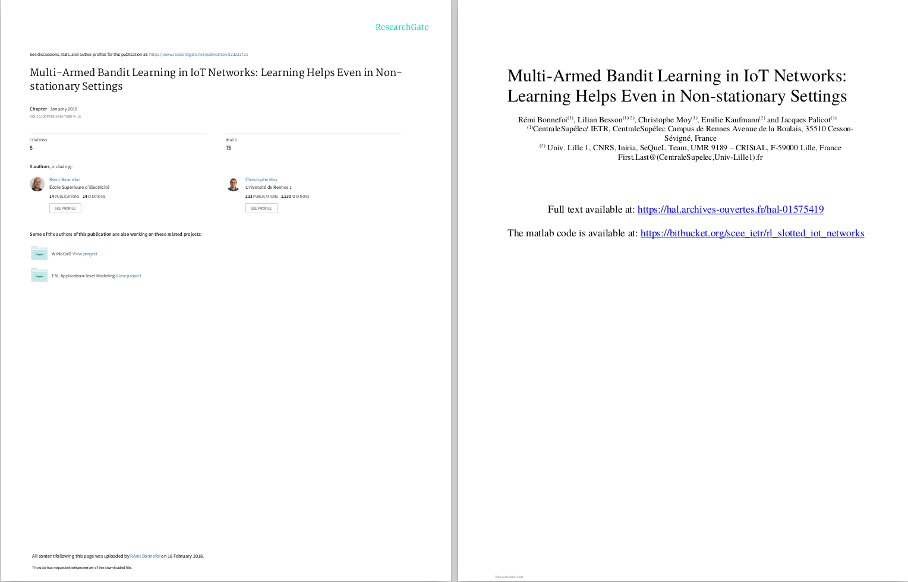

---

## How to find the PDF of a research paper ?
Once you know what to read, try this to find the paper:

1. Google Scholar / ResearchGate / Academia
2. Google / DuckDuckGo / your favorite search engine
3. The author's website! *Or directly ask them!*
4. arXiv search page (it's brand new and works perfectly well!),
5. or HAL search page
6. IEEEXplore : CentraleSupélec pays the license!
   [`ieeexplore-ieee-org.bibliopam.supelec.fr`](https://ieeexplore-ieee-org.bibliopam.supelec.fr)
6. Some hacky websites (use at your own risk),
   e.g., Sci-Hub → [`WhereIsSciHub.Now.sh`](https://whereisscihub.now.sh/) ?
7. :warning: *Never pay yourself to read a research paper!* :warning:

---

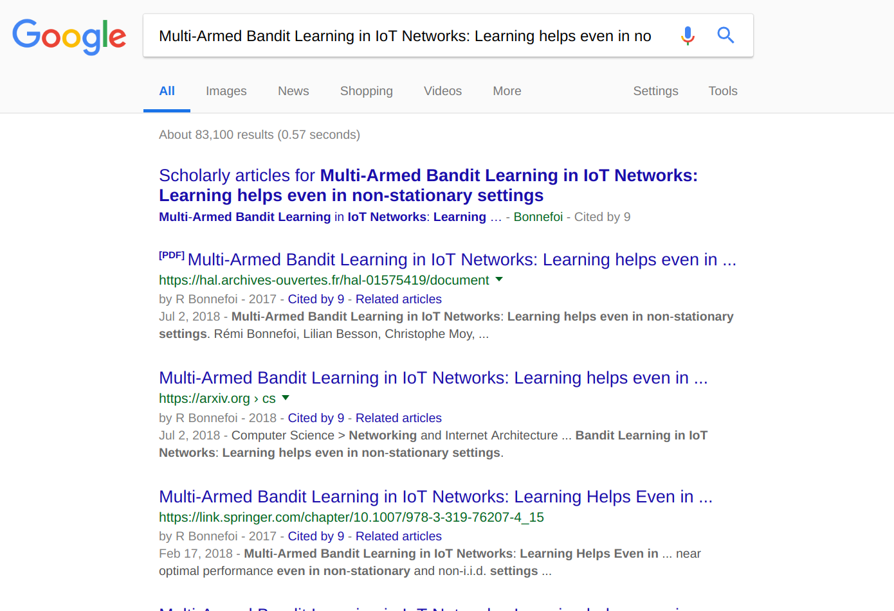

---

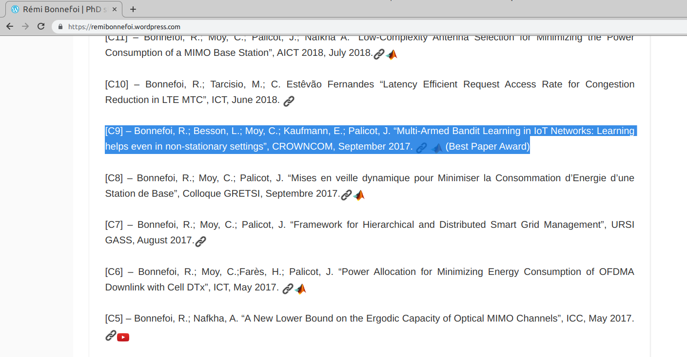

---

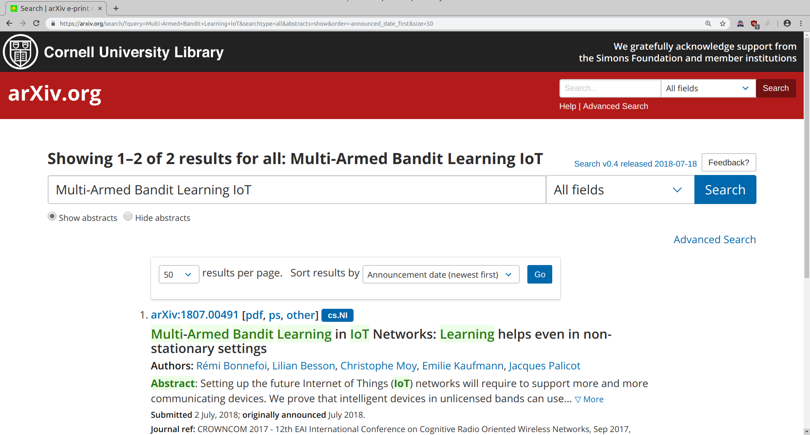

---

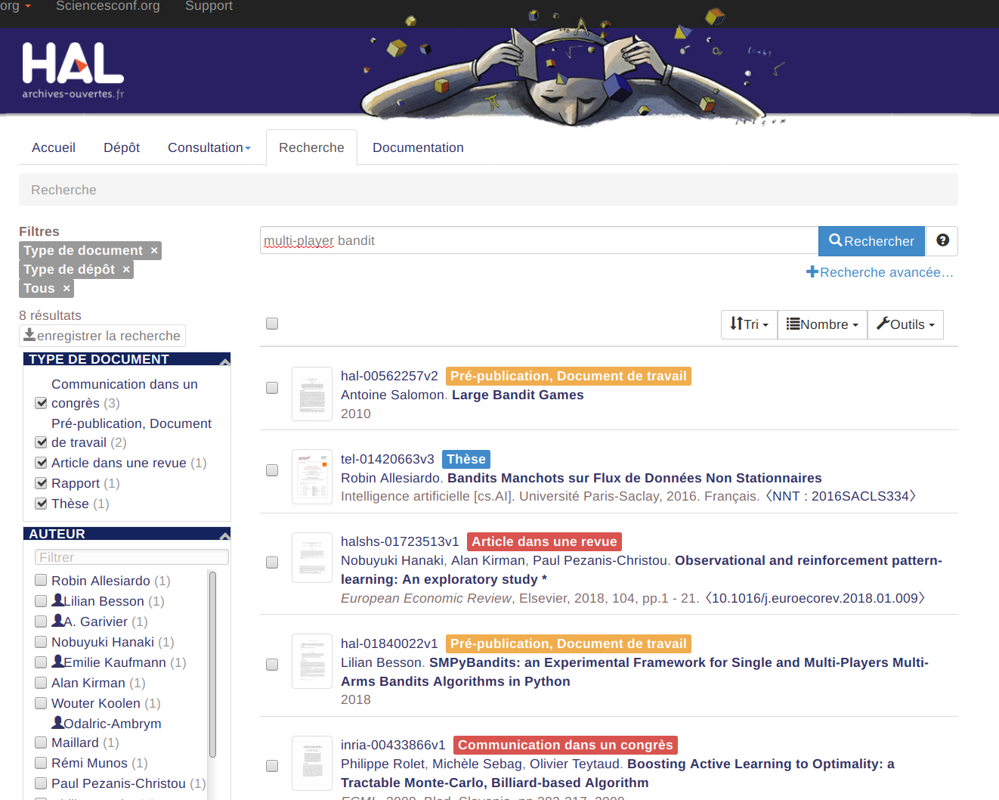

---

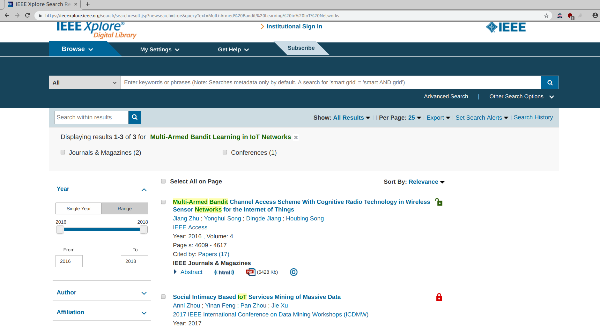

---

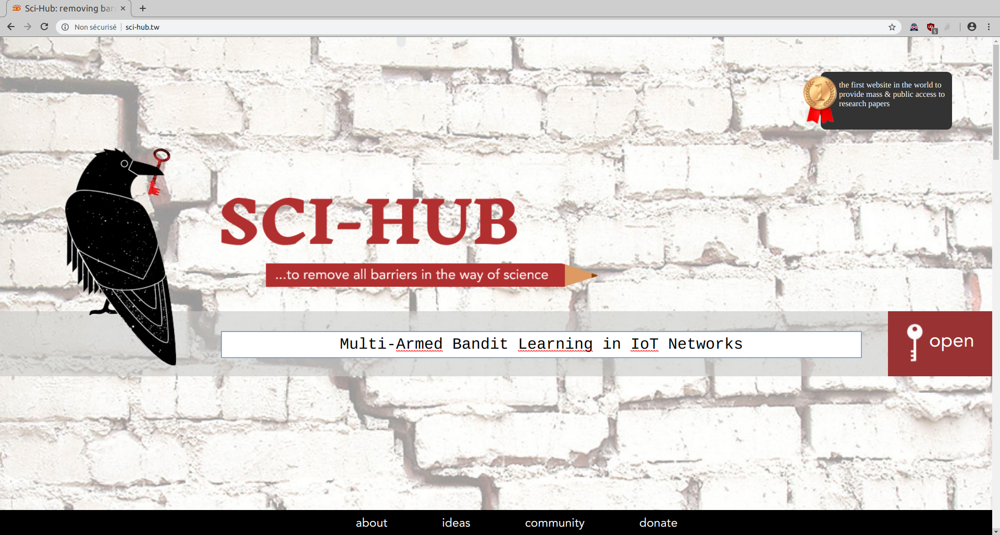

:warning: Don't do it!

---

## How to write paper and insert bibliography

- Use *LaTeX*
- Use *BibTeX* (or *BibLaTeX*)

Example (LaTeX `.tex` file and BibTeX `.bib` file):

```latex
\bibliographystyle{ieeetr}   % or alpha, or other style
\bibliography{myBibFile}     % at the end of the LaTeX file
```

```bibtex
@unpublished{SMPyBanditsHAL,
    title = {{SMPyBandits: an Experimental Framework
    for Single and Multi-Players Multi-Arms Bandits Algorithms in Python}},
    author = {Besson, Lilian},
    url = {https://hal.inria.fr/hal-01840022},
    note = {Presentation paper, at hal.inria.fr/hal-01840022},
    year = {2018},
}
```

---

## Example: In the body of the article

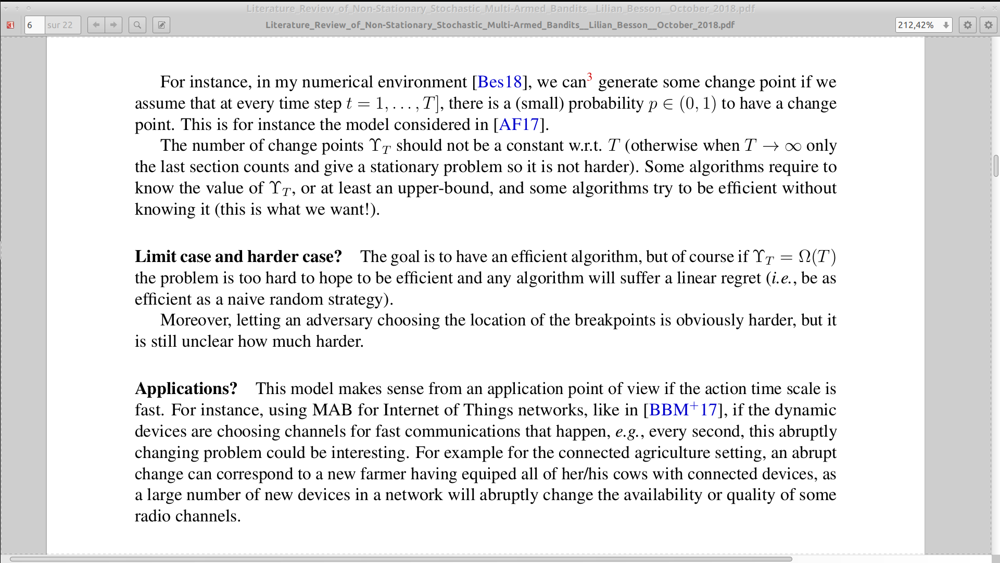

---

## Example: In the reference list

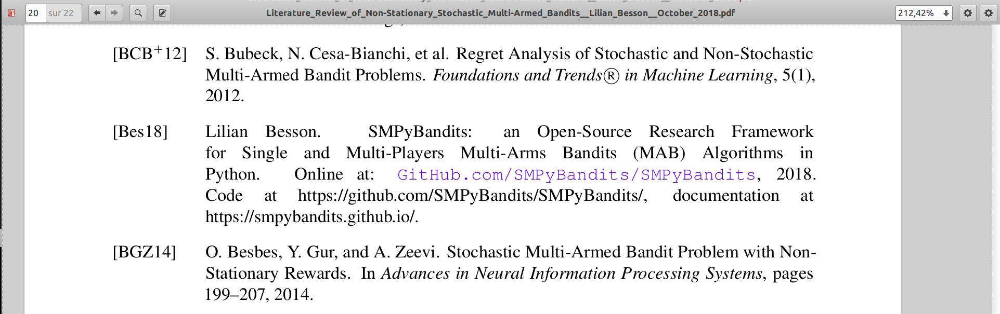

---

## Lazy way to organize your references

- Keep a bibtex file for each research project or paper,
- Fill it slowly and painfully everytime you think of a new reference
- Struggle a lot
- $\Longrightarrow$ avoid this lazy solution :warning:

> Lilian : I'm ashamed but I'm still at this level…

---

## Smart way to organize your references

Use a dedicated software such as

- [Zotero](www.zotero.org) $\Longrightarrow$ ask me
- [JabRef](www.jabref.org) $\Longrightarrow$ ask Hussein
- Others (see [full comparison by Munich University](https://mediatum.ub.tum.de/doc/1320978/1320978.pdf))

### Why selecting this two ones
- Used by the team
- Cross-plateform (Windows, Mac, Linux)
- Integration with text editors
- Open source $\Longrightarrow$ free

---

# But what is this ?

## Goal
- To help you along
	- searching,
	- classifying,
	- inserting references in your papers.

## Let's go for a quick walkthrough :walking:

---

## Step 1: Download, install and setup

- Download and install from website ([Zotero](www.zotero.org), [JabRef](www.jabref.org), etc).
- Download and install browser add-on.
	- Zotero: Firefox, Chrome & Safari
	- JabRef: Firefox only
- Setup synchronization.
	- Backup your bibliography
	- Share your bibliography
- Setup CentraleSupelec proxy if you want to access IEEExplore with connector.

---

## Setup proxy to access IEEExplore

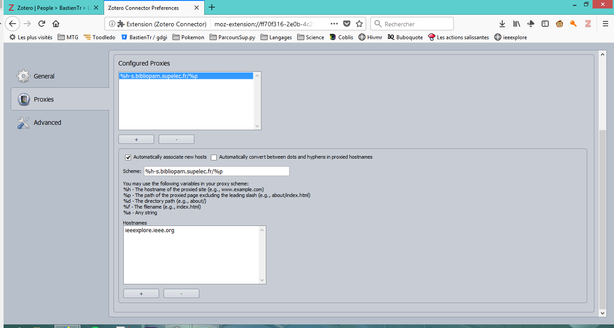

---

## Step 2: Develop your bibliography

### On both Zotero & JabRef
- Import files from your computer
- Save pages from your web browser
	- Papers
	- Web pages
	- Wikipedia...

### On JabRef
- Search for papers on IEEExplore, arXiv, Google Scholar...

---

## Step 3: Classify your bibliography

### On both Zotero & JabRef
- Classify into collections to sort documents by topics.
- Automatic fetch of meta-data.
- Search based on author, date, conferences...
- Add notes and comments.

### On Zotero
- Add markers and use them to find articles.
- Construct a chronology.

---

## Zotero desktop version

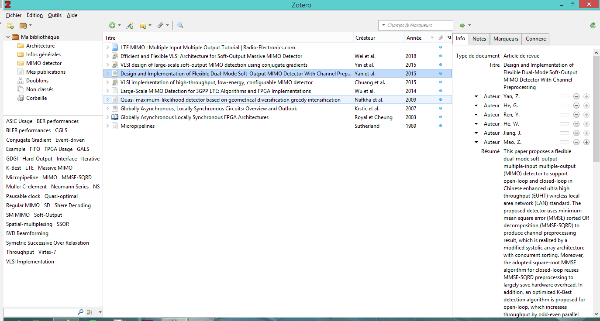

---

## Zotero web version

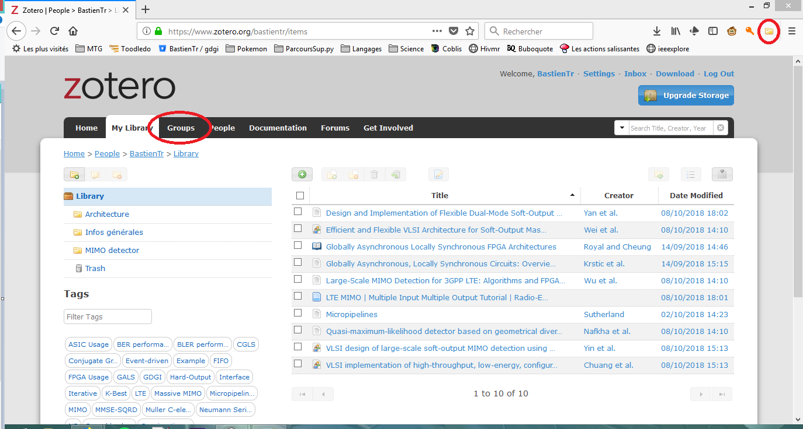

---

## Step 4: Add references to your documents

- Application plugins to quick reference insertions
	- JabRef: Emacs, Lyk, TeXstudio, Vim...
	- Zotero: LibreOffice, Word...

- Export a list of references as
	- *BibTex* and other *LaTeX* formats
	- IEEE style and other ordinary styles for copy & paste

---

## Export as *BibTex*

```
@incollection{goos_globally_2003,
	address = {Berlin, Heidelberg},
	title = {Globally {Asynchronous} {Locally} {Synchronous} {FPGA} {Architectures}},
	volume = {2778},
	isbn = {978-3-540-40822-2 978-3-540-45234-8},
	url = {http://link.springer.com/10.1007/978-3-540-45234-8_35},
	abstract = {Globally Asynchronous Locally Synchronous (GALS) Systems have provoked renewed interest over recent years as they have the potential to combine the benefits of asynchronous and synchronous design paradigms. It has been applied to ASICs, but not yet applied to FPGAs. In this paper we propose applying GALS techniques to FPGAs in order to overcome the limitation on timing imposed by slow routing.},
	language = {en},
	urldate = {2018-09-12},
	booktitle = {Field {Programmable} {Logic} and {Application}},
	publisher = {Springer Berlin Heidelberg},
	author = {Royal, Andrew and Cheung, Peter Y. K.},
	editor = {Goos, Gerhard and Hartmanis, Juris and van Leeuwen, Jan and Y. K. Cheung, Peter and Constantinides, George A.},
	year = {2003},
	doi = {10.1007/978-3-540-45234-8_35},
	keywords = {Micropipeline, Muller C-element},
	pages = {355--364},
	file = {Royal et Cheung - 2003 - Globally Asynchronous Locally Synchronous FPGA Arc.pdf:C\:\\Users\\Bastien\\Zotero\\storage\\PZHDR9ZI\\Royal et Cheung - 2003 - Globally Asynchronous Locally Synchronous FPGA Arc.pdf:application/pdf}
}
```

---

## Export as IEEE style for copy & paste

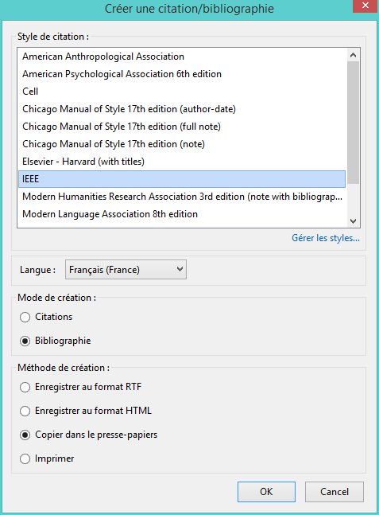

---

## Output

```
[1] Q. Wei, L. Liu, G. Peng, S. Yin, et S. Wei,
« Efficient and Flexible VLSI Architecture
for Soft-Output Massive MIMO Detector », in
Proceedings of Information Science and Cloud
Computing — PoS(ISCC 2017), Guangzhou, China,
2018, p. 055.

[2] B. Yin, M. Wu, J. R. Cavallaro, et C. Studer,
« VLSI design of large-scale soft-output MIMO
detection using conjugate gradients », in 2015
IEEE International Symposium on Circuits and
Systems (ISCAS), Lisbon, Portugal, 2015, p. 1498‑1501.
```

---

## Tips & tricks

- Save all papers that you read.
- Save also usefull web pages, newspaper articles...
	- :warning: Dont forget to add few information about the content


- A few minutes to lose now but hours to save later.

---

# Conclusion (1/3)

## Sum-up
- We showed you techniques to look for new references,
  and to find and download the PDF (*legally*)
- We showed you some softwares to manage your bibliography

## Pointers
- $\hookrightarrow$ [scholar.google.com](https://scholar.google.com/)
- $\hookrightarrow$ [archives-ouvertes.fr](https://www.archives-ouvertes.fr/) & [arxiv.org](https://arxiv.org/)
- $\hookrightarrow$ [duckduckgo.com](https://duckduckgo.com/) :heart:
- $\hookrightarrow$ [zotero.org](https://zotero.org) and [jabref.org](https://jabref.org)

---

# Conclusion (2/3)

## Next GouTP @ SCEE
- Any request or suggestion ?

## We need participants!
> :point_right: By *you*? Any idea is welcome! :smiley:

> Contact us if you want to do a GouTP !

---

# Conclusion (3/3)

> Thanks for joining :clap: !

## Your mission, if you accept it… :boom:
1. *Padawan level :* be smart about how you look for new references.
2. *Jedi level :* organize **and backup** your references and BibTeX files!
3. *Master level :* publish so many papers that your name will be in the BibTeX files of half the planet (*yes we can!*).
