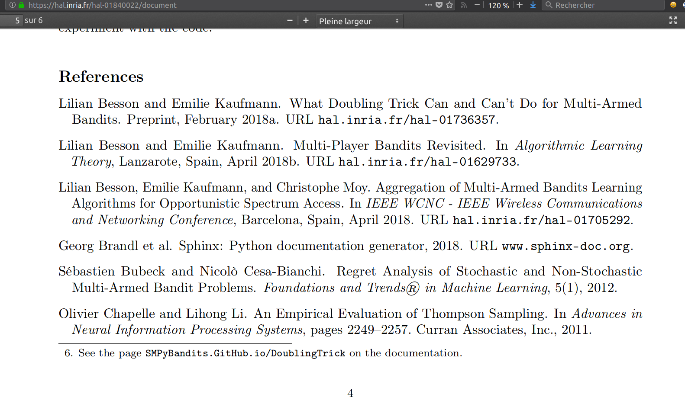
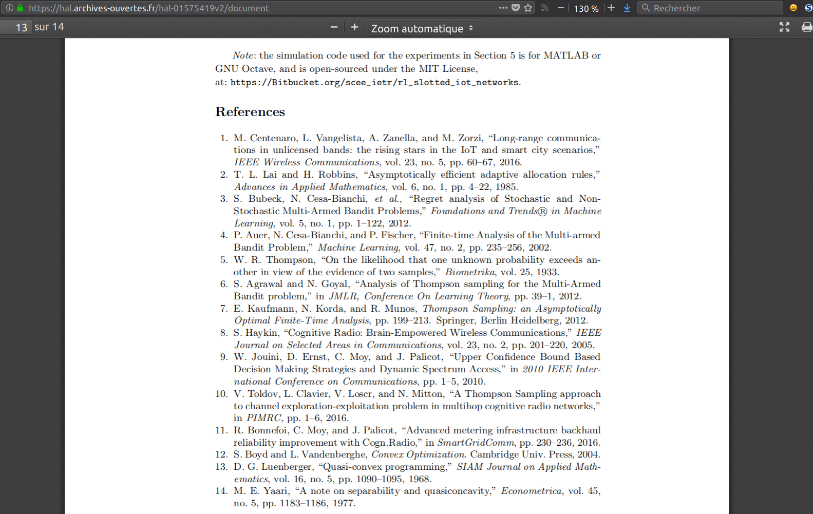
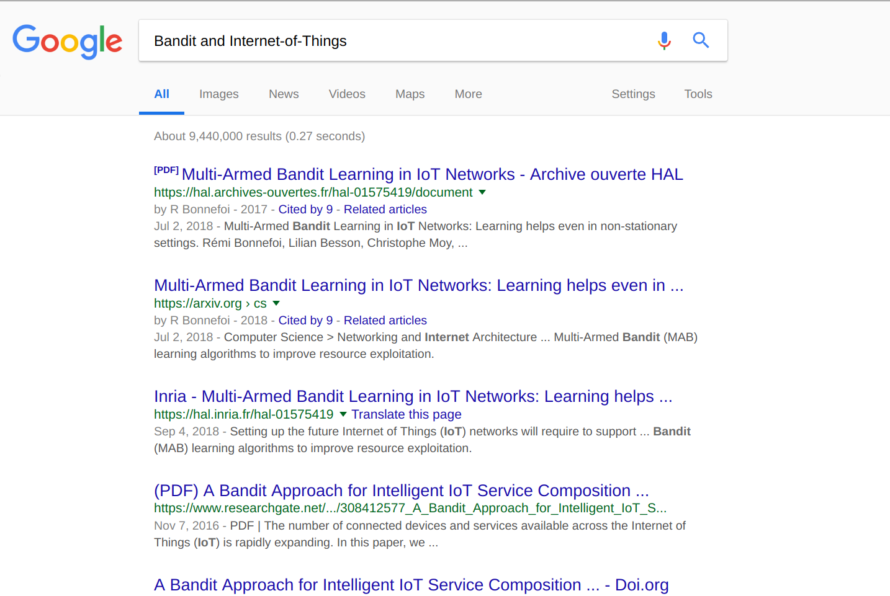
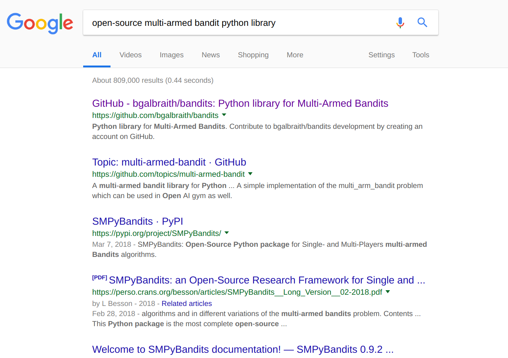
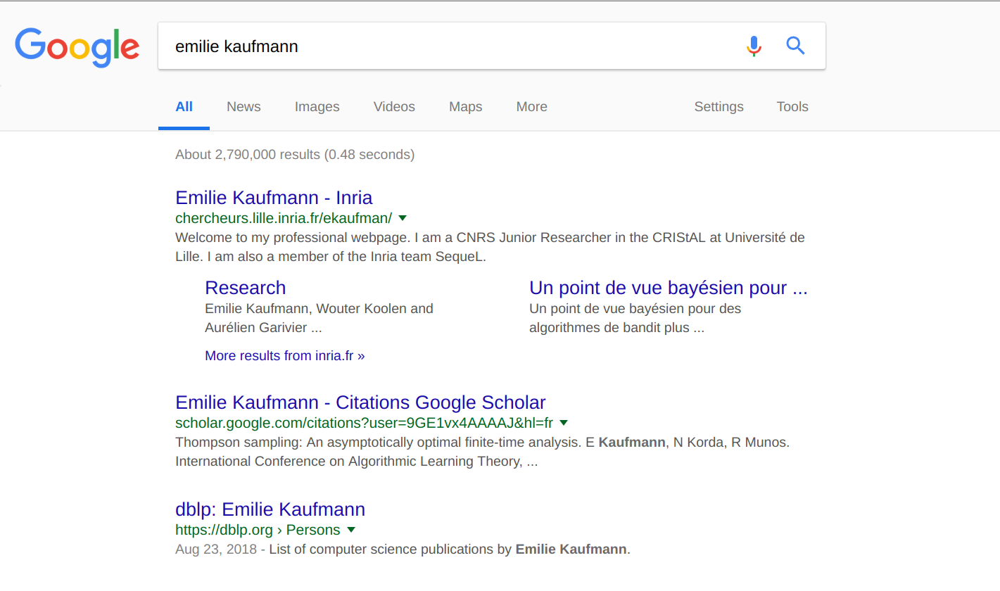
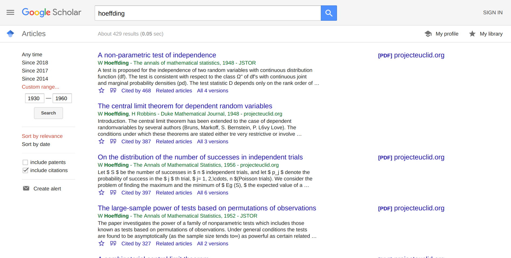
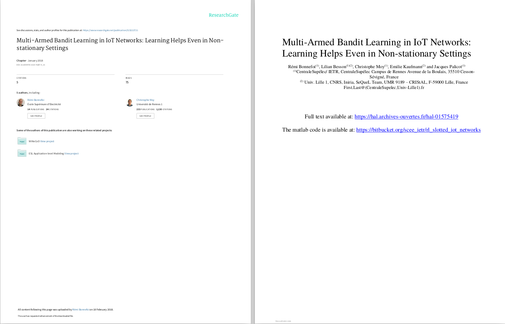
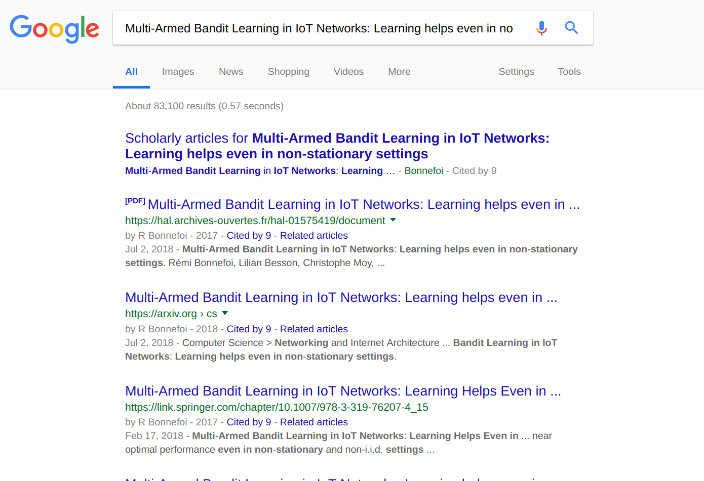
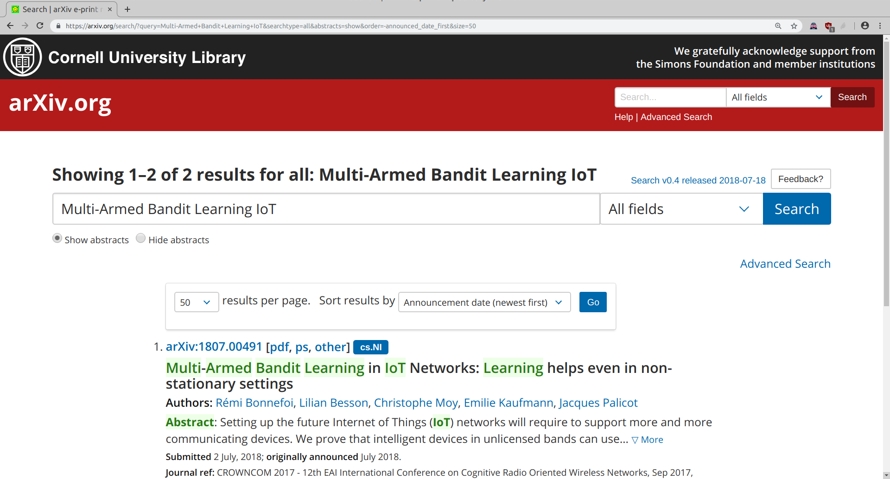
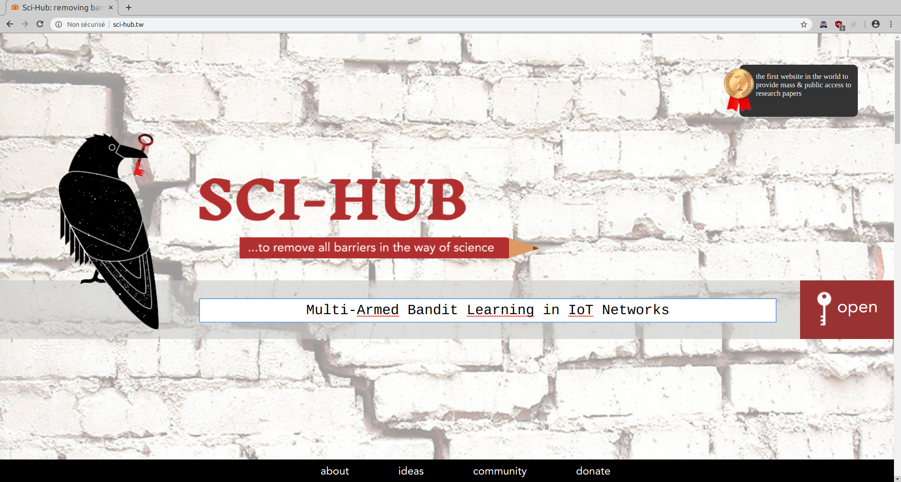

<!--
$theme: default
$size: 4:3
page_number: true
footer: GouTP @ SCEE | 18 October 2017 | By: Lilian Besson | Introduction to Jupyter notebooks
-->

<link rel="stylesheet" type="text/css" href="../common/marp-naereen.css" />


# $1^{\text{st}}\;\;$ $2018/19$ GouTP @ SCEE

- *About:* **Searching and Organizing Your Bibliographic References**

- *Date:* $18$th of October $2018$ :date:

- *Who:* [Lilian Besson](https://GitHub.com/Naereen/slides/) and [Bastien Trotobas](TODO) :hand:

<br><br>

### Open source content :notebook: ?
> Note: slides are online: `github.com/Naereen/slides/tree/master/
  2018_10__Looking_for_and_organizing`
  `_your_bibliographic_references__GouTP_at_CentraleSupelec`

---

# What's a *"GouTP"* ?

- **Internal monthly technical training session** :date:
- Usually: on *Thursday*, at *3pm :clock3: - 3:30pm* :clock330:
- With :coffee: coffee, :tea: tea and :cookie: sweets: we relax while training !

  > Initiative of Quentin and Vincent :clap: in January 2017...
  > Continued by Rémi, Muhammad, Rami and Lilian :ok_hand: !

<br><br>

## Not only @ SCEE :smiley: ?
- Currently open to the *FAST* and *AUT* teams

---

# Agenda for today :timer_clock: $\;\;\;\;\;\;\;\;\;\;\;\;\;\;$ ==[30 min]==

1. Quick presentation of internal tools @ SCEE $\;\;\;\;\;\;\;\;\;\;\;\,$ ==[5 min]==
2. How to look for bibliographic references? $\;\;\;\;\;\;\;\;\;\;\;\;\;\;\;$ ==[5 min]==
3. Demo time $\;\;\;\;\;\;\;\;\;\;\;\;\;\;\;\;\;\;\;\;\;\;\;\;\;\;\;\;\;\;\;\;\;\;\;\;\;\;\;\;\;\;\;\;\;\;\;\;\;\;\;\;\;\;$ ==[10 min]==
4. How to organize your references: JabRef & Zotero $;\;\;\;$ ==[5 min]==
3. Demo time $\;\;\;\;\;\;\;\;\;\;\;\;\;\;\;\;\;\;\;\;\;\;\;\;\;\;\;\;\;\;\;\;\;\;\;\;\;\;\;\;\;\;\;\;\;\;\;\;\;\;\;\;\;\;$ ==[10 min]==

<br>

## Please :pray:
Ask questions and interrupt me if you want!

---

# 1. Presentation of internal tools @ SCEE

- Welcome to our new PhD student and interns :raised_hand_with_fingers_splayed: !
- You met (almost) everybody this week !
- You will become familiar with the research themes of our team…

<br><br>

### $\hookrightarrow$ Let see a few :hammer_and_wrench: tools that can make your life easier!

---

<!-- *footer: -->

# Website :spider_web:
- [www-scee.rennes.supelec.fr](http://www-scee.rennes.supelec.fr/) was created by Rémi and Aymeric
- It is maintained by Karim and Majed


## New comers, please :pray:
- send a short summary of your research interest with links to your LinkedIn, Google Scholar profile (or other sites). Picture: *if you want*
- **to Rémi and I** so we add you on the website

---

# Internal Wiki :memo:
- We have a MediaWiki running locally on http://172.16.6.219/
- Welcome pack : can be useful in your first days here!
  http://172.16.6.219/mediawiki/index.php/Welcome_to_SCEE
- Anyone can edit, it is maintained by Rémi and I
- Participate if you have anything to change (create an account, edit!)


---

# Workstations :computer: (Windows & GNU/Linux)

- 2 Windows 7 workstations, with MATLAB
  + WS1 : `172.16.6.211`
  + WS2 : `172.16.6.212`
- 1 GNU/Linux (Ubuntu) workstation, with Python, GNU Radio…
  + WS3 : `172.16.6.213`
- Powerful machines: 12 cores, 32 Gb of RAM, lots of storage…
- Monitoring :mag: : http://172.16.6.219:8000 (ask us for ==id/passwd==)
  (please check for use load, before launching heavy simulations)

## :tipping_hand_woman: Ask for an account if you need
- To run computations, or to use the TestBed
- Ask to *Rami for Windows*, to *Lilian for GNU/Linux*

---


---

# USRP TestBeds :phone:
- We have 8 USRP cards that can be used from GNU Radio Companion on the WS3
- See more on http://172.16.6.219/mediawiki/index.php/Main_Page#Hardware

## Monitoring :mag:
- http://172.16.6.213:8000 (made by Quentin)
- let you see the IP of each USRP card
- and who uses what in real time

## :tipping_hand_woman: Advice
- If you need to use the USRP, *discuss with Nabil and Lilian before*

---


---

# 2. How to look for bibliographic references?

## :warning: Do we need references?
- Yes

## :warning: But just for the paper right?
- No: you need references *at every step* of our research job!

## :warning: How to find references?
- We will see some techniques

---

## Reading papers
- Each research paper has a list of references
- This always gives an easy way to find new references: just go read every quoted paper!

---



---



---

## Looking by keyword

- Try to look for some keywords, in Google Scholar, Google, DuckDuckGo, ResearchGate etc
- :warning: Some keywords will give *a lot* of results!
- Filter by language! Filter by date!
- Combine keywords!

---



---



---

## Looking by author

- If you know an author, it's easy to find his/her work
- It usually gives good references on related work!

## Example?
- For examples, with my advisor Émilie Kaufmann…

---



---


---

## Google Scholar

- Many researchers have a Google Scholar profile
- But it is also very useful to look for new references

---


---



---

## ResearchGate

- Many researchers have a Google Scholar profile
- But it is also very useful to look for new references
- (same, just less popular than Google Scholar)

### :warning: Warning!
- :warning: they have a very aggressive copyright policy!
- Suggestion: do as Rémi:
  only upload a one-page PDF that links to the HAL version

---



---

## How to find the PDF of a research paper ?
Once you know what to read, try this to find the paper:

1. Google Scholar / ResearchGate / Academia
2. Google / DuckDuckGo / your favorite search engine
3. The author's website! Or directly ask them!
4. arXiv search page (it's brand new and works perfectly well!)
5. IEEEXplore : CentraleSupélec pays the license!
   [`ieeexplore-ieee-org.bibliopam.supelec.fr`](https://ieeexplore-ieee-org.bibliopam.supelec.fr)
6. Some hacky websites (use at your own risk),
   e.g., Sci-Hub → [`WhereIsSciHub.Now.sh`](https://whereisscihub.now.sh/) ?
7. :warning: *Never pay yourself to read a research paper!* :warning:

---



---


---



---


---



---

# 3. How to organize your references: JabRef & Zotero

> By Bastien

---

## How to write paper and insert bibliography

- Use *LaTeX*
- Use *BibTeX* (or *BibLaTeX*)

Example (LaTeX `.tex` file and BibTeX `.bib` file):

```latex
\bibliographystyle{ieeetr}
\bibliography{myBibFile}     % at the end of the LaTeX file
```

```bibtex
@unpublished{SMPyBanditsHAL,
    title = {{SMPyBandits: an Experimental Framework
    for Single and Multi-Players Multi-Arms Bandits Algorithms in Python}},
    author = {Besson, Lilian},
    url = {https://hal.inria.fr/hal-01840022},
    note = {Presentation paper, at hal.inria.fr/hal-01840022},
    year = {2018},
}
```

---

## Lazy way to organize your references

- Keep a bibtex file for each research project or paper,
- Fill it slowly and painfully everytime you think of a new reference
- Struggle a lot
- $\Longrightarrow$ avoid this lazy solution :warning:

> Lilian : I'm ashamed but I'm still at this level…

---

## Smart way to organize your references

> By Bastien
> :boom: TODO

---

# Conclusion (1/3)

## Sum-up
- We showed you techniques to look for new references,
  and to find and download the PDF (*legally*)
- We showed you two softwares to manage your bibliography

## Pointers
- $\hookrightarrow$ [scholar.google.com](https://scholar.google.com/)
- $\hookrightarrow$ [duckduckgo.com](https://duckduckgo.com/) :heart:
- $\hookrightarrow$ [zotero.org](https://zotero.org) and [jabref.org](https://jabref.org)

---

# Conclusion (2/3)

## Next GouTP @ ==SCEE==
- Any request or suggestion ?

## We need participants!
> :point_right: By *you*? Any idea is welcome! :smiley:

---

# Conclusion (3/3)

> <span class="fontify">Thanks for joining :clap: !</span>
> <span class="fontify">Contact us if you want to do a GouTP !</span>

## Your mission, if you accept it… :boom:
1. *Padawan level :* be smart about how you look for new references.
2. *Jedi level :* organize and backup your references and BibTeX files!
3. *Master level :* publish so many papers that your name will be in the BibTeX files of half the planet (*yes we can!*).
