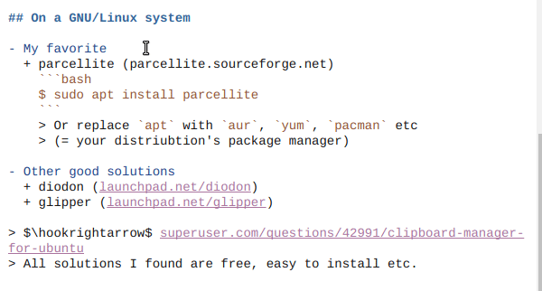
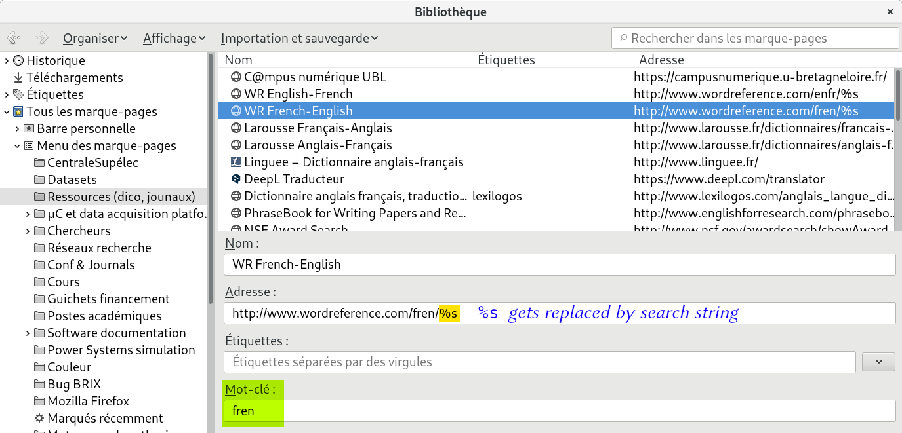
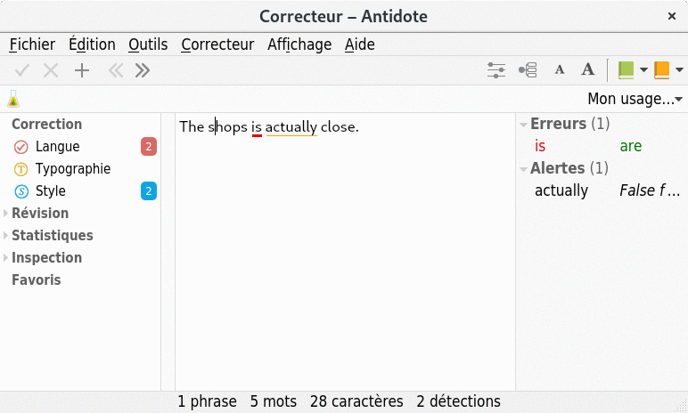

# $2^{\text{nd}}\;\;$ $2018/19$ GouTP @ SCEE

- *About:* **Five useful and various tools as a Christmas gift**

- *Date:* $21$th of December $2018$ :date:

- *Who:* [Lilian Besson](https://GitHub.com/Naereen/slides/) and [Bastien Trotobas](https://github.com/BastienTr/) and [Nabil Zeraneh](TODO) and [Pierre Haessig](http://pierreh.eu/) :hand:


### Open source content :notebook: ?
> Note: slides are online: `github.com/Naereen/slides/tree/master/
  2018_12__Four_useful_and_various_tools`
  `_as_a_Christmas_gift__GouTP_at_CentraleSupelec`

---

# What's a *"GouTP"* ?

- **Internal monthly technical training session** :date:
- Usually: on *Thursday*, at *3pm :clock3: - 3:30pm* :clock330:
- With :coffee: coffee, :tea: tea and :cookie: sweets: we relax while training !

  > Initiative of Quentin and Vincent :clap: in January 2017...
  > Continued by Rémi, Muhammad, Rami and Lilian :ok_hand: !


## Not only @ SCEE :smiley: ?
- Now open to all the teams of CentraleSupélec, campus of Rennes.

---

# Agenda for today :timer_clock:

## 1. Clipboard history manager

## 2. Offline documentation browser

## 3. Reformating Matlab figures

## 4. Compressing PNG, JPEG and PDF

## 5. Tools to write easily in a foreign language


### Please :pray:
Ask questions and interrupt us if you want!

---

# 1st tool: Clipboard history manager
Simple and tiny tool to help you win some time!

## :boom: Example of a problem?
- You're editing some files, browsing Internet
- You use `Ctrl+C`/`Ctrl+V` **a lot** (like everybody does)
- But you're tired of losing your copied text/macro/piece of code/URL when you copy something on it

## How to solve it?
- :cry: Don't, just find again your text and copy it... :boom: Slow!!
- :mag: Use a software to keep track of your history of copy/paste!

---

## On a GNU/Linux system

- My favorite
  + parcellite (parcellite.sourceforge.net)
    ```bash
    $ sudo apt install parcellite
    ```
    > Or replace `apt` with `aur`, `yum`, `pacman` etc
    > (= your distribution's package manager)

- Other good solutions
  + diodon (launchpad.net/diodon)
  + glipper (launchpad.net/glipper)

> $\hookrightarrow$ superuser.com/questions/42991/clipboard-manager-for-ubuntu
> All listed solutions I found are free, easy to install etc.

---

## On a Windows or Mac OS X system

- CopyQ (hluk.github.io/CopyQ) seems to be very good
  :ok_hand: free, open source, easy to install, multi-platform!
  

- Other solutions? there is a lot!

---

## Demo!
> Me editing the source code of last slides, using `parcellite`

[](https://localhost/publis/slides/2018_12__Four_useful_and_various_tools_as_a_Christmas_gift__GouTP_at_CentraleSupelec/figures/demo_parcellite.gif)

---

## Demo!
> Me editing the source code of last slides, using `parcellite`


---

## Good features for a *clipboard history manager*
- :scroll: Keep a history of your copied/pasted texts
- :mouse: Accessible in the system menu (system tray) with your mouse
- :sparkles: *Bonus* if accessible from a keyboard shortcut as a floating menu (`Ctrl+Alt+h` for `parcellite` on GNU/Linux, cf. demo)

## Other features?
- :notebook: Works with images & files
  (:cry: parcelitte don't support this, :ok_hand: CopyQ does)
- :recycle: Keep history after system reboot (they all do)
- :pencil: Modify / clean your clipboard history
- :raised_hands: Work with multiple items (for multi-cursor editors)

---

# 2nd tool: Offline documentation browser

TL;DR: if you use open source languages and tools for your work, the website devdocs.io is very useful!


- Browse and search documentation of languages and libraries
- Examples: Python, tensorflow, matplotlib, C++, etc
- Work *offline* (nice in a :airplane: plane, :train: train etc)

---


---


---

[](https://localhost/publis/slides/2018_12__Four_useful_and_various_tools_as_a_Christmas_gift__GouTP_at_CentraleSupelec/figures/demo_devdocs.gif)

---

# 3rd tool: Reformating Matlab figures

(slides by Nabil)

---

# 4th tool: Compressing PNGs, JPEGs & PDFs

- *What?*
  + Reduce the size of figures with little or no quality loss.
- *Why?* 
  + :chart_with_downwards_trend: Reduce the size of your research papers,
  + :rocket: Speed up your data transfers to your git, drive, etc,
  + :recycle: Reduce your environmental impact effortlessly.
- *How?*
  1. (you can) remove EXIF data from figures
  2. **Compress** them.
  3. See next slides.

---

## For PNGs :arrow_right: Up to 60% compression rate!

```bash
$ advpng -z -2 *.png  # on *Nix systems
      112098       88316  78% Zotero_desktop_idle.png
      120106       89860  74% Zotero_online.png
      124577       93638  75% bibtex_style.png
       21961       16303  74% generate_IEEE.png
       73520       56477  76% setup_proxy.png
      452262      344594  76%   # quite good!
```


---

## For JPEGs :arrow_right: already compressed

- One can reduce the size with little loss.
- Lots of web tools. One among all [CompressJPEG.com](https://compressjpeg.com/)


---

## Example: two compression steps

  

- 159 ko :arrow_right: 47 ko (30%) :arrow_right: 21 ko (13%)
- It depends on your use case!

---

## For PDFs :arrow_right: Up to 100% compression rate!

### On Unix systems
Lilian wrote [`PDFCompress`](https://bitbucket.org/lbesson/bin/src/master/PDFCompress) for this ($\hookrightarrow$ [`bitbucket.org/lbesson/bin`](https://bitbucket.org/lbesson/bin/)).

```bash
$ cp input.pdf output.pdf
$ PDFCompress output.pdf
# lot of verbose output ...

$ du input.pdf output.pdf
2,1M    input.pdf   |   1,1M    output.pdf

# it does this command with gs (ghostscript):
$ gs -dBATCH -dNOPAUSE -q -sDEVICE=pdfwrite \
     -sOutputFile=output.pdf input.pdf
```

## On Windows systems
Use online tools such as [SmallPDF.com](https://SmallPDF.com/compress-pdf)

---

# Writing tools

*Goal*: increase quality and productivity when writing, 
e.g. in a non native language

Three propositions:

1. Dictionnary power user: [WordReference.com](http://www.wordreference.com/) + Firefox [smart keywords](https://support.mozilla.org/en-US/kb/how-search-from-address-bar)
2. Fast translation with [DeepL.com](https://www.deepl.com/translator)
3. Grammar spellchecker with : [Antidote.info](https://www.antidote.info/)
   + Fr + En = $120 + 60$ €
   + LaTeX compatible
   + I used it for my PhD manuscript (in French), and all articles since then

---

# Firefox keywords for dictionnaries

*Goal*: fast word translation with Wordreference or other dictionnary.
cf. [support.mozilla.org/en-US/kb/Smart keywords](https://support.mozilla.org/en-US/kb/Smart%20keywords).

Access dictionnaries *without leaving the keyboard*
(no mouse click needed).

---

# Firefox keywords: HOWTO 1/2

Step 1: right-click in search field: "Add a Keyword for this Search..."


---

# Firefox keywords: HOWTO 2/2

Step 2: choose the keyword: "ling", "fren", "enfr"...


---
# Firefox keywords: check

NB: keywords are associated with *bookmarks*.

You can hack the bookmark record, playing with the `%s` placeholder:




---
# Firefox keywords: usage (without mouse!)

*(`Ctrl+L` to focus the address bar)*

Type `keyword` + `space` + search string:


Then hit `Enter` to query the search:


---
# DeepL online translator

[DeepL.com](https://www.deepl.com/) *(by the makers of [Linguee.com](https://www.linguee.com))*.

Key interesting points:

* **word-by-word interactivity**: adjust the translation to your taste
* integrated dictionnary

:warning: Important warning: in the free version, *everything gets recorded* (cf. [privacy policy](https://www.deepl.com/privacy.html)), like Google Translate...

---

# DeepL demo

My tip: make changes *forward*, or you shall loose previous changes :cry:.

[](https://localhost/publis/slides/2018_12__Four_useful_and_various_tools_as_a_Christmas_gift__GouTP_at_CentraleSupelec/figures/lang/DeepL.gif)

---

# Antidote grammar spellchecker

NB: non free tool: $120$ € + $60$ € for French + English

Features:

- detects advanced grammar errors
  + including *false friends* for French (e.g.: actuellement/actually)
- can spellcheck LaTeX
- includes dictionnaries with synonyms, antonyms, citations...

[](https://localhost/publis/slides/2018_12__Four_useful_and_various_tools_as_a_Christmas_gift__GouTP_at_CentraleSupelec/figures/lang/Antidote.gif)

---

# Conclusion (1/3)

## Sum-up
1. A *clipboard history manager* is simple to use and can be useful!
2. *Offline documentation browser* is awesome!
3. *Reformating Matlab figures* is simple and gives pretty figures!
4. *Compress your figures* before including them on your papers, sending them online, storing them on your git, etc!
5. *Advanced writing tools*

## Pointers
- $\hookrightarrow$ [Other JPEGs and PNGs compression tools](https://enviragallery.com/9-best-free-image-optimization-tools-for-image-compression/)
- $\hookrightarrow$ [Other PDFs compression tools](https://www.intowindows.com/6-ways-to-compress-pdf-files/)

---

# Conclusion (2/3)

## Next GouTP @ SCEE
- Any request or suggestion ?

## We need participants!
> :point_right: By *you*? Any idea is welcome! :smiley:

> *Contact us if you want to do a GouTP !*

---

# Conclusion (3/3)

Happy holidays!
And merry Christmas :christmas_tree: :snowman_with_snow: :gift: :santa: !

## Your mission, if you accept it... :boom:
1. *Padawan level :* **be smart and try new tools!**
2. *Jedi level :* **discuss** about your tools with your colleagues and friends!
3. *Master level :* **write your own** open source tools to solve problems nobody never had!

> Thanks for joining :clap: !
