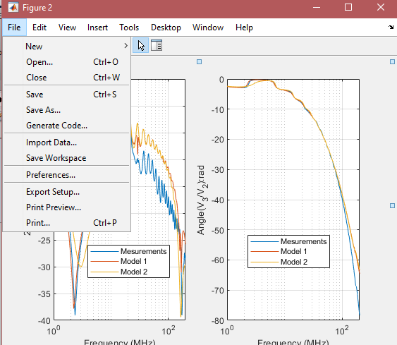
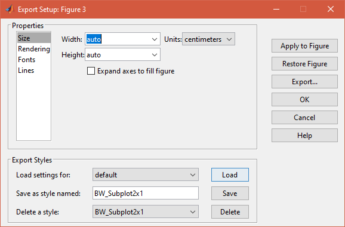
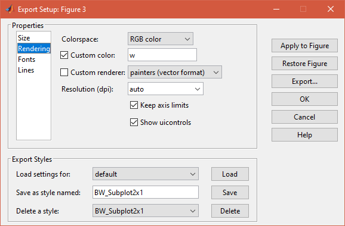
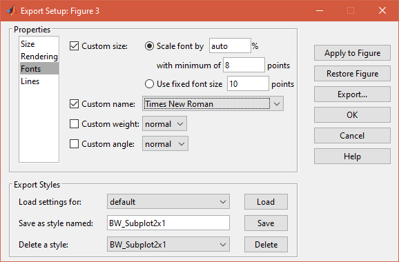
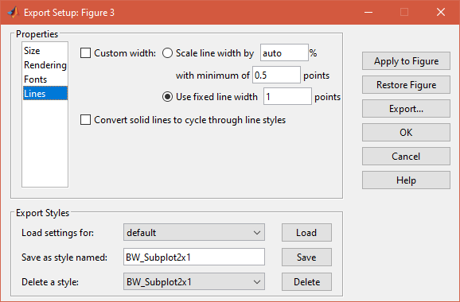

# Reformating Matlab figures

- Using export setup tool

- Demonstration :rocket:

---

## 1. Opening the tool

---

## 2. Configuring the figure size

---

## 3. Changing the colors

---

## 4. Choosing the font

---

## 5. Configuring the lines

---

## 6. Saving all of the configurations
Very smart!

