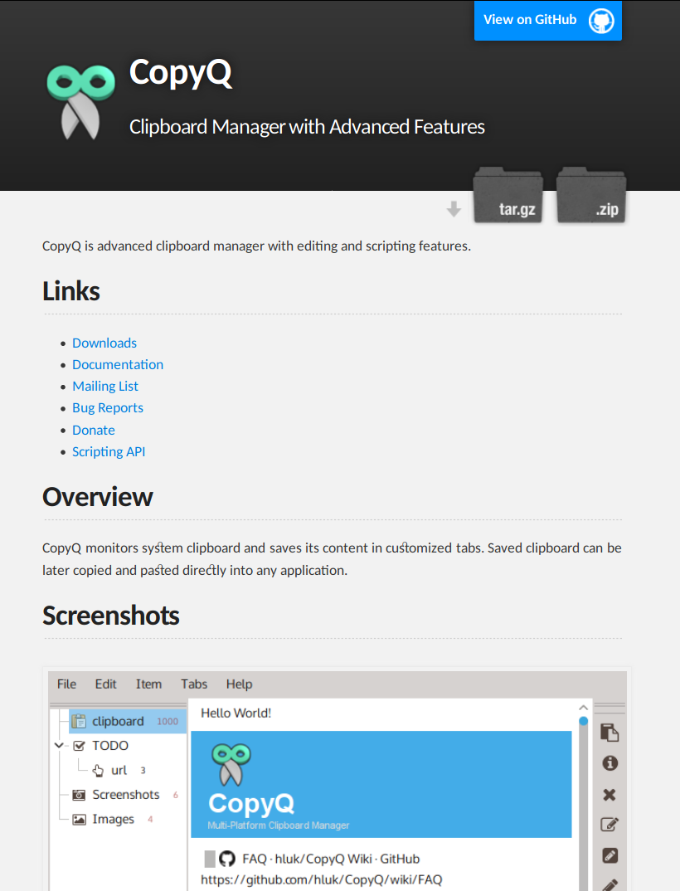
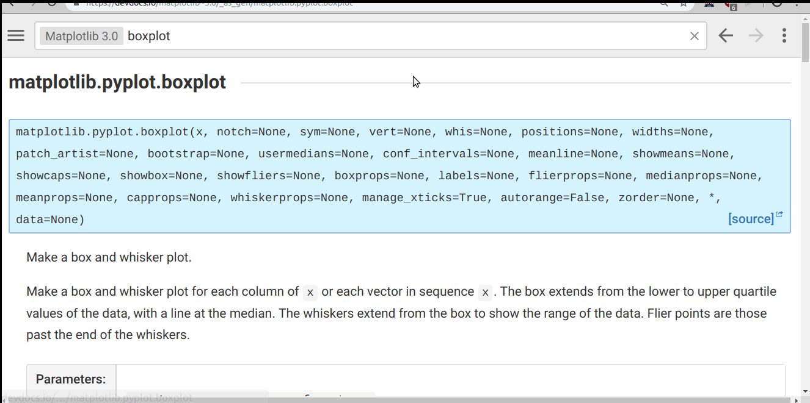

<!--
$theme: default
$size: 4:3
page_number: true
footer: GouTP @ SCEE | 21 December 2018 | By: Lilian Besson & Bastien Trotobas & Nabil Zaraneh
-->

<link rel="stylesheet" type="text/css" href="../common/marp-naereen.css" />


# $2^{\text{nd}}\;\;$ $2018/19$ GouTP @ SCEE

- *About:* **Four useful and various tools as a Christmas gift**

- *Date:* $21$th of December $2018$ :date:

- *Who:* [Lilian Besson](https://GitHub.com/Naereen/slides/) and [Bastien Trotobas](https://github.com/BastienTr/slides/) and [Nabil Zeraneh](TODO) :hand:

<br><br>

### Open source content :notebook: ?
> Note: slides are online: `github.com/Naereen/slides/tree/master/
  2018_12__Four_useful_and_various_tools`
  `_as_a_Christmas_gift__GouTP_at_CentraleSupelec`

---

# What's a *"GouTP"* ?

- **Internal monthly technical training session** :date:
- Usually: on *Thursday*, at *3pm :clock3: - 3:30pm* :clock330:
- With :coffee: coffee, :tea: tea and :cookie: sweets: we relax while training !

  > Initiative of Quentin and Vincent :clap: in January 2017...
  > Continued by Rémi, Muhammad, Rami and Lilian :ok_hand: !

<br><br>

## Not only @ SCEE :smiley: ?
- Now open to all the PhD students of CentraleSupélec, campus of Rennes.

---

# Agenda for today :timer_clock:

## 1. Clipboard history manager
Simple and tiny tool to help you win some time!

## 2. Offline documentation browser

## 3. Reformating Matlab figures

## 4. Tool 4

<br>

### Please :pray:
Ask questions and interrupt me if you want!

---

# 1st tool: Clipboard history manager (Lilian)

## :boom: Example of a problem?
- You're editing some files, browsing Internet
- You use `Ctrl+C`/`Ctrl+V` **a lot** (like everybody does)
- But you're tired of losing your copied text/macro/piece of code/URL when you copy something on it

## How to solve it?
- :cry: Don't, just find again your text and copy it... :boom: Slow!!
- :mag: Use a software to keep track of your history of copy/paste!

---

## On a GNU/Linux system

- My favorite
  + parcellite (parcellite.sourceforge.net)
    ```bash
    $ sudo apt install parcellite
    ```
    > Or replace `apt` with `aur`, `yum`, `pacman` etc
    > (= your distribution's package manager)

- Other good solutions
  + diodon (launchpad.net/diodon)
  + glipper (launchpad.net/glipper)

> $\hookrightarrow$ superuser.com/questions/42991/clipboard-manager-for-ubuntu
> All listed solutions I found are free, easy to install etc.

---

## On a Windows or Mac OS X system

- CopyQ (hluk.github.io/CopyQ) seems to be very good
  :ok_hand: free, open source, easy to install, multi-platform!
  

- Other solutions? there is a lot!

---

## Demo!
> Me editing the source code of last slides, using `parcellite`


---

## Good features for a *clipboard history manager*
- :scroll: Keep a history of your copied/pasted texts
- :mouse: Accessible in the system menu (system tray) with your mouse
- :sparkles: *Bonus* if accessible from a keyboard shortcut as a floating menu (`Ctrl+Alt+h` for `parcellite` on GNU/Linux, cf. demo)

Other features?
- :notebook: Works with images & files
  (:cry: parcelitte don't support this, :ok_hand: CopyQ does)
- ♻ Keep history after system reboot (they all do)
- :pencil: Modify / clean your clipboard history
- :raised_hands: Work with multiple items (for multi-cursor editors)

---

# 2nd tool: Offline documentation browser (Lilian)

TL;DR: if you use open source languages and tools for your work, the website devdocs.io is very useful!

- Browse and search documentation of languages and libraries
- Examples: Python, tensorflow, matplotlib, C++, etc
- Work *offline* (nice in a :airplane: plane, :train: train etc)

---


---



---

# 3rd tool: Reformating Matlab figures (Nabil)

TODO

---


---

# 4th tool: XXX (Bastien)

TODO

---


---

# Conclusion (1/3)

## Sum-up
1. A *clipboard history manager* is simple to use and can be useful!
2. *Offline documentation browser* is awesome!
3. *Reformating Matlab figures* is simple and gives pretty figures!
4. Tool 4

## Pointers
- $\hookrightarrow$ ?

---

# Conclusion (2/3)

## Next GouTP @ ==SCEE==
- Any request or suggestion ?

## We need participants!
> :point_right: By *you*? Any idea is welcome! :smiley:

> <span class="fontify">Contact us if you want to do a GouTP !</span>

---

# Conclusion (3/3)

Happy holidays!
And merry Christmas :christmas_tree: :snowman_with_snow: :gift: :santa: !

> <span class="fontify">Thanks for joining :clap: !</span>

## Your mission, if you accept it... :boom:
1. *Padawan level :* **be smart and try new tools!**
2. *Jedi level :* **discuss** about your tools with your colleagues and friends!
3. *Master level :* **write your own** open source tools to solve problems nobody never had!
