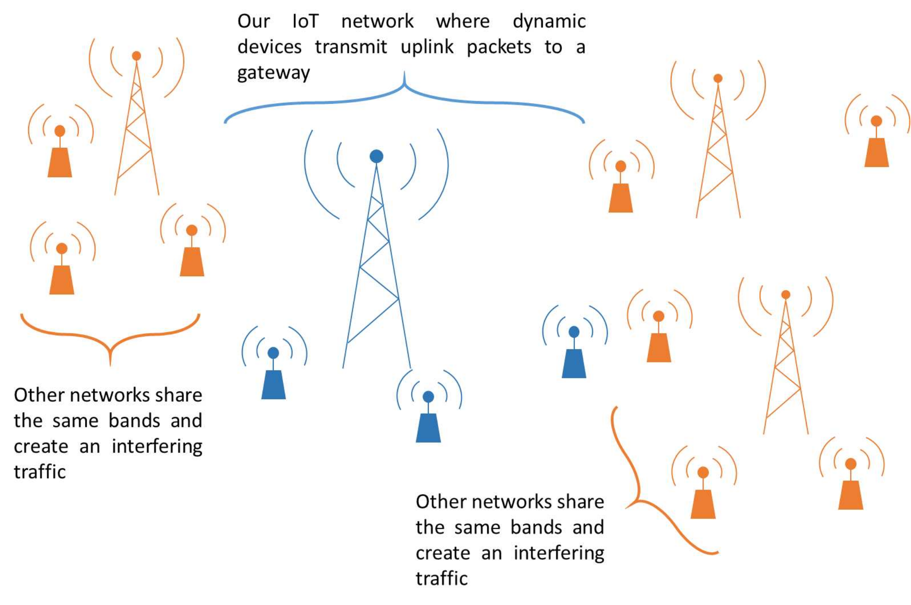
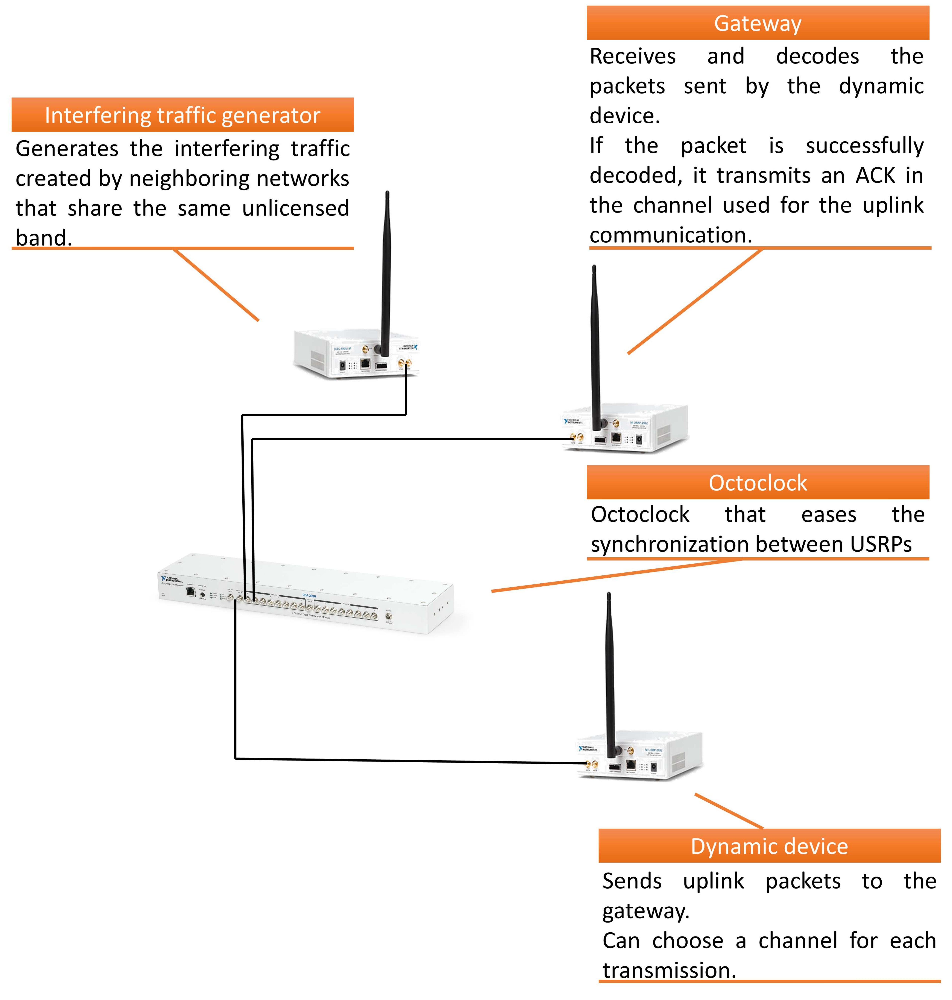
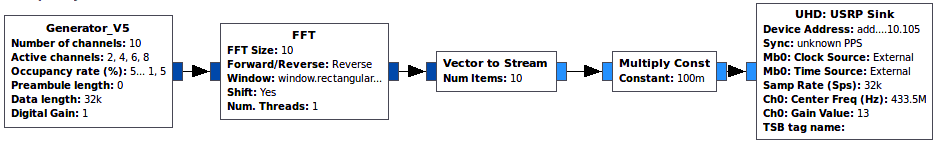
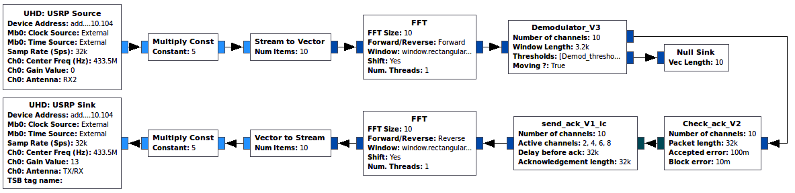
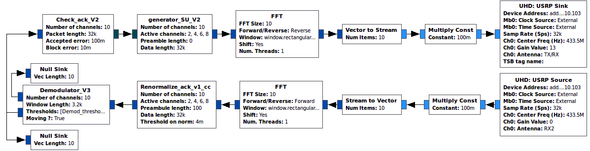
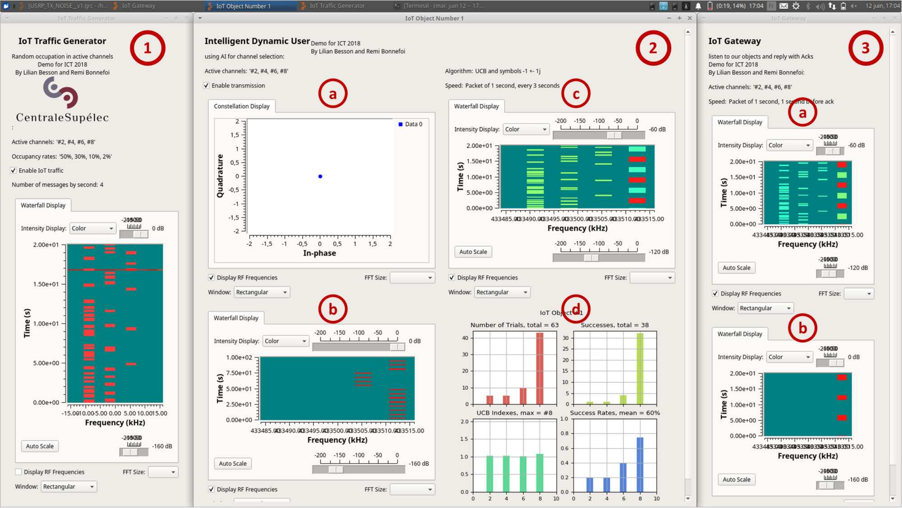
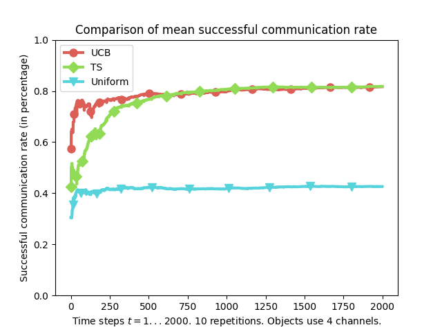

<!--
$theme: default
$size: 4:3
page_number: true
footer: GNU Radio Implementation of Multi-Armed bandits Learning for Internet-of-things Networks
-->

<link rel="stylesheet" type="text/css" href="../common/marp-naereen.css" />

### *IEEE WCNC 2019*: "**GNU Radio Implementation of Multi-Armed bandits Learning for Internet-of-things Networks**"

 

- *Date* :date: : $17$th of April $2019$

- *By* :wave: : [Lilian Besson](https://GitHub.com/Naereen/slides/), PhD Student in France, co-advised by
    

  | *Christophe Moy*   @ Univ Rennes 1 & IETR, Rennes | *Emilie Kaufmann*   @ CNRS & Inria, Lille |
  |:---:|:---:|

> See our paper at [`HAL.Inria.fr/hal-02006825`](https://hal.inria.fr/hal-02006825)

---

# Introduction

- We implemented a demonstration of a simple IoT network
- Using open-source software (GNU Radio) and USRP boards from Ettus Research / National Instrument
- In a wireless ALOHA-based protocol, IoT devices are able to improve their network access efficiency by using *embedded* *decentralized* *low-cost* machine learning algorithms
  (so simple implementation that it can be run on IoT device side)
- The Multi-Armed Bandit model fits well for this problem
- Our demonstration shows that using the simple UCB algorithm can lead to great empirical improvement in terms of successful transmission rate for the IoT devices

> Joint work by R. Bonnefoi, ==L. Besson== and C. Moy.

---

# :timer_clock: Outline

## 1. Motivations
## 2. System Model
## 3. Multi-Armed Bandit (MAB) Model and Algorithms
## 4. GNU Radio Implementation
## 5. Results

---

# 1. Motivations

- :chart_with_upwards_trend: IoT (the Internet of Things) is the most promizing new paradigm and business opportunity of modern wireless telecommunications,
- :chart_with_upwards_trend: More and more IoT devices are using unlicensed bands 
- $\Longrightarrow$ networks will be more and more occupied :boom:

But...

---

# 1. Motivations

- $\Longrightarrow$ networks will be more and more occupied :boom:

But...

- Heterogeneous spectrum occupancy in most IoT networks standards
- Simple but efficient learning algorithm can give great improvements in terms of successful communication rates
- IoT can improve their battery lifetime and mitigate spectrum overload thanks to learning!
- $\Longrightarrow$ more devices can cohabit in IoT networks in unlicensed bands !

---

# 2. System Model

### Wireless network

- In unlicensed bands (e.g. ISM bands: 433 or 868 MHz, 2.4 or 5 GHz)
- $K=4$ (or more) orthogonal channels

### One gateway, many IoT devices
- One gateway, handling different devices
- Using a ALOHA protocol (without retransmission)
- Devices send data for $1$s in one channel, wait for an *acknowledgement* for $1$s in same channel, use Ack as feedback: success / failure
- Each device: communicate from time to time (e.g., every $10$ s)
- Goal: max successful communications $\Longleftrightarrow$ max nb of received Ack

---

# 2. System Model

---

# Hypotheses

1. We focus on **one gateway**, $K \geq 2$ channels

2. Different IoT devices using the same standard are able to run a low-cost learning algorithm on their embedded CPU

 

3. The spectrum occupancy generated by the rest of
   the environment is **assumed to be stationary**

4. And **non uniform traffic**:
   some channels are more occupied than others.

---

# 3. Multi-Armed Bandits (MAB)
 

## 3.1. Model

## 3.2. Algorithms

---

# 3.1. Multi-Armed Bandits Model
- $K \geq 2$ resources (*e.g.*, channels), called **arms**
- Each time slot $t=1,\ldots,T$, you must choose one arm, denoted $A(t)\in\{1,\ldots,K\}$
- You receive some reward $r(t) \sim \nu_k$ when playing $k = A(t)$
- **Goal:** maximize your sum reward $\sum\limits_{t=1}^{T} r(t)$, or expected $\sum\limits_{t=1}^{T} \mathbb{E}[r(t)]$
- Hypothesis: rewards are stochastic, of mean $\mu_k$.
  Example: Bernoulli distributions.

### Why is it famous?
Simple but good model for **exploration/exploitation** dilemma.

---

# 3.2. Multi-Armed Bandits Algorithms
### Often "*index* based"
- Keep *index* $I_k(t) \in \mathbb{R}$ for each arm $k=1,\ldots,K$
- Always play $A(t) = \arg\max I_k(t)$
- $I_k(t)$ should represent our belief of the *quality* of arm $k$ at time $t$

### (:boom: unefficient) Example: "Follow the Leader"
- $X_k(t) := \sum\limits_{s < t} r(s) \bold{1}(A(s)=k)$ sum reward from arm $k$
- $N_k(t) := \sum\limits_{s < t} \bold{1}(A(s)=k)$ number of samples of arm $k$
- And use $I_k(t) = \hat{\mu}_k(t) := \frac{X_k(t)}{N_k(t)}$.

---

## *Upper Confidence Bounds* algorithm (UCB)
- Instead of $I_k(t) = \hat{\mu}_k(t) = \frac{X_k(t)}{N_k(t)}$, :ok_hand: add an *exploration term*
$$ I_k(t) = \mathrm{UCB}_k(t) = \frac{X_k(t)}{N_k(t)} + \sqrt{\frac{\alpha \log(t)}{2 N_k(t)}} $$

### Parameter $\alpha =$ trade-off exploration *vs* exploitation
- Small $\alpha \Longleftrightarrow$ focus more on **exploitation**,
- Large $\alpha \Longleftrightarrow$ focus more on **exploration**,
- Typically $\alpha=1$ works fine empirically and theoretically.

---

# 4. GNU Radio Implementation
 

## 4.1. Physical layer and protocol

## 4.2. Equipment

## 4.3. Implementation

## 4.4. User interface

---

# 4.1. Physical layer and protocol

> Very simple ALOHA-based protocol, $K=4$ channels

An uplink message :zap: $\,\nearrow\,$ is made of...
- a preamble (for phase synchronization)
- an ID of the IoT device, made of QPSK symbols $1\pm1j \in \mathbb{C}$
- then arbitrary data, made of QPSK symbols $1\pm1j \in \mathbb{C}$

A downlink (Ack) message :zap: $\,\swarrow\,$  is then...
- same preamble
- the same ID
  (so a device knows if the Ack was sent for itself or not)

---

# 4.2. Equipment
$\geq3$ USRP
boards
  

1: gateway

2: traffic
   generator

3: IoT dynamic
   devices
   (as much as we want)

---

# 4.3. :hammer_and_wrench: Implementation

- Using GNU Radio and GNU Radio Companion
- Each USRP board is controlled by one *flowchart*
- Blocks are implemented in C++
- MAB algorithms are simple to code

(examples...)

---

# Flowchart of the random traffic generator

---

# Flowchart of the IoT gateway

---

# Flowchart of the IoT dynamic device

---

# 4.4. User interface of our demonstration
$\hookrightarrow$ See video of the demo: [`YouTu.be/HospLNQhcMk`](https://youtu.be/HospLNQhcMk)

 

---

# 5. Example of simulation and results

On an example of a small IoT network:
- with $K=4$ channels,
- and *non uniform* "background" traffic (other networks),
  with a repartition of $15\%$, $10\%$, $2\%$, $1\%$

1. $\Longrightarrow$ the uniform access strategy obtains a successful communication rate of about $40\%$.

2. About $400$ communication slots are enough for the learning IoT devices to reach a successful communication rate close to $80\%$, using UCB algorithm or another one (Thompson Sampling).

> Note: similar gains of performance were obtained in other scenarios.

---

# Illustration

---

# 6. Conclusion

 

## :point_right: Take home message

 

**Dynamically reconfigurable IoT devices can learn on their own to favor certain channels, if the environment traffic is not uniform between the $K$ channels, and greatly improve their succesful communication rates!**

 

### :pray: Please ask questions !

---

# 6. Conclusion

### $\hookrightarrow$ See our paper: [`HAL.Inria.fr/hal-02006825`](https://hal.inria.fr/hal-02006825) :point_left:

### $\hookrightarrow$ See video of the demo: [`YouTu.be/HospLNQhcMk`](https://youtu.be/HospLNQhcMk)

### $\hookrightarrow$ See the code of our demo: :point_left:
> Under GPL open-source license, for GNU Radio:
[bitbucket.org/scee_ietr/malin-multi-arm-bandit-learning-for-iot-networks-with-grc](https://bitbucket.org/scee_ietr/malin-multi-arm-bandit-learning-for-iot-networks-with-grc/) :point_left:

 

Thanks for listening :+1: !
