<!--
$theme: default
$size: 4:3
page_number: true
footer: Upper-Confidence Bound for Channel Selection in LPWA Networks with Retransmissions
-->

<link rel="stylesheet" type="text/css" href="../common/marp-naereen.css" />

### *1st MoTION Workshop - 2019*: "**Upper-Confidence Bound for Channel Selection in LPWA Networks with Retransmissions**"

 

- *Date* :date: : $15$th of April $2019$

 

- *Who:* [Lilian Besson](https://GitHub.com/Naereen/slides/) :wave: , PhD Student in France, co-advised by

| *Christophe Moy*   @ IETR, Rennes | *Emilie Kaufmann*   @ CNRS & Inria, Lille |
|:---:|:---:|
| 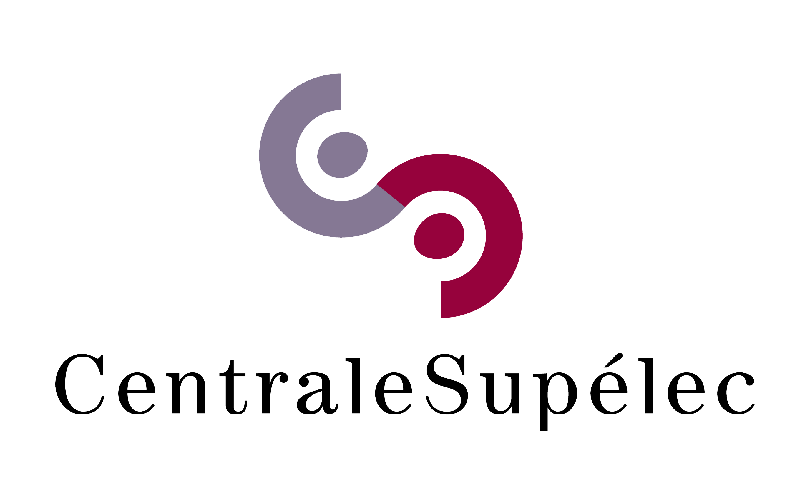 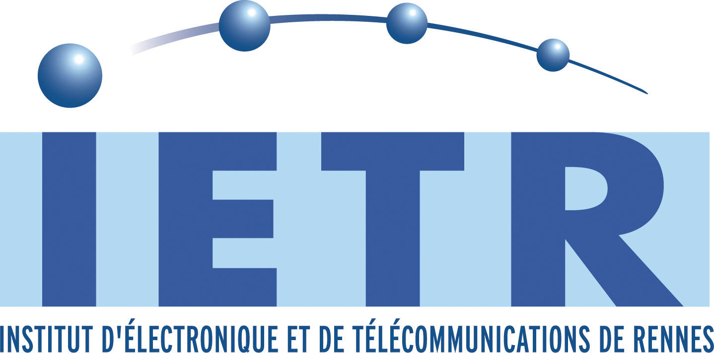 | 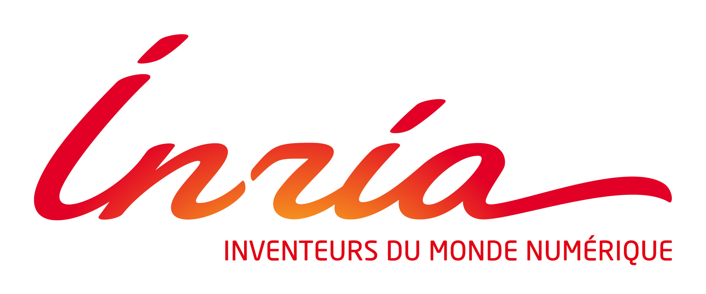  |

> See our paper at [`HAL.Inria.fr/hal-02049824`](https://hal.inria.fr/hal-02049824)

---

# :timer_clock: Outline

## 1. Motivations
## 2. System model
## 3. Multi-armed bandit (MAB) model and algorithms
## 4. Proposed heuristics
## 5. Numerical simulations and results

#### Please :pray: ask questions *at the end* if you want!

> By R. Bonnefoi, ==L. Besson==, J. Manco-Vasquez and C. Moy.

---

# 1. Motivations

- :chart_with_upwards_trend:IoT networks are interesting and will be more and more present,
- :chart_with_upwards_trend: More and more IoT devices are using unlicensed bands 
- $\Longrightarrow$ networks will be more and more occupied :boom:

But...

---

# 1. Motivations

- :chart_with_upwards_trend:IoT networks are interesting and will be more and more present,
- :chart_with_upwards_trend: More and more IoT devices are using unlicensed bands 
- $\Longrightarrow$ networks will be more and more occupied :boom:

But...

- Heterogeneous spectrum occupancy in most IoT networks standards
- Maybe IoT devices can improve their communication by *learning* to access the network more efficiently (e.g., by using the less occupied spectrum channel)
- Simple but efficient learning algorithm can give great improvements in terms of successful communication rates
- $\Longrightarrow$ can fit more devices in the existing IoT networks :tada: !

---

# 2. System model

### Wireless network

- In unlicensed bands, like the ISM bands
- $K=4$ (or more) orthogonal channels

 

### One gateway, many IoT devices

- One gateway, handling different devices
- Using a slotted ALOHA protocol **with retransmission**
- Devices send data for $1$s in one channel, wait for an *acknowledgement* for $1$s in same channel,
  use Ack as feedback: success / failure

---

### Transmission and retransmission model
- Each device communicates from time to time (e.g., every $10$ s)
  $\Longleftrightarrow$ probability $p$ of transmission at every time (Bernoulli process)

- Retransmit at most $M$ times if first transmission failed
  (until Ack is received)

- Retransmissions can use a different channel that the one used for first transmission

- Retransmissions happen after a random back-off time
  back-off time $\sim\mathcal{U}(0,\cdots,m-1)$

### The goal of each device
Is to *max*imize its successful communication rates
$\Longleftrightarrow$ *max*imize its number of received Ack.

---

# Do we need learning for transmission? Yes!

#### First hypothesis
The surrounding traffic is not uniformly occupying the $K$ channels.

#### Consequence
- Then it is always sub-optimal to use a (naive) uniformly random channel access

- $\Longrightarrow$ we can use online machine learning to let each IoT device learn, on its own and in an automatic and decentralized way, which channel is the best one (= less occupied) in its current environment.

- ==Learning is actually *needed* to achieve (close to) optimal performance.==

---

# Do we need learning for *re*transmission?

#### Second hypothesis
Imagine a set of IoT devices learned to transmit efficiently
(in the most free channel), in one IoT network.

#### Question
- Then if two devices collide, do they have a higher probability of colliding again *if retransmissions happen in the same channel* ?

---

# Mathematical intution and illustration

Consider one IoT device and one channel, we consider two probabilities:

- $p_c$ : suffering a collision at first transmission,
- $p_{c1}$ : collision at the first retransmission (if it uses the same channel).

 

In an example network with...
- a small transmission probability $p=10^{-3}$,
- from $N=50$ to $N=400$ IoT devices,

 

- $\Longrightarrow$ we ran simulations showing that
  ==$p_{c1}$ can be more than twice of $p_c$ (from $5\%$ to $15\%$!)==

---

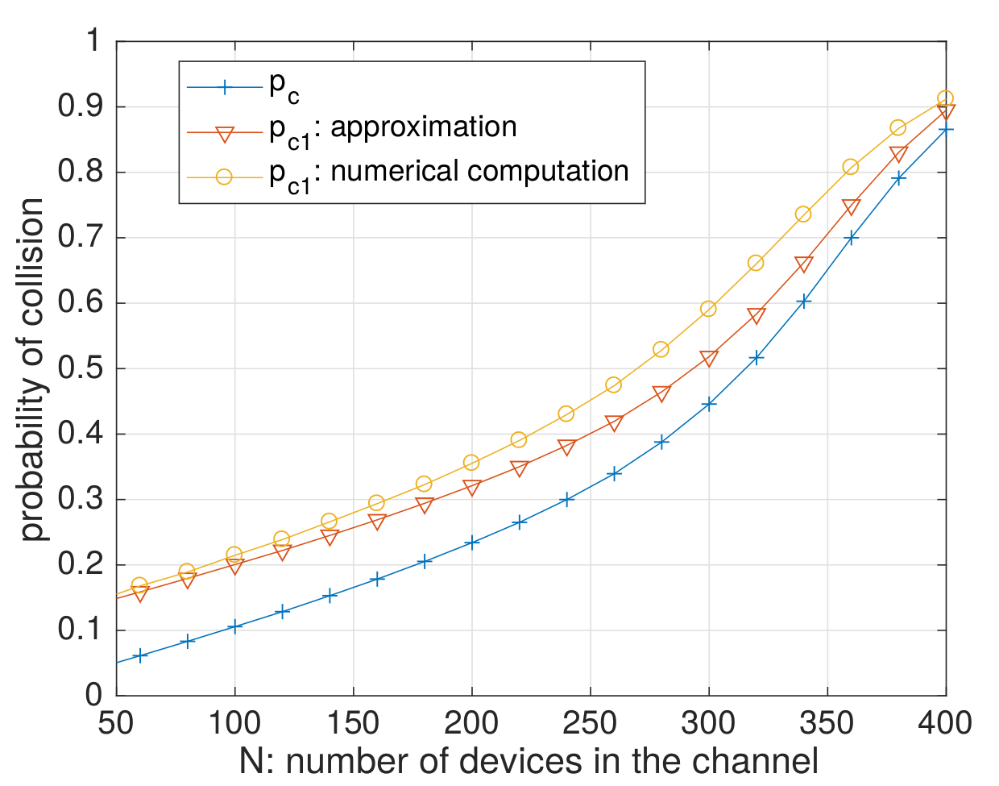

---

# Do we need learning for *re*transmission?
## :point_right: Maybe we do!

#### Consequence

- Then if two devices collide, they have a higher probability of colliding again *if retransmissions happen in the same channel*

- $\Longrightarrow$ we can also use online machine learning to let each IoT device learn, on its own and in an automatic and decentralized way, which channel is the best one (= less occupied)
  to retransmit a packet which failed due to a collision.

- ==Learning is again *needed* to achieve (close to) optimal performance.==

---

# 3. Multi-Armed Bandits (MAB)
 

## 3.1. Model

## 3.2. Algorithms

---

# 3.1. Multi-Armed Bandits Model
- $K \geq 2$ resources (*e.g.*, channels), called **arms**
- Each time slot $t=1,\ldots,T$, you must choose one arm, denoted $C(t)\in\{1,\ldots,K\}$
- You receive some reward $r(t) \sim \nu_k$ when playing $k = C(t)$
- **Goal:** maximize your sum reward $\sum\limits_{t=1}^{T} r(t)$, or expected $\sum\limits_{t=1}^{T} \mathbb{E}[r(t)]$
- Hypothesis: rewards are stochastic, of mean $\mu_k$.
  Example: Bernoulli distributions.

## Why is it famous?
Simple but good model for **exploration/exploitation** dilemma.

---

# 3.2. Multi-Armed Bandits Algorithms
### Often "*index* based"
- Keep *index* $U_k(t) \in \mathbb{R}$ for each arm $k=1,\ldots,K$
- Always use channel $C(t) = \arg\max U_k(t)$
- $U_k(t)$ should represent our belief of the *quality* of arm $k$ at time $t$

### (:boom: unefficient) Example: "Follow the Leader"
- $X_k(t) := \sum\limits_{s < t} r(s) \bold{1}(C(s)=k)$ sum reward from arm $k$
- $N_k(t) := \sum\limits_{s < t} \bold{1}(C(s)=k)$ number of samples of arm $k$
- And use $U_k(t) = \hat{\mu}_k(t) := \frac{X_k(t)}{N_k(t)}$.

---

# *Upper Confidence Bounds* algorithm (UCB)
- Instead of $U_k(t) = \hat{\mu}_k(t) = \frac{X_k(t)}{N_k(t)}$, :ok_hand: add an *exploration term*
$$ U_k(t) = \mathrm{UCB}_k(t) = \hat{\mu}_k(t) + \sqrt{\alpha \frac{\log(t)}{N_k(t)}} $$

### Parameter $\alpha =$ trade-off exploration *vs* exploitation
- Small $\alpha \Longleftrightarrow$ focus more on **exploitation**,
- Large $\alpha \Longleftrightarrow$ focus more on **exploration**,
- Typically $\alpha=1$ works fine empirically and theoretically.

---

# *Upper Confidence Bounds* algorithm (UCB)

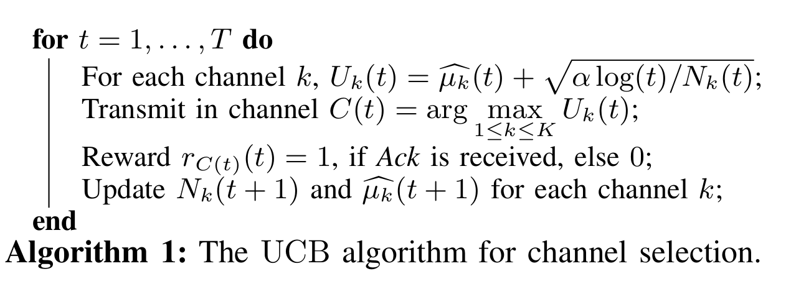

---

# 4. We Study Different Heuristics (5)

- They all use one UCB algorithm to decide the channel to use for first transmissions of any message

- They use different approaches for retransmissions:
  - "==Only UCB==": use same $\mathrm{UCB}$ for retransmissions,
  - "==Random==": uniformly random retransmissions,
  - "==UCB==": use another $\mathrm{UCB}^r$ for retransmissions
	(no matter the channel for first transmission),
  - "==K-UCB==": use $K$ different $\mathrm{UCB}^j$ for retransmission after a first transmission on channel $j\in\{1,\cdots,K\}$,
  - "==Delayed UCB==": use another $\mathrm{UCB}^d$ for retransmissions, but launched after a delay $\Delta$.

---

# 4.0. Only UCB

Use the same $\mathrm{UCB}$ to decide the channel to use for any transmissions, regardless if it's a first transmission or a retransmission of a message.

---

# 4.1. UCB + ==Random Retransmissions==

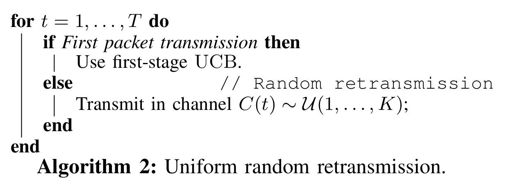

---

# 4.2. UCB + ==a single UCB for Retransmissions==

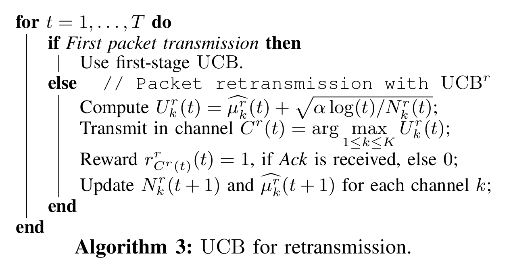

---

# 4.3. UCB + ==$K$ UCB for Retransmissions==

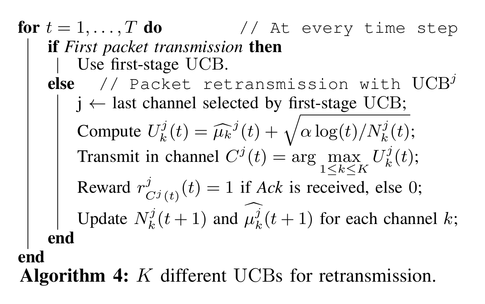

---

# 4.4. UCB + ==Random Retransmissions==

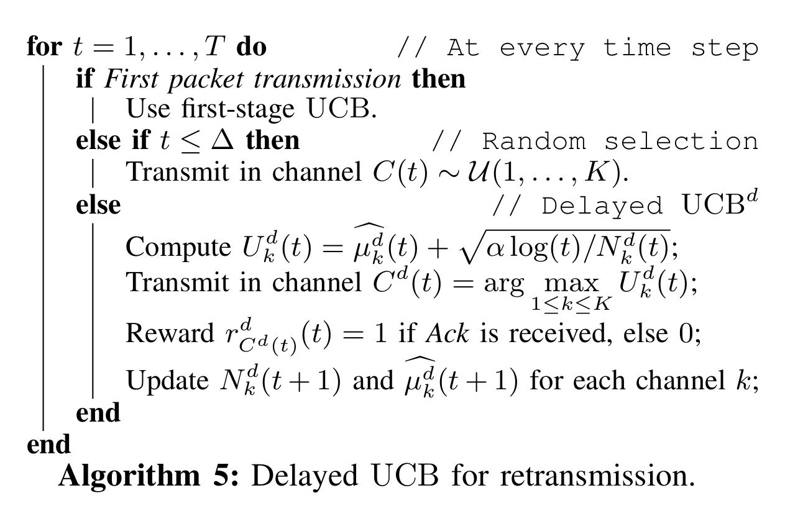

---

# 5. Numerical simulations and results

### What
- We simulate a network,
- With many IoT dynamic devices.

 

### Why ?
- IoT devices implement the UCB learning algorithm to learn to optimize their *first* transmission of any uplink packets,
- And the different heuristic to (try to) learn to optimize their *retransmissions* of the packets after any collision.

---

# 5.1. First experiment

We consider an example network with...

- $K=4$ channels (e.g., like in LoRa),
- $M=5$ maximum number of retransmission,
- $m=5$ maximum back-off interval,
- $p=10^{-3}$ transmission probability,
- $5=20 \times 10^4$ time slots,
- from $N=1000$ IoT devices.

:point_right: ==Non uniform occupancy of the $4$ channels:==
they are occupied $10$, $30$, $30$ and $30\%$ of times (by other IoT networks).

---

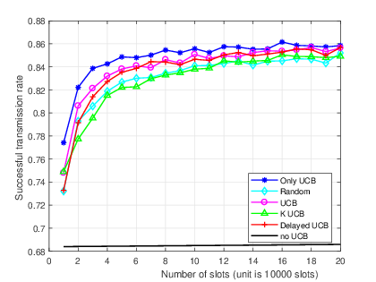

---

# 5.2. Second experiment

:point_right: ==Non uniform occupancy of the $4$ channels:==
they are occupied $40$, $30$, $20$ and $30\%$ of times (by other IoT networks).

---

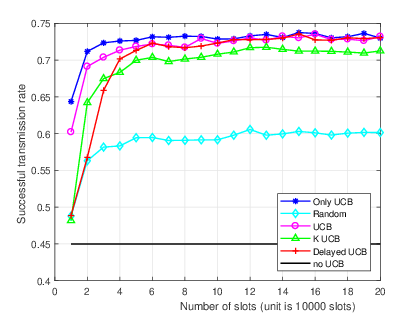

---

# 6. Summary (1/3)
## Settings
1. For **IoT networks** based on a simple **ALOHA protocol**
   (slotted both in time and frequency),
2. We presented a **retransmission model**,
 
3. Dynamic **IoT devices** can use **simple machine learning algorithms**, to improve their successful communication rate,
4. We focus on the packet retransmissions upon radio collision, by using low-cost **Multi-Armed Bandit** algorithms, like **UCB**.

---

# 6. Summary (2/3)
## We presented

Several **learning heuristics**

- that try to learn how to transmit and retransmit in a smarter way,
 
- by using the classical UCB algorithm for **channel selection for first transmission**:  it has a **low memory and computation cost**, easy to add on an embedded CPU of an IoT device,
 
- and different ideas based on UCB for the retransmissions upon collisions, that add no cost/memory overhead.

---

# 6. Summary (3/3)
## We showed

- Using machine learning for the *transmission* is **needed** to achieve optimal performance, and can lead to significant gain in terms of successful transmission rates  (up-to 30% in the example network).

- Using machine learning for the *retransmission* is also useful, and improves over previous approach unaware of retransmission.

- The proposed heuristics outperform a naive random access scheme.

- :point_right: Surprisingly, the main take-away message is that a simple UCB learning approach, that retransmit in the same channel, turns out to perform as well as more complicated heuristics.

---

# 6. Future works

- Implement our proposed approach in a real-world demo
  For instance using USRP boards.
- Study a real IoT LPWAN protocol (e.g., LoRa)
- Explore in LoRa how to use machine learning (e.g., Multi-Armed Bandit algorithms) to let IoT devices learn on their own the best retransmission pattern to follow in a given scenario.

---

# More ?

 

### $\hookrightarrow$ See our paper: [`HAL.Inria.fr/hal-02049824`](https://hal.inria.fr/hal-02049824) :point_left:

  

### :pray: Please ask questions !
### Or by email ==`Lilian.Besson @ CentraleSupelec.fr`== ?

  

Thanks for listening :+1: !
