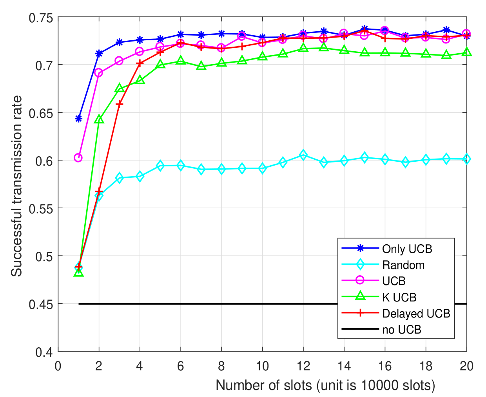

<!--
$theme: default
$size: 4:3
page_number: true
footer: Upper-Confidence Bound for Channel Selection in LPWA Networks with Retransmissions
-->

<link rel="stylesheet" type="text/css" href="../common/marp-naereen.css" />

### *IEEE WCNC 2019*: "**Upper-Confidence Bound for Channel Selection in LPWA Networks with Retransmissions**"

 

- *Date* :date: : $14$th of April $2019$

 

- *Who:* [Lilian Besson](https://GitHub.com/Naereen/slides/) :wave: , PhD Student in France, co-advised by

| *Christophe Moy*   @ IETR, Rennes | *Emilie Kaufmann*   @ CNRS & Inria, Lille |
|:---:|:---:|
|   |   |

> See our paper at [`HAL.Inria.fr/hal-02049824`](https://hal.inria.fr/hal-02049824)

---

# Introduction

- XXX

> By R. Bonnefoi, ==L. Besson==, J. Manco-Vasquez and C. Moy.

---

# :timer_clock: Outline

## 1. Motivations
## 2. System Model
## 3. Multi-Armed Bandit (MAB) Model and Algorithms
## 4. Proposed Heuristics
## 5. Results

### Please :pray:
Ask questions *at the end* if you want!

---

# 1. Motivations

- IoT networks are interesting and will be more and more present,
- More and more IoT objects
- $\Longrightarrow$ networks will be more and more occupied

But...

- Heterogeneous spectrum occupancy in most IoT networks standards
- Maybe IoT objects can improve their communication by *learning* to access the network more efficiently (e.g., by using the less occupied spectrum channel)
- Simple but efficient learning algorithm can give great improvements in terms of successful communication rates
- $\Longrightarrow$ can fit more objects in the existing IoT networks :tada: !

---

# 2. System Model

Wireless network
- In ISM band, centered at $433.5$ MHz (in Europe)
- $K=4$ (or more) orthogonal channels

Gateway
- One gateway, handling different objects
- Communications with ALOHA protocol (without retransmission)
- Objects send data for $1$s in one channel, wait for an *acknowledgement* for $1$s in same channel, use Ack as feedback: success / failure
- Each object: communicate from time to time (e.g., every $10$ s)
- Goal: maximize successful communications $\Longleftrightarrow$ maximize sum of received Ack

---

# 2. Markov Chain of our System Model

---

# Hypotheses

1. Blabla
1. Blabla
1. Blabla
1. Blabla

---

# 3. Multi-Armed Bandits (MAB)
 

## 3.1. Model

## 3.2. Algorithms

---

# 3.1. Multi-Armed Bandits Model
- $K \geq 2$ resources (*e.g.*, channels), called **arms**
- Each time slot $t=1,\ldots,T$, you must choose one arm, denoted $C(t)\in\{1,\ldots,K\}$
- You receive some reward $r(t) \sim \nu_k$ when playing $k = C(t)$
- **Goal:** maximize your sum reward $\sum\limits_{t=1}^{T} r(t)$, or expected $\sum\limits_{t=1}^{T} \mathbb{E}[r(t)]$
- Hypothesis: rewards are stochastic, of mean $\mu_k$.
  Example: Bernoulli distributions.

## Why is it famous?
Simple but good model for **exploration/exploitation** dilemma.

---

# 3.2. Multi-Armed Bandits Algorithms
### Often "*index* based"
- Keep *index* $U_k(t) \in \mathbb{R}$ for each arm $k=1,\ldots,K$
- Always use channel $C(t) = \arg\max U_k(t)$
- $U_k(t)$ should represent our belief of the *quality* of arm $k$ at time $t$

### Example: "Follow the Leader"
- $X_k(t) := \sum\limits_{s < t} r(s) \bold{1}(A(s)=k)$ sum reward from arm $k$
- $N_k(t) := \sum\limits_{s < t} \bold{1}(A(s)=k)$ number of samples of arm $k$
- And use $U_k(t) = \hat{\mu}_k(t) := \frac{X_k(t)}{N_k(t)}$.

---

# *Upper Confidence Bounds* algorithm (UCB)
- Instead of using $U_k(t) = \frac{X_k(t)}{N_k(t)}$, add an *exploration term*
$$ U_k(t) = \frac{X_k(t)}{N_k(t)} + \sqrt{\alpha \frac{\log(t)}{N_k(t)}} $$

### Parameter $\alpha$: tradeoff exploration *vs* exploitation
- Small $\alpha$: focus more on **exploitation**,
- Large $\alpha$: focus more on **exploration**,
- Typically $\alpha=1$ works fine empirically and theoretically.

---

# *Upper Confidence Bounds* algorithm (UCB)

---

# 4. We Study Different Heuristics (5)

- They all use one UCB algorithm to decide the channel to use for first transmissions of any message

- They use different approaches for retransmissions:
  - "==Only UCB==": use same $\mathrm{UCB}$ for retransmissions,
  - "==Random==": uniformly random retransmissions,
  - "==UCB==": use another $\mathrm{UCB}^r$ for retransmissions
	(no matter the channel for first transmission),
  - "==K-UCB==": use $K$ different $\mathrm{UCB}^j$ for retransmission after a first transmission on channel $j\in\{1,\cdots,K\}$,
  - "==Delayed UCB==": use another $\mathrm{UCB}^d$ for retransmissions, but launched after a delay $\Delta$.

---

# 4.0. Only UCB

Use the same $\mathrm{UCB}$ to decide the channel to use for any transmissions, regardless if it's a first transmission or a retransmission of a message.

---

# 4.1. UCB + Random Retransmissions

---

# 4.2. UCB + a single UCB for Retransmissions

---

# 4.3. UCB + $K$ UCB for Retransmissions

---

# 4.4. UCB + Random Retransmission

---

# 5. Results

XXX

---

# 5.1. First Experiment

- Blabla
- Blabla
- Blabla
- Blabla

---

---

# 5.2. Second Experiment

- Blabla
- Blabla
- Blabla
- Blabla

---

---

---

# 6. Summary

## We showed
1. XXX
2. XXX
3. XXX
4. XXX

## Take home message

**XXX**

---

# 6. Future works

- Implement our proposed approach in a real-world demo using USRP boards
- Study a real IoT LPWAN protocol (e.g., LoRa)

# More ?

### $\hookrightarrow$ See our paper: [`HAL.Inria.fr/hal-02049824`](https://hal.inria.fr/hal-02049824)

### Please ask questions !

 

Thanks for listening !
