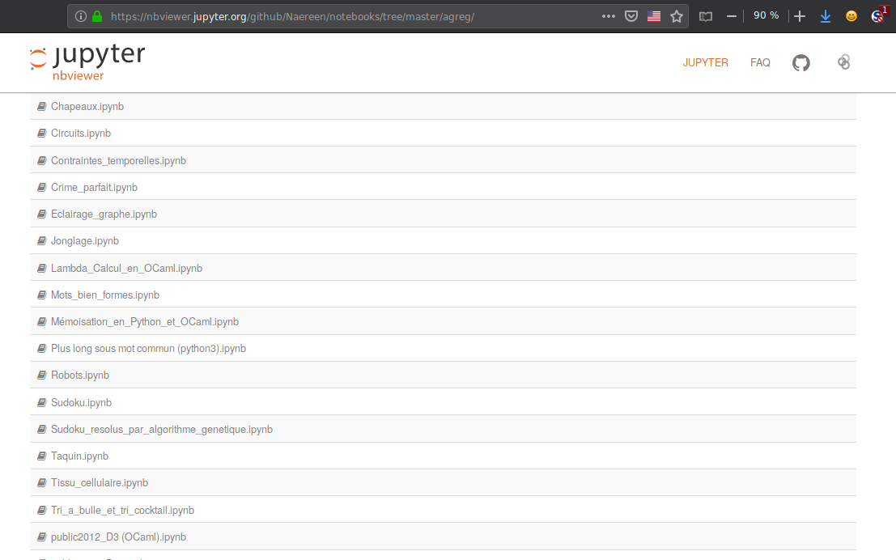
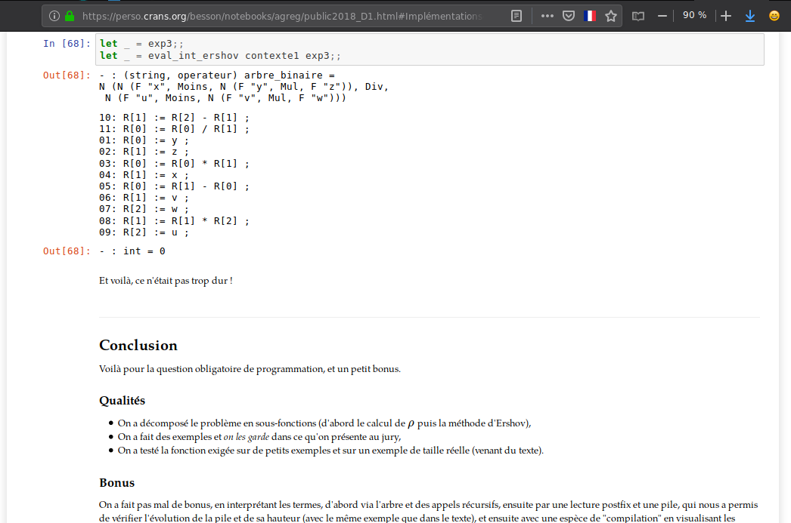
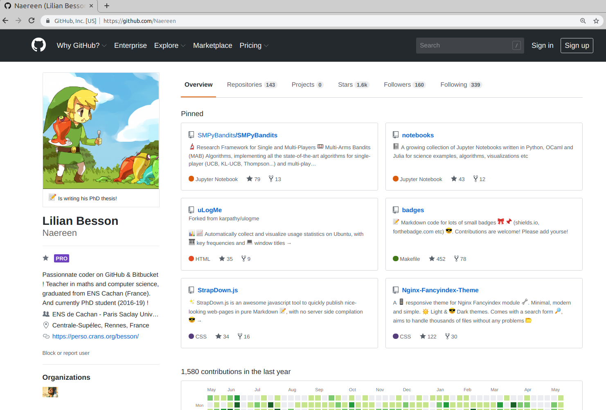
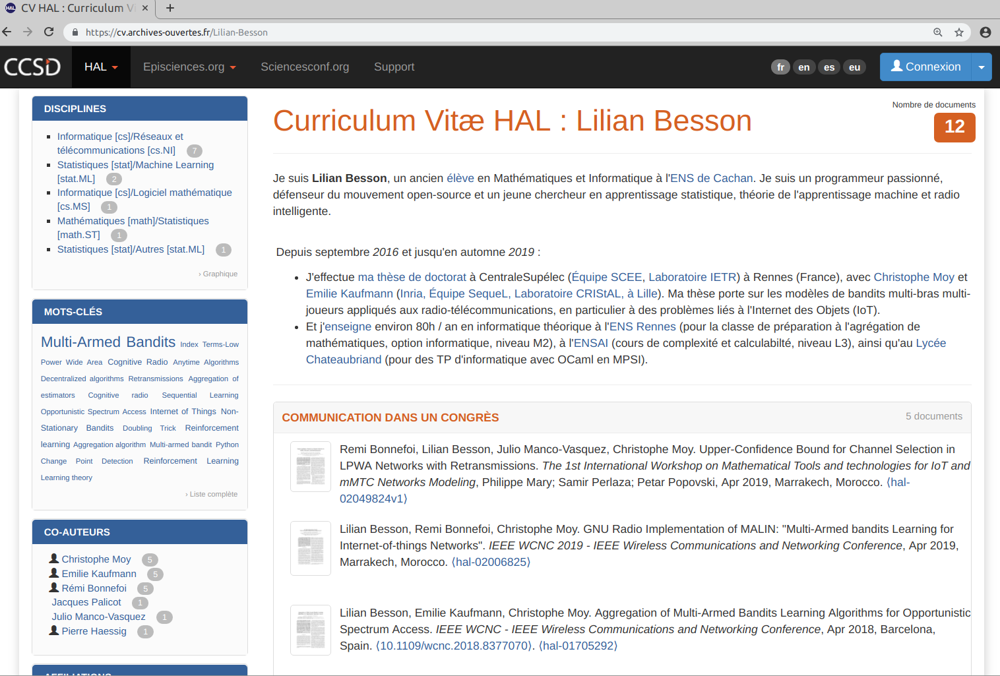
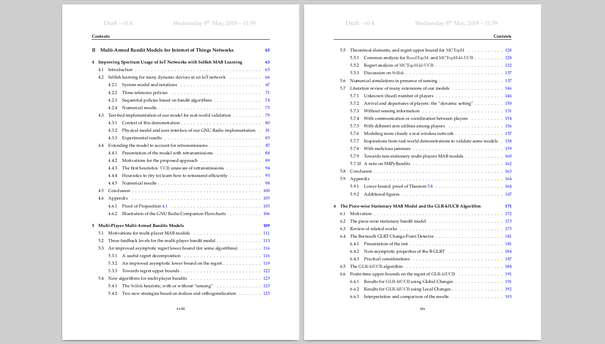
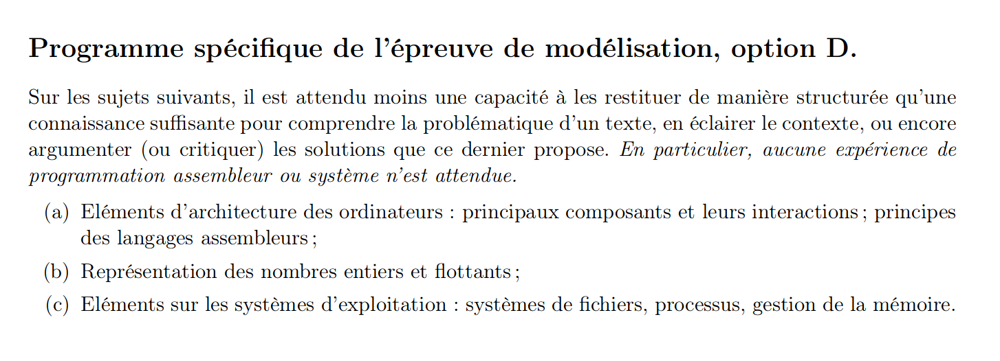

<!--
$theme: default
$size: 4:3
page_number: true
footer: Audition poste AGPR - ENS de Rennes - Lilian Besson - 29 mai 2019
-->

<link rel="stylesheet" type="text/css" href="../common/marp-naereen.css" />

# Audition : poste AGPR à l'ENS de Rennes
 

$\hookrightarrow$ Merci de cette opportunité.
 

### :school: *Lieu* : ENS de Rennes.

### :date: *Date* : 29 mai 2019.

### :wave: *Pour* : [Lilian Besson](https://GitHub.com/Naereen/slides/).

### :alarm_clock: *Durée* : 20 minutes.

---

# :timer_clock: Organisation de l'exposé
 

## 1. Présentation du candidat
## 2. Projet personnel pour 2019
## 3. Projet pédagogique à l'ENS de Rennes
## 4. Projet de recherche à l'IRISA
## 5. Objectifs personnels

---

# 1. Présentation du candidat

- Cursus universitaire

- Expériences d'enseignements

- Expériences en programmation & développement

- Expériences de recherche

  

> Cf. mon CV ou mon site web pour plus de détails.
> $\hookrightarrow$ [perso.crans.org/besson](https://perso.crans.org/besson/)

---

## Cursus universitaire : ==10 ans== d'informatique et de mathématiques

- 2009-2011 : prépa MPSI & MP$^*$ au Lycée Thiers, à Marseille
 
- 2011-2016 : double cursus maths + info à l'ENS de Cachan
  + Double licence, maths appliquées & info théorique
  + Master 1, maths appliquées & info théorique (MPRI)
  + 2014 : agrégation maths option informatique (23ème)
  + 2015-2016 : master 2 maths appliquées (MVA, 1er/115)
 
- 2016-2019 : thèse de doctorat à CentraleSupélec, campus de Rennes
  + co-encadrement à Inria Lille (équipe SequeL)

---

## Expériences d'enseignements : ==6 ans, $\simeq$ 650 heures==

- 2013-2014 : cours particuliers & correction de copies (maths)
- 2014-2015 : un an de césure, deux semestres passés en Inde à Hyderabad, pour participer à la création d'une école d'ingénieur-e-s.
  + *Mahindra Ecole Centrale* (Mahindra group + École Centrale Paris)
  + Environ 250h de cours, maths et info niveau post-bac

- 2015-2016 : 120h de TD/TP et khôlle au lycée Lakanal (maths + info)
- 2016-2018 : 40h de TD/TP à l'ENSAI (informatique théorique)
- 2016-2019 : $\simeq$ 150h de TP, leçons, oraux blancs, pour la prépa' agrég' en maths option info, à l'ENS de Rennes
- 2017 & 2018 : évaluation de rapports de stage des élèves (L3, M1) du département informatique

---

# $\rightarrow$ [`perso.crans.org/besson/infoMP`](https://perso.crans.org/besson/infoMP/)

---

# $\rightarrow$ [`perso.crans.org/besson/ensai-2017`](https://perso.crans.org/besson/ensai-2017)

---

# $\rightarrow$ [`perso.crans.org/besson/agreg-2017`](https://perso.crans.org/besson/agreg-2017/)

---

###### [`nbviewer.jupyter.org/github/Naereen/notebooks/tree/master/agreg/`](https://nbviewer.jupyter.org/github/Naereen/notebooks/tree/master/agreg/)

---

# [`perso.crans.org/besson/notebooks/agreg`](https://perso.crans.org/besson/notebooks/agreg)

---

## Expériences en programmation & développement

- Passionné de logiciels libres et de libre diffusion
  > Tout ce que j'ai rédigé (pour mon master 2, mes cours, ma recherche etc) est distribué en ligne sous licence libre

- Actif sur Bitbucket depuis 2012 $\hookrightarrow$ [`Bitbucket.org/lbesson`](https://Bitbucket.org/lbesson)
- Très actif sur GitHub depuis 2015 $\hookrightarrow$ [`GitHub.com/Naereen`](https://GitHub.com/Naereen)

- Utilisateur expert en Python, OCaml, LaTeX, Bash, git, Julia, etc
  + Habitué au TP en Python ou Ocaml (niveau L1 $\to$ M2)
  + $10$ formations techniques "GouTP" données durant ma thèse

- Capable de créer/maintenir des pages et site web, SQL etc
- Maintenance de machines (Windows, GNU Linux) pour ma thèse

---

# $\rightarrow$ [`GitHub.com/Naereen`](https://GitHub.com/Naereen)

---

## Expériences de recherche

- 2012, 2013, 2016 : à l'ENS de Cachan, trois stages de recherche
- 2013, 2014-2015, 2016 : un an et demi à l'étranger (RU, Inde, Suisse)

- 2016-2019 : thèse à la frontière entre mathématiques, informatique, télécommunications et électronique. Co-encadrement par :
  + Christophe Moy (Univ Rennes 1, IETR) expert en *cognitive radio*
  + et Emilie Kaufmann (CNRS, labo CRIStAL & Inria Lille), experte en statistiques, probabilités et surtout les *bandits multi-bras*

  ##### Publications :
  - 4 articles dans des conférences internationales (2017, 2018, 2019)
  - 2 workshop (2019), 1 démo à une conf. internationale (2018)
  - 3 articles en cours de seconde soumission…

---

# $\rightarrow$ [CV.Archives-Ouvertes.fr/Lilian-Besson](https://cv.archives-ouvertes.fr/lilian-besson)

---

# 2. Projet personnel pour 2019

### Je termine ma thèse de doctorat

- Je termine la rédaction de ma thèse
- Mon manuscrit est basé sur mes principales publications
- Les rapporteurs et le jury sont constitués, et déjà contactés
- Soutenance prévue en octobre 2019

### Autres points d'ici septembre 2019
- Un séjour à Lille fin juin pour assister aux oraux d'agrégation ?
  Si j'ai le temps...
  $\Longrightarrow$ important de garder une expérience actuelle du concours !
- Je devrais présenter un article au GRETSI 2019 (Lille, fin août)

---

## Aperçu de mon manuscrit ([GitHub.com/Naereen/phd](https://GitHub.com/Naereen/phd))

---

# 3. Projet pédagogique à l'ENS de Rennes

Avec ce poste d'Agrégé Préparateur à l'ENS de Rennes, je souhaiterai…
 

### 1. Rester très impliqué dans la préparation à l'agrégation de maths option informatique (prépa agrég)
 

### 2. *Mais aussi*… m'investir dans d'autres formations !
 

### 3. *Et enfin*… créer de nouvelles formations ?

---

## 3.1. Prépa agrég (maths, option info)

J'aimerais avant tout…

- garder deux séances de leçon/modélisation « exemple »
- garder 7/8 séances de TP de programmation (en OCaml, *et* Python ?)
- garder $\simeq$ 15 séances d'entraînements pour les épreuves orales de leçon & modélisation
- et aussi des oraux blancs (j'aimerai participer pour les leçons aussi)
- je peux donner des rappels/compléments de cours pour l'algorithmique, $\lambda$-calcul etc (selon les besoins)
- si besoin, je peux prendre en charge la gestion de la formation !
  > Je pense connaître assez bien les rouages de son organisation, et l'expérience sera très enrichissante.

---

## 3.1. Prépa agrég : ==lacunes==
### :warning: On peut essayer de mieux préparer pour ces points du programme, les connaissances des élèves sont souvent limitées

 

---

## 3.1. Prépa agrég : ==idées de nouveautés==

1. Un ou deux TD de "culture générale informatique"
   - connaissances de base en architectures logicielle, matérielle etc
   - évalué par un QCM (plein de petites connaissances, rédaction participative avec les élèves de cette année ?)

2. Un cours/TD focalisé sur la représentation des nombres et l'arithmétique, "côté machine" : nombres entiers binaires, flottants (norme IEEE 754) etc
   > Je veux aussi terminer la rédaction d'un nouveau texte de modélisation sur les "posits", une alternative aux flottants IEEE

3. Raviver l'utilisation du wiki "Minerve" pour l'option info
   $\hookrightarrow$ [minerve.ens-rennes.fr/index.php/Leçons_d'informatique](https://minerve.ens-rennes.fr/index.php/Le%C3%A7ons_d%27informatique)

---

## 3.2. M'investir dans d'autres formations (1/2)

- Évaluer des rapports et des soutenances de stages de recherche (L3, M1) m'a beaucoup plu en août 2017 et 2018…
  $\hookrightarrow$ Utile de connaître les expériences "hors de l'école" des élèves !

- Je suis très intéressé par des TD ou TP dans n'importe quel cours d'informatique ou maths appliquées, en L3 et M1.
  + En particulier : algorithmique, programmation, $\lambda$-calcul, optimisation numérique, proba/stats, machine learning
  + Au département d'informatique
  + Mais aussi, département de mathématiques, de mécatronique…

---

## 3.2. M'investir dans d'autres formations (2/2)

J'aimerai ==monter un cours d'apprentissage statistique==

1. Cours d'introduction théorique + TP aux élèves dpt maths + informatique (+ mécatronique ?) en L3, ==Semestre #2==
2. Compléments théoriques + un "zoo" des méthodes existantes + un projet de développement aux élèves de M1, ==Semestre #3==

Quelques idées :

- TP = un projet découpé en morceaux, appliqué à de "vraies" données
- le lier à un groupe de lecture bi-mensuel à l'IRISA ?
- dès la seconde édition du cours, j'aimerai permettre aux M1 d'intervenir auprès des L3 (ex : les faire évaluer les TP etc)

---

## 3.3. Intervenir dans de nouvelles formations ? (1/2)

- Le CAPES d'informatique sera ouvert dès la rentrée 2019 :tada: !
  > L'agrégation d'informatique suivra peut-être (un jour :pray:)

- L'ISTIC ouvre une formation au CAPES en septembre (M1 d'info), conçue en accord avec l'ESPE de Bretagne

- J'aimerai y intervenir, si c'est possible (quelques heures ?)

#### *Idée / espoir* : entrelacer les formations à l'agrégation et au CAPES
Entre-aide bi-directionelle : agreg $\Longleftrightarrow$ CAPES ?

- Une leçon préparée par un-e candidat-e à l'agrég sera probablement un bon (complément de) cours pour les candidats au CAPES

> Le programme du CAPES n'est pas encore disponible...

---

## 3.3. Créer de nouvelles formations ? (2/2)

#### « Pré-prépa agrég »
- Entre janvier et avril 2019
- Avec une doctorante de l'IRISA et 2 anciens élèves de la prépa agrég
- Nous avons donné quelques séances de compléments de cours en maths aux élèves de M1 du département informatique ($\simeq$ 20h)
- 6 élèves étaient déjà intéressés pour préparer l'agrég l'an prochain
- Rappels de cours, renforcements théoriques, méthode (développement au tableau) etc

$\Longrightarrow$ j'aimerai refaire cette formation en 2020, la prendre en charge et la renforcer, s'il y a assez d'élèves !

+ Ici aussi : entreaide prépa agrég $\Longleftrightarrow$ pré-prépa agrég ?

---

# 4. Projet de recherche après ma thèse

  

1. Après ma thèse, je souhaite poursuivre une activité de recherche

  

2. Toujours en maths + info, en "machine learning" et algorithmique numérique, mais sans contrainte quant aux applications

---

# 4. Projet de recherche à l'IRISA

#### Dans ce but :

- J'ai discuté avec plusieurs chercheurs, depuis février (à l'IRISA, mais aussi à l'ENSAI, l'IMT et l'IETR…)
- J'ai pris contact avec l'équipe PANAMA
- Jérémy Cohen, chercheur CNRS recruté en octobre, s'est montré très enthousiaste pour collaborer avec moi !
- Rémi Gribonval et Frédéric Bimbot étaient très contents de la perspective que je rejoigne leur équipe !

---

# 4. Projet de recherche à l'IRISA

- Avec Jérémy Cohen, nous avons identifié différentes possibilités
  pour une collaboration tous les deux (trois axes)
- Rémi Gribonval ne sera que très peu impliqué
  (supervision & discussions)

### Organisation / prévision
- 1/2 jours par semaines à plein temps dès octobre
- Une place dans les bureaux de l'équipe
- Lectures et discussions très régulières, octobre-décembre
- Recherche active dès janvier 2020
- Je pense pouvoir être "productif" dès mars prochain

---

## 3 axes de recherche avec Jérémy Cohen

1. Méthodes matricielles et tensorielles étendues au cadre « en ligne »
   $\hookrightarrow$ mélange nos deux domaines d'expertise

2. Détection et adaptation automatique à des non-stationnarités
   $\hookrightarrow$ encore très peu étudié mais très utile "en vrai"
   $+$ Continue une des questions au cœur de ma thèse !

3. Sélection automatique du meilleur algorithme et/ou hyper apprentissage automatique (en ligne ou non), avec des bandits
   $\hookrightarrow$ déjà étudié, mais pas encore appliqué aux méthodes matricielles/tensorielles
   $+$ Continue une des questions au cœur de ma thèse !

 
Pas plus de détails, mais je peux donner des idées au tableau si besoin.

---

## Autres aspects de mon intégration à l'IRISA

1. Séminaire de l’équipe PANAMA
   + J'y présente mon dernier travail début juin !

2. Créer un groupe de lecture "Deep Reinforcement Learning"
   + Possiblement lié au cours d'apprentissage statistique à l'ENS ?

3. Formations techniques : deux demi-journées annuelles (en 2020)
   + diffusion et production de codes libres,
   + tests et documentations de codes de recherche en mathématiques appliquées et informatique

4. Encadrer un-e stagiaire de recherche à partir d'avril 2020 ?

---

# 5. Autres objectifs personnels

1. Terminer mes travaux de thèse en cours
   (un ou deux articles à réécrire et soumettre ailleurs ?)

 

2. Remettre un pied en **classe préparatoire** ?
   - En septembre, peut-être demander une autorisation de cumul ?
   - pour des khôlles de maths et/ou TD/TP d'informatique
   - *maximum 2h/semaine*, si la charge d'AGPR le permet
   - $\hookrightarrow$ en MPSI/MP, avec Amélie Stainer au Lycée Chateaubriand ?

 

3. Rester à Rennes 2 ou 3 ans, voire plus…

---

# Perspectives (après ce poste)

Après 2/3$^+$ années en tant qu'AGPR à l'ENS de Rennes…

### Prochain poste ?

- Mouvement spécifique (EN), pour demander un poste en classe préparatoire (maths+info / info)

- Peut-être aussi postuler au CNRS, Inria ou Maître de Conférence (sections 26, 27) ?

### *Mais aussi ?*

- Enseigner l'informatique dans le secondaire…?
- Lycée Français à l'étranger…?
- Retourner enseigner à l'étranger (écoles d'ingénieurs, prépa etc)…?

---

# Seconde partie : questions & discussion

    
    

Merci de votre attention .
