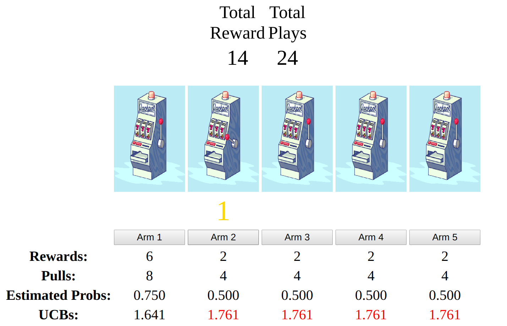
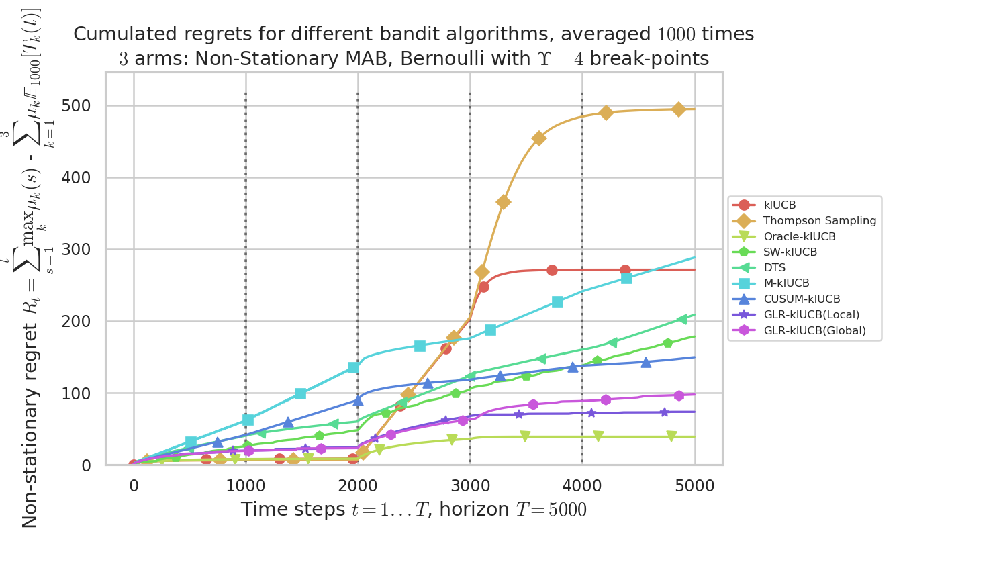

\justifying
\titlepage
{height="0.18\textheight"}
{height="0.21\textheight"}
{height="0.18\textheight"}

Publications associated with this talk

Joint work with my advisor Emilie Kaufmann:

-   [*"Analyse non asymptotique d'un test séquentiel de détection de
    ruptures et application aux bandits non
    stationnaires"*](https://hal.inria.fr/hal-02006471/document)\
    by **L. Besson** & [E.
    Kaufmann](http://chercheurs.lille.inria.fr/ekaufman/research.html)

    $\hookrightarrow$ presented at **GRETSI**, in Lille (France), next
    August 2019

    \vspace*{30pt}
-   [*"The Generalized Likelihood Ratio Test meets klUCB: an Improved
    Algorithm for Piece-Wise Non-Stationary
    Bandits"*](https://hal.inria.fr/hal-02006471/document)\
    by **L. Besson** & [E.
    Kaufmann](http://chercheurs.lille.inria.fr/ekaufman/research.html)\
    February 2019, pre-print on
    [[HAL-02006471]{style="color: blue"}](https://hal.inria.fr/hal-02006471)
    and
    [[arXiv:1902.01575]{style="color: blue"}](https://arxiv.org/abs/1902.01575)

Outline of the talk
===================

Outline of the talk

1.  (Stationary) Multi-armed bandits problems

2.  Piece-wise stationary multi-armed bandits problems

3.  The B-GLR test and its finite time properties

4.  The BGLR-T + klUCB algorithm

5.  Regret analysis

6.  Numerical simulations

1. (Stationary) Multi-armed bandits problems
============================================

1\. (Stationary) Multi-armed bandits problems

1.  [ **(Stationary) Multi-armed bandits problems** ]{.alert}

2.  [ Piece-wise stationary multi-armed bandits problems
    ]{style="color: gray"}

3.  [ The B-GLR test and its finite time properties
    ]{style="color: gray"}

4.  [ The BGLR-T + klUCB algorithm ]{style="color: gray"}

5.  [ Regret analysis ]{style="color: gray"}

6.  [ Numerical simulations ]{style="color: gray"}

What is a bandit problem?
-------------------------

Multi-armed bandits

$=$ Sequential decision making problems in uncertain environments :

{height="0.55\textheight"}

$\hookrightarrow$ Interactive demo
[[`perso.crans.org/besson/phd/MAB_interactive_demo/`]{style="color: blue"}](https://perso.crans.org/besson/phd/MAB_interactive_demo/)\
Ref: \[Bandits Algorithms, Lattimore & Szepesvári, 2019\], on
[[`tor-lattimore.com/downloads/book/book.pdf`]{style="color: blue"}](https://tor-lattimore.com/downloads/book/book.pdf)

Mathematical model
------------------

Mathematical model

-   Discrete time steps $t = 1, \dots, T$\
    The *horizon* $T$ is fixed and usually unknown

-   At time $t$, an *agent plays the arm* $A(t)\in\{1,\dots,K\}$,\
    then she observes the *iid random reward* $r(t) \sim \nu_k$,
    $r(t)\in\mathbb{R}$

    \pause
-   Usually, we focus on Bernoulli arms
    $\nu_k = \mathrm{Bernoulli}(\mu_k)$, of mean $\mu_k\in[0,1]$, giving
    binary rewards $r(t) \in\{0,1\}$.

    \pause
-   **Goal** : maximize the sum of rewards $\sum\limits_{t=1}^T r(t)$

-   or [maximize the sum of expected rewards
    $\mathbb{E}\left[ \sum\limits_{t=1}^T r(t) \right]$]{.alert}

    \pause
-   Any efficient policy must balance [between exploration and
    exploitation]{.alert}: it must explore all arms to discover the best
    one, while exploiting the arms known to be good so far.

Naive solutions
---------------

Two examples of bad solutions

$i)$ Pure exploration

-   Play arm $A(t) \sim \mathcal{U}(\{1,\dots,K\})$ uniformly at random

-   $\implies$ Mean expected rewards
    $\frac{1}{T} \mathbb{E}\left[ \sum\limits_{t=1}^T r(t) \right] = \frac{1}{K} \sum\limits_{k=1}^K \mu_k \ll \max_k \mu_k$

\pause
$ii)$ Pure exploitation

-   Count the number of samples and the sum of rewards of each arm
    $N_k(t) = \sum\limits_{s < t} \mathbbm{1}(A(s)=k)$ and
    $X_k(t) = \sum\limits_{s < t} r(s) \mathbbm{1}(A(s)=k)$

-   Estimate the [unknown]{.alert} mean $\mu_k$ with
    $\widehat{\mu_k}(t) = X_k(t) / N_k(t)$

-   Play the arm of maximum empirical mean :
    $A(t) = \arg\max_k \widehat{\mu_k}(t)$

-   Performance depends on the first draws, and can be very poor!

$\hookrightarrow$ Interactive demo
[[`perso.crans.org/besson/phd/MAB_interactive_demo/`]{style="color: blue"}](https://perso.crans.org/besson/phd/MAB_interactive_demo/)

The *"Upper Confidence Bound"* algorithm
----------------------------------------

A first solution: *"Upper Confidence Bound"* algorithm

-   Compute
    $\mathrm{UCB}_k(t) = X_k(t) / N_k(t) + \sqrt{\alpha \log(t) / N_k(t)}$\
    $=$ an [upper confidence bound]{.alert} on the [unknown]{.alert}
    mean $\mu_k$

-   Play the arm of maximal UCB : $A(t) = \arg\max_k \mathrm{UCB}_k(t)$\
    $\hookrightarrow$ Principle of "optimism under uncertainty"

-   $\alpha$ balances between *exploitation* ($\alpha\to0$) and
    *exploration* ($\alpha\to\infty$)

    \pause
-   [UCB is efficient]{.alert}: the best arm is identified correctly
    (with high probability) if there are enough samples (for $T$ large
    enough)

-   $\implies$ Expected rewards attains the maximum
    ($\forall \alpha>1/2$)
    $$\text{For~} T\to\infty, \;\;\; \frac{1}{T} \mathbb{E}\left[ \sum\limits_{t=1}^T r(t) \right] \to \max_k \mu_k$$

Elements of the proof for UCB algorithm

Elements of proof of convergence (for $K$ Bernoulli arms)

-   Suppose the first arm is the best:
    $\textcolor{deeppurple}{\mu^*} = \textcolor{deeppurple}{\mu_1} > \mu_2 \geq \ldots \geq \mu_K$

-   $\mathrm{UCB}_k(t) = X_k(t) / N_k(t) + \sqrt{\alpha \log(t) / N_k(t)}$

-   Hoeffding's inequality gives
    $\mathbb{P}(\mathrm{UCB}_k(t) < \mu_k(t)) \leq \mathcal{O}(\frac{1}{t^{2 \alpha}})$\
    $\implies$ the different $\mathrm{UCB}_k(t)$ are true "Upper
    Confidence Bounds" on the (unknown) $\mu_k$ (most of the times)

-   And if a suboptimal arm $k>\textcolor{deeppurple}{1}$ is sampled, it
    implies
    $\mathrm{UCB}_k(t) > \mathrm{UCB}_{\textcolor{deeppurple}{1}}(t)$,
    but $\mu_k < \textcolor{deeppurple}{\mu_1}$: Hoeffding's inequality
    also proves that any "wrong ordering" of the $\mathrm{UCB}_k(t)$ is
    unlikely

-   We can prove that suboptimal arms $k$ are sampled about $o(T)$
    times\
    $\implies \mathbb{E}\left[ \sum\limits_{t=1}^T r(t) \right] \underset{T\to\infty}{\to} \textcolor{deeppurple}{\mu^*} \times \mathcal{O}(T) + \sum\limits_{k: \Delta_k>0} \mu_k \times o(T)$

    [But... at which speed do we have this convergence?]{.alert}

Regret of a bandit algorithm
----------------------------

Measure the performance of an algorithm $\mathcal{A}$ with its mean
regret $R_{\mathcal{A}}(T)$

-   Difference in the accumulated rewards between an "oracle" and
    $\mathcal{A}$

-   The "oracle" algorithm always plays [the (unknown) best arm
    $k^* = \arg\max \mu_k$]{style="color: deeppurple"} (we note the best
    mean [$\mu_{k^*} = \mu^*$]{style="color: deeppurple"})

-   Maximize the sum of expected rewards $\Longleftrightarrow$ [minimize
    the regret]{.alert}
    $$\alert{ R_{\mathcal{A}}(T) } = \mathbb{E}\left[ \sum\limits_{t=1}^T \textcolor{deeppurple}{r_{k^*}}(t) \right] - \sum\limits_{t=1}^T \mathbb{E}\left[ r(t) \right] = T \textcolor{deeppurple}{\mu^*} - \sum\limits_{t=1}^T \mathbb{E}\left[ r(t) \right].$$

\pause
\vspace*{10pt}
Typical regime for stationary bandits (lower & upper bounds)

-   No algorithm $\mathcal{A}$ can obtain a regret better than
    $R_{\mathcal{A}}(T) \geq \Omega(\log(T))$

-   And an efficient algorithm $\mathcal{A}$ obtains
    $R_{\mathcal{A}}(T) \leq \mathcal{O}(\log(T))$

Regret of two UCB algorithms
----------------------------

Regret of the UCB algorithm and another algorithm

For any problem with $K$ arms following Bernoulli distributions, of
means $\mu_1,\dots,\mu_K \in[0,1]$, and [optimal mean
$\mu^*$]{style="color: deeppurple"}, then

For the UCB algorithm

$$R_T^{\mathrm{UCB}} \leq ( \sum_{\substack{k=1,\dots,K \\ \mu_k < \textcolor{deeppurple}{\mu^*}}} \frac{8}{(\mu_k - \textcolor{deeppurple}{\mu^*})} ) \log(T) + o(\log(T)) = \mathcal{O}\left( \alert{C(\mu_1,\dots,\mu_K)} \log(T) \right).$$

\<2-\>For the kl-UCB algorithm: a smaller regret upper-bound

$$R_T^{\mathrm{kl}\text{-}\mathrm{UCB}} \leq ( \sum_{\substack{k=1,\dots,K \\ \mu_k < \textcolor{deeppurple}{\mu^*}}} \frac{(\mu_k - \textcolor{deeppurple}{\mu^*})}{\mathrm{kl}(\textcolor{deeppurple}{\mu^*}, \mu_k)} ) \log(T) + o(\log(T)).$$
If $\mathrm{kl}(x, y) = x \log(x/y) + (1-x) \log((1-x)/(1-y))$ is the
binary relative entropy (*ie*, Kullback-Leibler divergence of two
Bernoulli of means $x$ and $y$)

2. Piece-wise stationary multi-armed bandits problems
=====================================================

2\. Piece-wise stationary MAB problems

1.  [ (Stationary) Multi-armed bandits problems ]{style="color: gray"}

2.  [ **Piece-wise stationary multi-armed bandits problems** ]{.alert}

3.  [ The B-GLR test and its finite time properties
    ]{style="color: gray"}

4.  [ The BGLR-T + klUCB algorithm ]{style="color: gray"}

5.  [ Regret analysis ]{style="color: gray"}

6.  [ Numerical simulations ]{style="color: gray"}

Non stationary MAB problems

Stationary MAB problems Arm $k$ gives rewards sampled from [the same
distribution]{style="color: blue"} for any time step:
$\forall t, r_k(t) \overset{\text{iid}}{\sim} \nu_k = \mathrm{Bernoulli}(\mu_k)$.

\pause
Non stationary MAB problems? Arm $k$ gives rewards sampled a [(possibly)
different distributions]{.alert} for any time step:
$\forall t, r_k(t) \overset{\text{iid}}{\sim} \nu_k\alert{(t)} = \mathrm{Bernoulli}(\mu_k\alert{(t)})$.

$\implies$ harder problem! And very hard if $\mu_k(t)$ can change at any
step!

\pause
**Piece-wise stationary** problems! $\hookrightarrow$ we focus on the
easier case when there are at most $o(\sqrt{T})$ intervals on which the
means are all stationary (= **sequence**)

Definitions
-----------

Break-points and stationary sequences

Define

-   The number of break-points\
    $\Upsilon_T = \sum\limits_{t=1}^{T-1} \mathbbm{1}(\exists k\in \{1,\dots,K\}$
    $:$ $\mu_k(t) \neq \mu_k(t+1) )$

-   The $i$-th break-point\
    $\tau^{i} = \inf\{t > \tau^{i-1} : \exists k : \mu_k(t) \neq \mu_k(t+1)\}$
    (with $\tau^0=0$)

\<2-\>**Hypotheses** on piece-wise stationary problems

-   The rewards $r_k(t)$ generated by each arm $k$ are [*iid* on each
    interval]{.alert} $[ \tau^{i} + 1, \tau^{i+1} ]$ (the $i$-th
    sequence)

-   There are $\Upsilon_T = o(\sqrt{T})$ break-points

-   And [$\Upsilon_T$ can be known before-hand]{.alert}

-   All sequences are "long enough"

Example of a piece-wise stationary MAB problem We plots the means
[$\mu_1(t)$]{style="color: red"}, [$\mu_2(t)$]{style="color: green"},
[$\mu_3(t)$]{style="color: blue"} of $K=3$ arms. There are
$\Upsilon_T=4$ break-points and $5$ sequences between $t=1$ and
$t=T=5000$:

{width="100%"}

Extending the definition of regret
----------------------------------

Regret for piece-wise stationary bandits?

The "oracle" algorithm know plays the (unknown) best arm
$k^*(t) = \arg\max \mu_k(t)$ (which changes between stationary
sequences)
$$\alert{ R_{\mathcal{A}}(T) } = \mathbb{E}\left[ \sum\limits_{t=1}^T r_{k^*(t)}(t) \right] - \sum\limits_{t=1}^T \mathbb{E}\left[ r(t) \right] = \left(\alert{\sum_{t=1}^T \max_k \mu_k(t)} \right) - \sum\limits_{t=1}^T \mathbb{E}\left[ r(t) \right].$$

\pause
\vspace*{10pt}
Typical regime for piece-wise stationary bandits

-   The conjectured lower-bound is
    $R_{\mathcal{A}}(T) \geq \Omega(\sqrt{K \Upsilon_T T})$

-   Currently, state-of-the-art algorithms $\mathcal{A}$ obtain
    $$R_{\mathcal{A}}(T) \leq \mathcal{O}(K \sqrt{\Upsilon_T T \log(T)})$$

3. The B-GLR test and its finite time properties
================================================

3\. The B-GLR test and its finite time properties

1.  [ (Stationary) Multi-armed bandits problems ]{style="color: gray"}

2.  [ Piece-wise stationary multi-armed bandits problems
    ]{style="color: gray"}

3.  [ **The B-GLR test and its finite time properties** ]{.alert}

4.  [ The BGLR-T + klUCB algorithm ]{style="color: gray"}

5.  [ Regret analysis ]{style="color: gray"}

6.  [ Numerical simulations ]{style="color: gray"}

Break-point detection
---------------------

The break-point detection problem

Imagine the following game...

-   You observe data $X_1,X_2,\ldots,X_t,\ldots \in[0,1]$

-   You know $X_t$ is generated by a certain (unknown) distribution

-   [Your goal]{.alert} is to distinguish between two hypotheses:

    -   [The distributions have the same mean ("no break-point")\
        $\exists \mu_0, \mathbb{E}[X_1] = \mathbb{E}[X_2] = \ldots = \mathbb{E}[X_t] = \mu_0$]{style="color: deeppurple"}

    -   [The distributions have changed mean at a break-point at time
        $\tau$\
        $\exists \mu_0, \mu_1, \tau, \mathbb{E}[X_1] = \ldots = \mathbb{E}[X_{\tau}] = \mu_0, \mathbb{E}[X_{\tau+1}] = \mathbb{E}[X_{\tau+2}] = \ldots = \mu_1$]{style="color: meca"}

\pause
A [sequential break-point detection]{.alert} is a stopping time,
measurable under $\mathcal{F}_t = \sigma(X_1,\dots,X_t)$, which rejects
the hypothesis [$\mathcal{H}_0$]{style="color: deeppurple"} when
$\widehat{\tau} < +\infty$.

Likelihood ratio test for Bernoulli observations
------------------------------------------------

Bernoulli likelihood ratio test

**Hypothesis**: all distributions are Bernoulli

The problem boils down to distinguishing

-   [$(\exists \mu_0 : \forall i\in\mathbb{N}^*, X_i \overset{\text{i.i.d.}}{\sim} \cB(\mu_0))$]{style="color: deeppurple"},
    against the alternative

-   [$(\exists \mu_0 \neq \mu_1, \tau > 1 : X_1, \ldots, X_\tau \overset{\text{i.i.d.}}{\sim} \cB(\mu_0) \text{~et~} X_{\tau+1}, \ldots \overset{\text{i.i.d.}}{\sim} \cB(\mu_1))$]{style="color: meca"}.

\pause
The [Likelihood Ratio statistic]{.alert} for this hypothesis test, after
observing $X_1,\dots,X_n$, is given by
$$\mathcal{L}(n) = \frac{\sup\limits_{\textcolor{meca}{\mu_0,\mu_1,\tau < n}}\ell(X_1,\dots,X_n ; \textcolor{meca}{\mu_0,\mu_1,\tau})}{\sup\limits_{\textcolor{deeppurple}{\mu_0}}\ell(X_1,\dots,X_n ;\textcolor{deeppurple}{\mu_0})},$$
where $\ell(X_1,\dots,X_n ; \textcolor{deeppurple}{\mu_0})$ (resp.
$\ell(X_1,\dots,X_n ; \textcolor{meca}{\mu_0,\mu_1,\tau})$) is the
likelihood of the observations under a model in
[$\mathcal{H}_0$]{style="color: deeppurple"} (resp.
[$\mathcal{H}_1$]{style="color: meca"}).

\pause
[$\hookrightarrow$ High values of this statistic tends to reject
[$\mathcal{H}_0$]{style="color: deeppurple"} over
[$\mathcal{H}_1$]{style="color: meca"}.]{.alert}

Expression of the Bernoulli Likelihood ratio

We can rewrite this statistic
$\mathcal{L}(n) = \frac{\sup\limits_{\textcolor{meca}{\mu_0,\mu_1,\tau < n}}\ell(X_1,\dots,X_n ; \textcolor{meca}{\mu_0,\mu_1,\tau})}{\sup\limits_{\textcolor{deeppurple}{\mu_0}}\ell(X_1,\dots,X_n ;\textcolor{deeppurple}{\mu_0})}$,
by using Bernoulli likelihood, and shifting means
$\widehat{\mu}_{k:k'} = \frac{1}{k'-k+1} \sum\limits_{s=k}^{k'} X_s$ :

$$\begin{aligned}
    \log \mathcal{L}(n) = \sup_{s \in \{2,\dots,n-1\}} \bigl[
      & s \times \mathrm{kl} (\underbrace{\widehat{\mu}_{1:s}}_{\text{before change}},\underbrace{\widehat{\mu}_{1:n}}_{\text{all data}} ) \\
      + & (n-s) \times \mathrm{kl} (\underbrace{\widehat{\mu}_{s+1:n}}_{\text{after change}},\underbrace{\widehat{\mu}_{1:n}}_{\text{all data}} ) \bigr].
  \end{aligned}$$

Where
$\mathrm{kl}(x,y) =x \ln\bigl(x/y\bigr) + (1-x)\ln\bigl((1-x)/(1-y)\bigr)$
is the binary relative entropy

The BGLR-T
----------

The Bernoulli Generalized likelihood ratio test (BGLR)

-   We can extend the Bernoulli likelihood ratio test if the
    observations are [sub-Bernoulli]{.alert}.

-   And any bounded distributions on $[0,1]$ is sub-Bernoulli

-   $\implies$ the BGLR test can be applied for any bounded
    observations!

\pause
The BGRL-T sequential break-point detection test The [BGLR-T]{.alert} is
the stopping time

$$\widehat{\tau}_{\delta} = \inf \bigl\{ n \in \mathbb{N}^* : \max_{s \in \{2,\dots,n-1\}} \bigl[s \, \mathrm{kl}\left(\widehat{\mu}_{1:s},\widehat{\mu}_{1:n}\right) + (n-s) \, \mathrm{kl}\left(\widehat{\mu}_{s+1:n},\widehat{\mu}_{1:n}\right)\bigr] \geq \beta(n,\delta) \bigr\}$$

with a [threshold function]{.alert} $\beta(n,\delta)$ specified later.

False alarm
-----------

Probability of false alarm

A good test should not detect any break-point if there is no break-point
to detect...

False alarm The stopping time is $\widehat{\tau}_\delta$, and a
break-point is detected if $\widehat{\tau}_\delta < \infty$.

Let $\mathbb{P}_{\textcolor{deeppurple}{\mu_0}}$ be a probability model
under which the observations are $X_t \in[0,1]$ and
[$\mathbb{E}[X_t] = \mu_0$ for all $t$]{style="color: deeppurple"}.

The [false alarm probability]{.alert} is
$\mathbb{P}_{\textcolor{deeppurple}{\mu_0}}(\widehat{\tau}_\delta < \infty)$.

[$\implies$ Goal: controlling the false alarm event!]{.alert} (in high
probability)

First result for the BGLR test

Controlling the false alarm probability For any [confidence
level]{.alert} $0<\delta<1$, the BGLR test satisfies
$$\mathbb{P}_{\textcolor{deeppurple}{\mu_0}}(\widehat{\tau}_\delta < \infty) \leq \delta$$
with the threshold function
$$\beta(n,\delta)= 2\,\mathcal{T}\left(\frac{\ln(3n\sqrt{n}/\delta)}{2}\right) + 6\ln(1+\ln(n)) \simeq \ln(3n \sqrt{n}/\delta).$$

Where $\mathcal{T}(x)$ verifies $\mathcal{T}(x)\simeq x + \ln(x)$ for
$x$ large enough

\<2\>Proof ? Hard to explain in a short time...\
$\hookrightarrow$ pre-print on
[[HAL-02006471]{style="color: blue"}](https://hal.inria.fr/hal-02006471)
and
[[arXiv:1902.01575]{style="color: blue"}](https://arxiv.org/abs/1902.01575)

Delay of detection
------------------

Delay of detection

A good test should detect a break-point "fast enough" if there is a
break-point to detect, with enough samples before the break-point

Delay of detection Let $\mathbb{P}_{\textcolor{meca}{\mu_0,\mu_1,\tau}}$
be a probability model under which $X_t \in[0,1]$ and [$X_t$ a mean
$\mu_0$ for all $t \leq \tau$, and $\mu_1$ for all $t > \tau$, with
$\mu_0 \neq \mu_1$]{style="color: meca"}.

The [gap]{.alert} of this break-point is $\Delta = |\mu_0 - \mu_1|$.

The [delay of detection]{.alert} is
$u = \widehat{\tau}_{\delta} - \tau$.

[$\implies$ Goal: controlling the delay of detection!]{.alert} (in high
probability)

Second result for the BGLR test

Controlling the delay of detection On a break-point of amplitude
$\Delta = |\mu_1 - \mu_0|$, the B-GLRT test satisfies

$$\mathbb{P}_{\textcolor{meca}{\mu_0,\mu_1,\tau}} (\widehat{\tau}_{\delta} \geq \textcolor{meca}{\tau} + u) \leq \exp\left( -\frac{2\textcolor{meca}{\tau} u}{\textcolor{meca}{\tau} + u}\left(\max\left[ 0, \Delta - \sqrt{\frac{\textcolor{meca}{\tau} + u}{2\textcolor{meca}{\tau} u} \beta(\textcolor{meca}{\tau} + u,\delta)} \right]\right)^2 \right).$$

with the same threshold function
$\beta(n,\delta) \simeq \ln(3n \sqrt{n}/\delta)$.

Consequence In high probability, the delay $\widehat{\tau}_\delta$ of
BGLR is $\mathcal{O}(\Delta^{-2} \ln(1/\delta))$ if enough samples are
observed before the break-point at time $\tau$.

Summary of results for BGLR-T
-----------------------------

BGLR is an efficient break-point detection test!

-   We just saw that by choosing

    -   a confidence level $\delta$,

    -   and a good threshold function
        $\beta(n,\delta) \simeq \ln(3n^{3/2}/\delta)$

-   we can control the two properties of the BGLR test:

    -   its [false alarm probability]{.alert}:
        $\mathbb{P}_{\textcolor{darkpurple}{\mu_0}}(\widehat{\tau}_\delta < \infty) \leq \delta$

    -   its [detection delay]{.alert}:
        $\mathbb{P}_{\textcolor{meca}{\mu_0,\mu_1,\tau}} (\widehat{\tau}_{\delta} \geq \tau + u)$
        decreases exponentially fast wrt $u$ (if there are enough
        samples before and after the break-point).

-   $\implies$ it is an efficient break-point detection test

\pause
Finite time guarantees The two guarantees are [finite time]{.alert} and
not asymptotic, this kind of results are quite recent!

4. The BGLR-T + klUCB algorithm
===============================

4\. The BGLR-T + klUCB algorithm

1.  [ (Stationary) Multi-armed bandits problems ]{style="color: gray"}

2.  [ Piece-wise stationary multi-armed bandits problems
    ]{style="color: gray"}

3.  [ The B-GLR test and its finite time properties
    ]{style="color: gray"}

4.  [ **The BGLR-T + klUCB algorithm** ]{.alert}

5.  [ Regret analysis ]{style="color: gray"}

6.  [ Numerical simulations ]{style="color: gray"}

BGRL test + kl-UCB index
------------------------

Our algorithm: BGRL test + kl-UCB index (1/2)

Main ideas

-   We compute a UCB index on each arm

-   Most of the times, we select the arm with highest index
    $A_t = \arg\max\limits_{k\in \{1,\dots,K\}} \mbox{kl-UCB}_k(t)$

-   We use a BGLR test to detect changes on the played arm

-   If a break-point is detected, we reset the memories of *all arms*

\pause
The kl-UCB indexes

-   $\tau_k(t)$ is the time of last restart of arm $k$ before time $t$,

-   $n_k(t)$ counts the the selections, and $\widehat{\mu}_k(t)$ is the
    empirical means of observations since the last restart of arm $k$,

-   Let
    $\mbox{kl-UCB}_k(t) = \max \bigl\{ q\in[0,1] : n_k(t) \times \mathrm{kl}\left(\widehat{\mu}_k(t),q\right) \leq f(t - \tau_k(t)) \bigr\}$

-   $f(t) = \ln(t) + 3 \ln(\ln(t))$ controls the width of the UCB.

Our algorithm: BGRL test + kl-UCB index (2/2)

How do we use the BGLR test? (parameter $\delta$) From observations
$Z_1,\cdots,Z_n$ we detect a break-point with confidence level $\delta$
when
$$\sup_{1 < s < n} \left[s \times \mathrm{kl} \left( \widehat{Z}_{1:s}, \widehat{Z}_{1:n}\right) + (n-s) \times \mathrm{kl} \left( \widehat{Z}_{s+1:n}, \widehat{Z}_{1:n} \right) \right] \geq \beta(n,\delta)$$

\pause
Forced exploration (parameter $\alpha$)

-   We use a forced exploration uniformly on all arms...\
    *ie*, in average, arm $k$ is forced to be sampled at least
    $T \times \alpha / K$ times

-   $\implies$ so we can detect break-points on all the arms

-   and not only on the arm played by the kl-UCB indexes

The BGLR + kl-UCB algorithm

0.1

0.9

\Donnees{\emph{Parameters of the problem} : $T\in\mathbb{N}^*$, $K\in\mathbb{N}^*$\;}
\Donnees{\emph{Parameters of the algorithm} : $\alpha \in (0, 1)$, $\delta>0$\;}
**Initialisation :** $\forall k \in \{1,\dots,K\}$, $\tau_k = 0$ and
$n_k = 0$\

5. Regret analysis
==================

5\. Regret analysis

1.  [ (Stationary) Multi-armed bandits problems ]{style="color: gray"}

2.  [ Piece-wise stationary multi-armed bandits problems
    ]{style="color: gray"}

3.  [ The B-GLR test and its finite time properties
    ]{style="color: gray"}

4.  [ The BGLR-T + klUCB algorithm ]{style="color: gray"}

5.  [ **Regret analysis** ]{.alert}

6.  [ Numerical simulations ]{style="color: gray"}

Hypotheses
----------

Hypotheses of our theoretical analysis

-   Denote $\tau^{i}$ the position of $i$-th break-point

-   and $\mu_k^{i}$ the mean of arm $k$ on segment
    $[\tau^i, \tau^{i+1}]$.

-   Let $b(i) \in \arg\max_k \mu_k^{i}$

-   and the largest gap at break-point $i$ is
    $\Delta^{i} = \max\limits_{k=1,\dots,K} |\mu_k^{i} - \mu_k^{i-1}| >0$.

\pause
Assumption Let
$d^{i} = d^{i}(\alpha,\delta) = \lceil \frac{4K}{\alpha(\Delta^{i})^2}\beta(T,\delta) + \frac{K}{\alpha} \rceil$.

Assume that all sequences are long enough:
$$\forall i \in \{1,\dots,\Upsilon_T\}, \;\;\;\; \tau^{i} - \tau^{i-1} \geq 2\max( d^{i}, d^{i-1} ).$$

The minimum length of the $i$-th sequence depends on the amplitude of
the changes at [the beginning]{style="color: darkred"} and [the
end]{style="color: darkblue"} of the sequence
([$\Delta^i$]{style="color: darkred"} and
[$\Delta^{i+1}$]{style="color: darkblue"})

Regret upper-bound
------------------

Theoretical result

Under this hypothesis, we obtained a *finite time* upper-bound on the
regret $R_T$, with explicit dependency from the problem difficulty.

The exact bound uses:

-   the divergences $\mathrm{kl}(\mu_{k}^{i},\mu_{b(i)}^{i})$ to account
    for the difficulty of the stationary problem on any sequence,

-   $\Delta^{i}$ express the difficulty of detecting the $i$-th
    break-point,

as well as

-   the parameter $\alpha$ probability of forced exploration,

-   and the parameter $\delta$ the confidence level of the break-point
    detection algorithm.

Simplified form of the regret upper-bound

Regret upper bound for BGLR + kl-UCB

-   Let $\alpha = \sqrt{\Upsilon_T \ln(T) / T}$ and
    $\delta = 1 / \sqrt{\Upsilon_T T}$

-   And for a problem satisfying our assumption

-   Then the regret of our algorithm, with parameters $\alpha$ and
    $\delta$, satisfies
    $$R_T =\mathcal{O}\left( \frac{K}{\left(\textcolor{deeppurple}{\Delta^{\text{change}}}\right)^2}\sqrt{T \Upsilon_T \ln(T)} + \frac{(K-1)}{\textcolor{meca}{\Delta^{\text{opt}}}} \Upsilon_T\ln(T) \right),$$

-   with
    $\textcolor{deeppurple}{\Delta^{\text{change}}} = \min_{i} \Delta^{i}$
    [the smallest detection gap between two stationary
    segments]{style="color: deeppurple"},

-   $\textcolor{meca}{\Delta^{\text{opt}}}$ [the smallest value of
    sub-optimality gap on a stationary segment]{style="color: meca"}.

\pause
$\implies$ $R_T = \mathcal{O}(K \sqrt{T \Upsilon_T \log(T)})$ if we hide
the dependency on the gaps.

Comparison with other algorithms
--------------------------------

Comparison with other state-of-the-art approaches

Our algorithm (BGLR + kl-UCB)

-   Hypotheses: bounded rewards, known $T$ and
    $\Upsilon_T = o(\sqrt{T})$, and long enough stationary sequences

-   We obtain $R_T = \mathcal{O}(K \sqrt{\Upsilon_T T \log(T)})$

\pause
And two recent competitors:

CUSUM-UCB [\[Liu & Lee & Shroff, AAAI 2018\]]{style="color: gray"}

-   Also require [prior knowledge of a lower-bound on the gaps]{.alert}

-   They obtained
    $R_T = \mathcal{O}(K \sqrt{\Upsilon_T T \log(T / \Upsilon_T)})$

M-UCB [\[Cao & Zhen & Kveton & Xie, AISTATS 2019\]]{style="color: gray"}

-   Also require [prior knowledge of a lower-bound on the gaps]{.alert}

-   They obtained $R_T = \mathcal{O}(K \sqrt{\Upsilon_T T \log(T)})$

6. Numerical simulations
========================

6\. Numerical simulations

1.  [ (Stationary) Multi-armed bandits problems ]{style="color: gray"}

2.  [ Piece-wise stationary multi-armed bandits problems
    ]{style="color: gray"}

3.  [ The B-GLR test and its finite time properties
    ]{style="color: gray"}

4.  [ The BGLR-T + klUCB algorithm ]{style="color: gray"}

5.  [ Regret analysis ]{style="color: gray"}

6.  [ **Numerical simulations** ]{.alert}

Setup of the experiments
------------------------

Numerical simulations

We consider three problems with

-   $K=3$ arms, Bernoulli distributed

-   $T=5000$ time steps (fixed horizon)

-   $\Upsilon_T=4$ break-points ($=5$ stationary sequences)

-   Algorithms can use this prior knowledge of $T$ and $\Upsilon_T$

-   $1000$ independent runs, we plot the average regret

\pause
Reference

-   We used my open-source Python library for simulations of multi-armed
    bandits problems, **SMPyBandits**\
    $\hookrightarrow$ Published online at
    [[`SMPyBandits.GitHub.io`]{style="color: blue"}](https://SMPyBandits.GitHub.io)

-   More experiments are included in the long version of the paper!\
    $\hookrightarrow$ pre-print on
    [[HAL-02006471]{style="color: blue"}](https://hal.inria.fr/hal-02006471)
    and
    [[arXiv:1902.01575]{style="color: blue"}](https://arxiv.org/abs/1902.01575)

Problem 1: only local changes

{width="100%"}

We plots the means: [$\mu_1(t)$]{style="color: red"},
[$\mu_2(t)$]{style="color: green"}, [$\mu_3(t)$]{style="color: blue"}.

Results on problem 1 {width="115%"}
$\implies$ BGLR achieves the best performance among non-oracle
algorithms!

Problem 2: only global changes
{width="100%"}

Results on problem 2 {width="115%"}
$\implies$ BGLR again achieves the best performance!

Pb 3: non-uniform lenghts of stationary sequences
{width="100%"}

Results on problem 3 {width="115%"}
$\implies$ BGLR achieves the best performance among non-oracle
algorithms!

Conclusions from the simulations
--------------------------------

Interpretation of the simulations (1/2)

Conclusions in terms of regret

-   Empirically we can check that the [BGLR test is efficient]{.alert}:

    -   it has a [low false alarm probability]{.alert}

    -   it has a [small delay]{.alert} if the stationary sequences are
        long enough

    And this is true even if the hypotheses of our analysis are not
    satisfied!

-   Using the kl-UCB indexes policy gives good performance

$\implies$ Our algorithm (BGLR test + kl-UCB) is efficient

$\implies$ We verified that it obtains state-of-the-art performance!

Interpretation of the simulations (2/2)

What about the efficiency in terms of time and memory?

Memory: efficient Our algorithm is as efficient as other
state-of-the-art strategies!\
Memory $= \mathcal{O}(K d_{\max})$ for $K$ arms and horizon $T$.

\<2-\>Time: slow! But it is too slow! Time $= \mathcal{O}(K T d_{\max})$
for $K$ arms and horizon $T$.

$\hookrightarrow$ we proposed two numerical tweaks to speed it up

$\implies$ BGLR test + kl-UCB can be as fast as M-UCB or CUSUM-UCB

$\hookrightarrow$ see the long version on
[[HAL-02006471]{style="color: blue"}](https://hal.inria.fr/hal-02006471)
and
[[arXiv:1902.01575]{style="color: blue"}](https://arxiv.org/abs/1902.01575)

($d_{\max}$ $=$ duration of the longer stationary sequence,
$T \leq (1+\Upsilon_T) d_{\max}$)

Conclusion
==========

Summary
-------

Summary

What we just presented...

-   The Multi-Armed Bandits problem (MAB)

-   Stationary, then [piece-wise stationary]{.alert}

-   The BGLR test is efficient

    -   to detect break-points with [no false alarm]{.alert} and [low
        delay]{.alert}

    -   for Bernoulli (or sub-Bernoulli) data,

    -   and does not need to know the amplitude of the break-point

-   We can combine it with an efficient MAB policy: [BGLR +
    kl-UCB]{.alert}

-   Its regret bound is
    $R_T = \mathcal{O}(K \sqrt{T \Upsilon_T \log(T)})$
    (state-of-the-art)

-   On numerical simulations, our algorithm outperforms other efficient
    policies, and can be as fast as its best competitors

Thanks
------

Conclusion

Thanks for your attention .

\vspace*{20pt}
Questions & Discussion ?
